# Microservices Architecture

## 微服务架构核心

### 什么是微服务架构？

> 马丁·福勒（Martin Fowler) 

- 一组小的服务
- 独立的进程
- 轻量级通信
- 基于业务能力
- 独立部署
- 无集中式管理
- 一种架构风格，将单体应⽤划分成一组⼩的服务，服务之间相互协作，实现业务功能
- 每个服务运行在独⽴的进程中，服务间采用轻量级的通信机制协作（通常是HTTP/JSON）
- 每个服务围绕业务能力进行构建，并且能够通过⾃动化机制独立地部署
- 很少有集中式的服务管理，每个服务可以使用不同的语⾔言开发，使用不同的存储技术
- 参考： https://www.martinfowler.com/articles/microservices.html 

> Adrian Cockcroft （Netflix，网飞）

- Loosely coupled service oriented architecture with bounded context
- 基于有界上下⽂文的， 松散耦合的⾯面向服务的架构 


### 微服务的利弊

- 利
  - 强模块化边界
  - 可独立部署
  - 技术多样性 
- 弊
  - 分布式系统复杂性
  - 最终一致性
  - 运维复杂性
  - 测试复杂性 

> 如果你搞不定一个单块应用，别指望微服务能够拯救你！ 


### 康威法则

- Organizations which design systems … are constrained to produce designs which are copies of the communication structures of these organizations.
- 设计系统的组织，其产生的架构设计等价于组织间的沟通结构 
- 为什么架构师需要，了解技术架构与组织架构？


### 微服务的适用性 

> 企业应该在什么时候开始考虑引入微服务？
>
> 业务团队发展到百人的时候，就可以开始引入微服务。


#### 单块优先 

> 一开始不需要直接走微服务，风险高！


### 微服务组织架构 

- 从传统职能型到跨职能产品型 


- 端到端，闭环（End-end ownership）
- who buid it, who run it ！
- 两个披萨原则！


### 中台战略和微服务 

- 技术中台
- 业务中台
- 业务前台
- 大中台，小前台


### 服务分层概念 

- 基础服务
- 聚合服务


### 微服务总体技术架构体系图 

- 接入层
- 网关层
- 业务服务层
- 支撑服务
- 平台服务
- 基础设施层


### 服务发现 LB

#### 独立LB 

- 硬件 F5
- 软件 Nginx
- LB，(Load Balancer)


#### 进程内LB 


#### 主机独立进程LB 

- 运维成本比较高


### 微服务网关 

#### API Gateway

- 屏蔽内部服务的细节，对外展示一个接口
- 反向路由
- 认证安全
- 限流熔断
- 日志监控


#### Netflix Zuul 网关架构 


### Netflix 微服务服务发现路路由体系 

- Eurka(服务注册中心) + Zuul(网关层)


### 微服务配置中心原理 

- 一般都是自己写的配置文件，到处都是，无法追溯
- 非常重要的微服务组件


#### 携程 Apollo 配置中心

- 保证高可用，设计周到
- 定时拉取与实时推送配置


### RPC vs REST 

- 通信协议


### 服务框架和治理 

> Alibaba的 Dubbo框架。

- 服务注册发现
- 服务负载均衡
- 服务路由（软路由）
- 日志监控
- 延迟监控
- 调用链监控
- 限流熔断措施
- 安全和访问控制
- RPC和REST通讯调用
- 序列化
- 代码生成，契约开发
- 统一异常处理
- 文档
- 配置中心集成
- 后台服务集成


### 五层监控体系和监控分类 

- 基础设施监控
- 系统层监控
- 应用层监控
- 业务监控
- 端用户体验监控


#### 监控架构和主流技术栈 

- 一般监控架构
- 时间序列数据库：InfluxDB和Grafana


### 调用链监控

#### Trace调用链监控原理 

- 启动一个Span,生成 Span ID, trace ID。


#### 调用链监控选型 

- Cat
- Zipkin
- Pinpoint


### Netflix Hystrix 断路器原理 

- 限流，熔断，隔离，降级
- 雪崩效应


### 基于镜像治理和多环境的持续交付流水线 

- 容器部署技术
- Docker，环境一致性和镜像部署
- 镜像治理中心，docker registry。


#### 蓝绿、金丝雀和灰度发布 

- 蓝绿部署，依赖网关，进行新老版本切换
- 灰度发布，保证蓝绿部署，渐进过渡


### 资源调度框架 Mesos 架构 

- Mesos 最早来自谷歌，后来开源
- Mesos 将所有的资源集合起来，成为大型计算机，只作为资源调度
- Framework 进行任务的运行


### 基于容器云发布体系 


## 微服务架构实战

### OAuth2 和 微服务安全架构

#### 课程概述 

##### 课程概述


##### 课程参考书 

OAuth2 in Action：https://www.manning.com/books/oauth-2-in-action 

OAuth 2.0 Cookbook：https://www.packtpub.com/virtualization-and-cloud/oauth-20-cookbook 


##### 微服务基础架构体系2018预览(draft) 

- OAuth2授权认证中心架构和实践
- 微服务配置中心Apollo架构和实践
- 调用链监控CAT架构和实践
- 微服务网关Zuul架构和实践
- 容错限流Hystrix/Turbine架构和实践
- 微服务注册发现Eureka/Ribbon架构和实践
- 时间序列监控KairosDB架构和实践
- 微服务监控告警ZMon架构和实践
- 综合案例分析 


##### 架构和技术栈预览 


#### 问题域 

##### 开放系统间授权 

> 场景：相片拥有者想去使用云冲印服务，打印云存储服务商的粘片。


##### 图例 

- 资源拥有者
- 客户应用
- 受保护的资源


##### 办法1：密码用户名复制 

> 直接将用户名和密码给客户应用，进行登录，进行后续操作。


##### 办法2：万能钥匙 

> 使用一个key，访问某个受保护的资源文件，进行相应的操作。


##### 办法3：特殊令牌 

> 使用令牌的方式，实现访问资源。


##### 传统单块应用安全 

- 登录工程：传统 Web 应用中的身份验证技术：https://insights.thoughtworks.cn/traditional-web-app-authentication/
- 传统中，登录的时候进行用户鉴权，然后才可以进行后续的操作；
- 为了保证不是每一次登录都进行数据库鉴权，使用Cookie和Session机制，给客户端发送Cookie，在后续访问中携带，服务端基于Cookie，找到之前的会话（Session），进行有状态的会话服务。


##### 现代微服务安全 

- 单独使用不是一个AuthServer ，进行鉴权；
- 各个客户端，进行访问的时候，传递token。


##### 你见过OAuth吗? 

- 不需要注册账号，直接就可以使用其他应用的账号进行登录方式；
- 使用微信登录，qq登录，微博登录等等。


##### 总结： OAuth2解决问题域和场景 

- 开放系统间鉴权
- 现代微服务安全
- 企业内部应用认证鉴权（IAM/SSO）


#### OAuth2最简向导 

- The Simplest Guide To OAuth 2.0：https://darutk.medium.com/the-simplest-guide-to-oauth-2-0-8c71bd9a15bb


- 首先有用户的数据 
- 有个资源服务器负责管理用户数据 
- 有个客户应用需要访问用户的数据 
- 给资源服务器按个门暴露用户数据称为API 
- 客户应用可以通过API访问用户数据 
- 资源服务器返回用户数据 


- 如果来了个恶意客户应用怎么办 
- 即使恶意客户应用要求访问用户数据 
- 资源服务器还是返回用户数据，恶意应用也能访问用户数据
- 需要一种机制保护用户数据


- 业界实践是提前给客户应用颁发一个Access Token，它表示客户应用被授权可以访问用户数据 
- 访问用户数据时，给出Access Token 
- 资源服务器取出请求中的Access Token 
- 并校验Access Token确认客户应用有访问用户数据的权限 
- 校验通过后，资源服务器返回用户数据 
- 该机制可以工作的前提是 必须提前给客户应用颁发Access Token 


- 谁颁发Access Token呢？ 授权服务器
- 授权服务器和客户应用的关系如下 
- 授权服务器负责生成Access Token 
- 并给客户应用颁发Access Token 


- 角色回顾：一个授权服务器，一个客户应用，一个资源服务器 
- 授权服务器负责生成Access Token 
- 并将Access Token颁发给客户应用 
- 客户应用带上Access Token访问用户数据 
- 资源服务器从请求中取出Access Token 
- 校验Access Token具有访问用户数据的权限 
- 校验通过后，资源服务器返回用户数据 


- 上面的流程中第一步是授权服务器生成Access Token，在真实流程中，在颁发Token前先要征询用户同意 
- 首先客户应用请求Access Token 
- 授权服务器征询用户意见，是否将权限授予客户应用 
- 如果用户同意授权服务器颁发token 
- 授权服务器生成一个Access Token 
- 并将token颁发给客户应用 
- 注意黄色椭圆圈起来的部分 
- OAuth 2.0标准化了Access Token的请求和响应部分，OAuth2.0的细节在RFC 6749（ OAuth 2.0授权框架）中描述 


#### OAuth2定义和原理 

##### 什么是OAuth 2.0 

- 用于REST/APIs的代理授权框架(delegated authorization framework) 
- 基于令牌Token的授权，在无需暴露用户密码的情况下，使应用能获取对用户数据的有限访问权限 
- 解耦认证和授权 
- 事实上的标准安全框架，支持多种用例场景
  - 服务器端WebApp
  - 浏览器单页SPA
  - 无线/原生App
  - 服务器对服务器之间 


##### 令牌类比仆从钥匙(Valet Key) 

- 给应用授予有限的访问权限，让应用能够代表用户去访问用户的数据


##### OAuth 2.0历史 


##### OAuth 2.0优势 


##### OAuth 2.0不足 


##### OAuth 2.0主要角色 


##### OAuth术语 

- 客户应用
- 资源服务器
- 授权服务器
- 资源拥有者


- 客户凭证
- 令牌
- 作用域


##### OAuth令牌类型 

- 访问令牌
- 刷新令牌
- 授权码
- Bearer Token
- Proof of Possession (PoP) Token


##### OAuth 2.0误解 

- Oauth 2 是一个认证框架，不是认证协议


##### 回顾 

- Oauth 本质是，如何获取token和如何使用token


#### 典型OAuth Flow和选型 

##### 参考资料

- The OAuth 2.0 Authorization Framework(RFC6749)：https://tools.ietf.org/html/rfc6749
- 理解OAuth 2.0：http://www.ruanyifeng.com/blog/2014/05/oauth_2_0.html


##### 授权码模式 

> 目前最常用的方式。


##### 简化模式 

> 最容易受到攻击。


##### 密码模式

> 只有公司自己内部使用的时候，才可以使用，防止密码泄露！


##### 客户端模式


##### 刷新令牌

> 使用Token的存活时间，保证不一定每一次授权都走完整个授权流程。


##### 授权流程渠道(channels) 

- 前端渠道
- 后端渠道

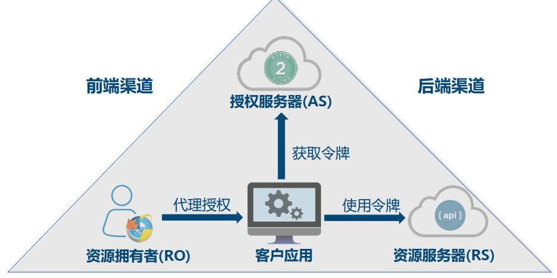


##### 四种OAuth 2.0授权类型(Flows) 

- 授权码
- 简化
- 用户名密码
- 客户端凭证


##### 授权类型选择~客户应用类型 

- 公开
- 私密

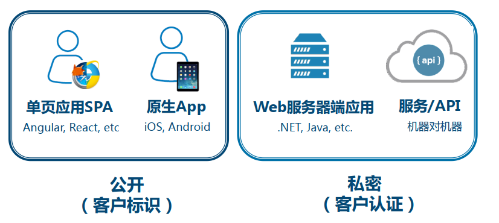


##### 授权类型选择~流程 

> 使用判断流程图，基于不同应用类型，选择不同的授权模式。


#### OAuth2授权服务器和资源服务器案例实操 

##### 授权服务器 

- 授权端点
- token端点
- 校验端点
- 吊销端点


##### Spring Security OAuth2架构 

- OAuth：http://terasolunaorg.github.io/guideline/5.3.0.RELEASE/en/Security/OAuth.html


##### 基于授权码模式+Spring Security OAuth2的最简授权服务器

- 依赖

```xml
<dependency>
    <groupId>org.springframework.boot</groupId>
    <artifactId>spring-boot-starter-security</artifactId>
</dependency>
<dependency>
    <groupId>org.springframework.boot</groupId>
    <artifactId>spring-boot-starter-web</artifactId>
</dependency>
<!-- for OAuth 2.0 -->
<dependency>
    <groupId>org.springframework.security.oauth</groupId>
    <artifactId>spring-security-oauth2</artifactId>
</dependency>
```

- 见示例代码
- 

##### 基于简化模式+Spring Security OAuth2的最简授权服务器

- 见示例代码

##### 基于密码模式+Spring Security OAuth2的最简授权服务器

- 见示例代码

##### 基于客户端模式+Spring Security OAuth2的最简授权服务器

- 见示例代码


##### 实验扩展

- 支持刷新令牌Refresh Token 
- 使用关系数据库存储令牌和客户信息 
- 使用缓存Cache存储令牌提升性能 
- 授权服务器和资源服务器拆分 
- Revoke端点 （吊销端点）
- Introspection端点 （校验端点）


#### OAuth2客户端案例实操 

##### 客户端以授权码方式访问OAuth2服务器案例，使用rest template

- 见示例代码


##### 实验扩展

- 使用Spring Security OAuth2
- 客户端支持简化/密码/客户端模式 
- 客户端支持refresh token 


#### JWT令牌原理 

##### 访问令牌的类型 

- By reference token（透明令牌）
- By value token （自包含令牌）


##### JSON Web Token(JWT) 

- 网址：https://jwt.io/
- 三部分组成：Header.Claims.Signature


##### 令牌签发人和目标接收人 


#### JWT案例实操 

##### 基于密码模式+Spring Security OAuth2+JWT的最简授权服务器

- jwt 依赖

```xml
<dependency>
    <groupId>org.springframework.security</groupId>
    <artifactId>spring-security-jwt</artifactId>
</dependency>
```

- authserver
- resourceserver
- 对称签名和校验
- 见示例代码


##### 实验扩展

- 在JWT令牌中增加定制claims
- JWT令牌的非对称签名和校验
- 使用JWE加密/解密JWT令牌 


#### Android无线应用接入OAuth2案例实操 

##### Android对接OAuth2授权服务器（基于Spring Security OAuth2+内存H2数据库）

- 见示例代码


##### 实验扩展

- 支持用户名密码模式
- 使用PKCE(RFC7636)增强无线客户使用授权码模式的安全性 


#### Angularjs单页应用接入OAuth2案例实操 

##### Angularjs对接OAuth2授权服务器（基于Spring Security OAuth2+Mysql数据库） 

- Spring REST API + OAuth2 + AngularJS：http://www.baeldung.com/rest-api-spring-oauth2-angularjs
-  AngularJS重点关注`oauth-ng.js`。
- 见示例代码


##### 实验扩展

- 支持密码模式


#### Github社交登录案例实操 

##### Github社交联合登录实验

- Spring Social：https://spring.io/projects/spring-social
- https://projects.spring.io/spring-social/
- Connect your Spring application with Software-as-a-Service (SaaS) API providers such as Facebook, Twitter, and LinkedIn.

- 依赖

```xml
<dependency>
    <groupId>org.springframework.social</groupId>
    <artifactId>spring-social-config</artifactId>
</dependency>
<dependency>
    <groupId>org.springframework.social</groupId>
    <artifactId>spring-social-core</artifactId>
</dependency>
<dependency>
    <groupId>org.springframework.social</groupId>
    <artifactId>spring-social-web</artifactId>
</dependency>
<dependency>
    <groupId>org.springframework.social</groupId>
    <artifactId>spring-social-github</artifactId>
    <version>1.0.0.M4</version>
</dependency>
```


##### 实验扩展

- 新浪微博，微信，QQ做对接实验
- Spring Social 文档学习


#### OAuth2安全风险和案例实操 

##### 常见OAuth 2.0安全问题 

- 确保HTTPS传输
- 防止泄露客户密码
- 很多输入需要验证


##### CSRF

> 黑客使用自己的账号和密码，获得授权码；
>
> 将授权码给正常使用的用户，让用户点击；
>
> 由于Spring social 具有跨站点防伪造安全机制，需要一个state传回去；
>
> 此时的点击就是错误的。
>
> Possible CSRF detected - state parameter was required but no state could be found


#### OpenId Connect简介 

##### OpenID Connect 

- (Identity, Authentication) + OAuth 2.0 = OpenID Connect 
- 比较新


#### 下一代微服务安全架构 

##### 方案一

- 前端使用 Access Token（无意义的字符串）
- 后端使用 JWT（表征用户信息的有意义）
- 基于API网关，集中校验，进行Access Token 与 JWT的交换


##### 方案二

- 全称加密 JWT
- API网关，直接进行自校验，不需要去授权服务器校验
- 不能吊销，只能等待JWT自己过期


##### 方案三

- 加入缓存方式
- 优化方案一
- 基于API网关，集中校验，进行Access Token 与 JWT的交换
- 推荐使用，标准参考方案


##### 生产级部署实践 

- 业务指标监控
- 接口调用性能指标
- 缓存 Caching
- HA和水平扩容（高可用，多台）


#### 参考资源和后续课程预览 

##### OAuth2/OIDC开源产品 

Redhat Keycloak（ Java）： http://www.keycloak.org

Apereo CAS（ Java）：https://www.apereo.org/projects/cas

IdentityServer（ C#）：https://identityserver.io/

OpenId-Connect-Java-Spring-Server：https://github.com/mitreid-connect/OpenIDConnect-Java-Spring-Server 


##### Spring Security OAuth2 

- Developer Guide：https://projects.spring.io/spring-security-oauth/docs/oauth2.html
- OAuth-2.0-Cookbook：
  - https://www.packtpub.com/product/oauth-2-0-cookbook/9781788295963
  - https://github.com/PacktPublishing/OAuth-2.0-Cookbook


##### OAuth和OIDC库 

- Google OAuth Client Library
- ScribeJava
- Spring Security OAuth
- Nimbus OAuth SDK
- 各种语言的服务器和客户端库: https://oauth.net/code/ 


##### OAuth2/OIDC SaaS服务 

- okta: https://www.okta.com/
- Auth0: https://auth0.com/ 


##### 规范参考 

- https://oauth.net
- https://jwt.io
- https://openid.net


##### 参考文章 

- 理解OAuth2: http://www.ruanyifeng.com/blog/2014/05/oauth_2_0.html
- The Simplest Guide To OAuth 2.0：https://darutk.medium.com/the-simplest-guide-to-oauth-2-0-8c71bd9a15bb


##### 参考开源代码 

- OAuth2全家桶项目 :https://github.com/newnil/oauth2-family-barrel
- Apache Oltu+Shiro实现OAuth2服务器(李胜钊) :https://github.com/monkeyk/oauth2-shiro
- Using JWT with Spring Security OAuth :
  - https://www.baeldung.com/spring-security-oauth-jwt
  - https://github.com/Baeldung/spring-security-oauth


##### 课程代码 

- https://github.com/spring2go/oauth2lab


##### 后续课程预览~模块

- 服务安全
- 运行时支撑服务
- 服务容错
- 服务监控
- 服务框架
- 后台服务
- 服务部署平台


##### 后续课程预览~技术体系


### Apollo 和 微服务配置中心架构

#### 课程概述 

##### 课程概述和亮点

- 第二个模块
- 携程开源配置中心Apollo深度剖析
- Spring Cloud Config简介
- 面向业务场景、原理和架构
- 面向微服务
- 结合案例和实操(Apollo)
- 结合生产最佳实践 


##### 架构和技术栈预览 


#### 业务需求 

##### 研发小故事 

-  小D 每个用户限购10个！ 


- 小D 每人限购2个！ 


-  小S 每个用户限购10个！ 


- 小S 每人限购2个！ 


- 为什么要配置中心 


##### 传统应用配置问题 

- **主要采用本地文件静态配置**
  本地静态配置导致在运行时无法动态修改

- **配置散乱格式不标准**
  有的用xml格式，有的用properties，有的存DB

- **易引发生产事故**
  发布的时候容易将非生产的配置带到生产上，引发事故

- **配置修改麻烦，周期长**
  当部署的服务器很多时，修改配置费时费力

- **配置信息缺少安全审计和版本控制功能**
  事后无法追溯，谁改的？改了什么？什么时候改的？当出现问题无法及时回滚 


##### 配置中心解决办法 


##### 现代交付需求 

- 云原生
- 微服务


##### 现代配置核心需求

- 交付件和配置隔离
- 抽象标准化
- 集中式
- 高可用
- 实时性
- 治理


##### 公司案例和产品 

- Diamond(开源) 
- Archaius(开源) 
- Gatekeeper
- Disconf(开源)
- Apollo(开源)


#### 配置定义和场景 

##### 配置基本概念 

**配置定义**

• 可独立于程序的可配变量
• 同一份程序在不同配置下会有不同行为
• 连接字符串，应用配置，业务配置 

**配置形态**

• 程序内部hardcode（ 反模式，不建议！ ）
• 配置文件
• 环境变量
• 启动参数
• 基于数据库 

**配置治理**

• 权限控制和审计
• 不同环境、集群配置管理
• 框架类组件配置管理
• 灰度发布 


##### 配置分类和场景 

- 静态配置
  - 环境相关
  - 安全配置
- 动态配置
  - 应用配置
  - 功能开关
  - 业务配置


##### 蓝绿发布 

- 使用功能开关，灵活的自助式部署


##### 功能降级 

- 区分不同的用户，给出不同的展示效果


##### DB/Schema迁移 

- https://blog.launchdarkly.com/feature-flagging-to-mitigate-risk-in-database-migration/
- 使用功能开关
- 保证 10% 到 100% 的数据迁移


##### 电商结账功能的A/B测试 

- 使用新功能 beta 测试，增量式上新功能


#### 开关驱动开发原理和实践 

##### 开关驱动开发 

- 开关配置中心
- 逻辑判断新老功能


##### 基于开关的持续交付 

- https://blog.launchdarkly.com/feature-flag-driven-development/


##### 长生命期分支的问题 

- Merge 地狱


##### Trunk based Development(TBD) 

➢ 每天至少向主干Trunk提交一次
➢ Trunk始终在可发布状态
➢ 将新功能代码(或者未完成代码)影藏在功能开关后面
➢ 使用branch by abstraction进行重构
➢ 可以开分支branch，但是一般不超过2天 


##### Branch by Abstraction重构 


##### TBD案例 

- https://www.stevesmith.tech/blog/organisation-antipattern-build-feature-branching/


##### Re-planning 

- 功能不需要，回退版本


##### TBD & CD 

- Continuous Delivery


##### 优劣权衡 


#### 携程Apollo配置中心简介 

##### 背景 

- 2016年
- https://github.com/ctripcorp/apollo


##### 功能亮点 

- 统一管理不同环境、不同集群的配置
- 配置修改实时生效（热发布）
- 版本发布管理
- 灰度发布（5->10->100-> 全部发布）
- 权限管理、发布审核、操作审计
- 客户端配置信息监控
- 提供Java和.Net原生客户端
- 提供开放平台API
- 部署简单
- 文档完善 


##### 简化架构 


##### Apollo主界面 


##### 已知接入公司 

- https://github.com/ctripcorp/apollo#contribution


#### Apollo核心概念 

##### 核心概念~应用(application) 

唯一的appid 


##### 核心概念~环境(environment) 

DEV, FAT, UAT, PRO 


##### 核心概念~集群(cluster) 

默认数据中心作为cluster 

不同区拿到不同的配置信息


##### 核心概念~名字空间(namespace) 

- 一个应用下不同配置的分组 
- 应用默认有自己的配置 
- 也可以使用公共组件的配置


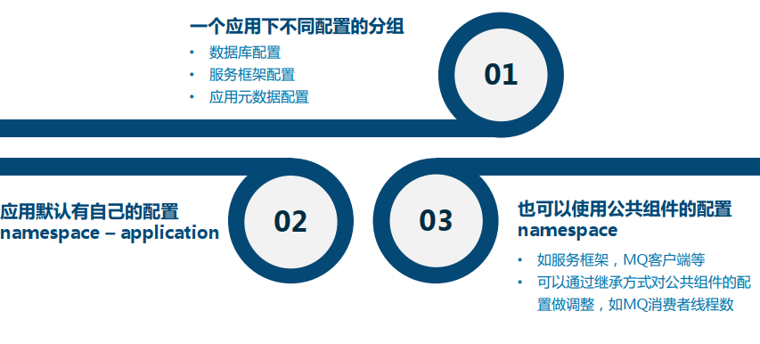


##### 名字空间类型 

- 私有(Private)类型
- 公有(Public)类型
- 关联类型(继承类型) 


##### 关联类型案例 


##### 核心概念~配置项(item) 


##### 核心概念~权限 

- 编辑和发布权限分离


#### Apollo快速起步 

- 参考：https://github.com/ctripcorp/apollo/wiki/Apollo-Quick-Start-Docker%E9%83%A8%E7%BD%B2

- 在docker-quick-start目录下执行`docker-compose up`

- 在Docker环境下需要通过下面的命令运行Demo客户端：

  ```
  docker exec -i apollo-quick-start /apollo-quick-start/demo.sh client
  ```

- 超级管理员添加新用户：http://{portal地址}/user-manage.html 
  
- 用户管理界面：http://localhost:8070/user-manage.html
  
- 使用新用户，添加新的项目之后，想要直接发布成功，需要启动对应的client
  - vi client\META-INF\app.properties
  - 更改app.id=xxx
  - docker exec -i apollo-quick-start /apollo-quick-start/demo.sh client


#### Apollo架构设计之服务器端 

##### 架构视图1 


##### 模块介绍1 

- Config Service 
- Admin Service 
- Meta Server 


##### 模块介绍2 

- Eureka 
- Portal 
- Client 


##### 架构视图2 


##### 领域模型 


##### 权限模型 


##### 实时推送设计 


##### ReleaseMessage实现 

- 使用数据库当做队列

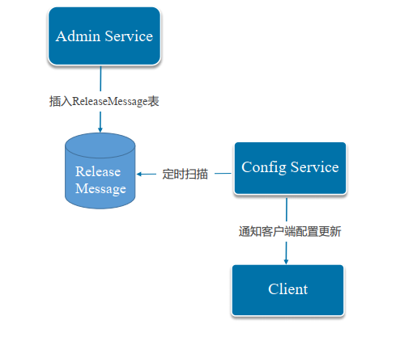


#### Apollo架构设计之客户端 

##### 客户端架构

- 双保险：配置更新推动+定时拉去配置

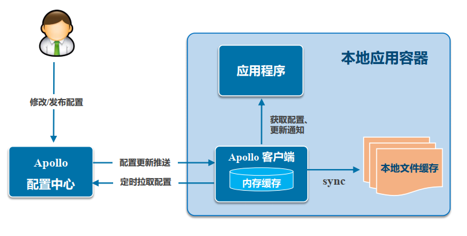


##### 客户端实现总结 


#### Apollo架构设计之高可用和监控 

##### Apollo HA高可用设计 


##### HA图例 


##### Apollo监控 

- 内置支持CAT 
- 定制扩展 
- 关键指标

CAT：https://github.com/dianping/cat

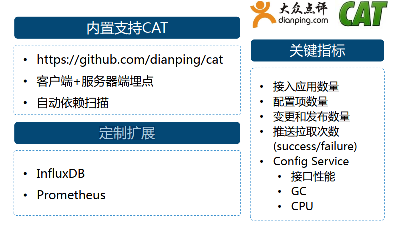


#### Apollo分布式部署指南 

##### 先决条件 


##### 部署案例~ctrip 

- 携程部署案例

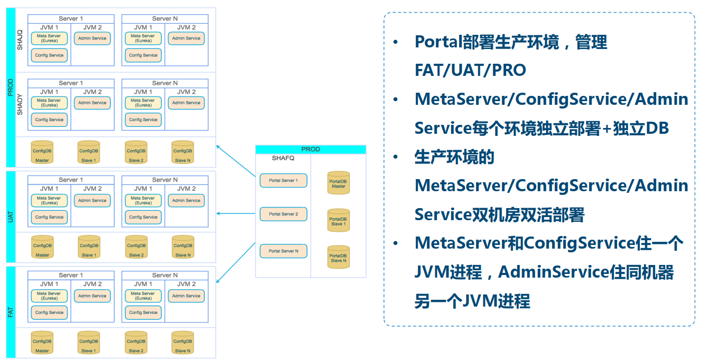


##### 部署图例 


##### 关键配置和注意点 

- 创建数据库
- Portal DB 部署一份，调整好
- Config DB 部署 双活，多份


#### Apollo Java客户端和多语言接入 

##### 环境要求 

- Java 1.7+ 
- Guava: 15.0+
  • Apollo客户端默认会引用Guava 19，如果你的项目引入
  了其它版本，请确保版本号>=15.0 


##### AppId 


##### 配置中心地址

- 客户端读取MetaServer地址方式
- 启动参数-Ddev_meta=http://someIp:8080
- apollo-core.jar中的apollo-env.properties（ 推荐）
- classpath中单独一份app-env.properties
  • local.meta=http://localhost:8080
  • dev.meta=http://dev-apconfig.spring2go.com
  • fat.meta=http://fat-apconfig.spring2go.com
  • uat.meta=http://uat-apconfig.spring2go.com
  • pro.meta=http://apconfig.spring2go.com 


##### 运行环境设置Environment

- 客户端所在运行环境Env
- 启动参数-Denv=YOUR-ENV，注意key小写
- OS环境变量ENV，注意key大写
- 配置文件（ 推荐）
  • Mac/Linux，文件位置为opt/settings/server.properties
  • Windows，文件位置为C:\opt\settings\server.properties
  • 格式env=DEV
  • 支持DEV/FAT/UAT/PRO
  • 本地开发模式env=Local 


##### 可选集群Cluster

- 一个环境中的一个app，对不同的集群可以有不同的配置
- 启动参数-Dapollo.cluster=app_cluster_v1, key全小写
- 通过配置文件（ 推荐）
  • Mac/Linux，文件位置为opt/settings/server.properties
  • Windows，文件位置为C:\opt\settings\server.properties
  • 可设置数据中心集群idc=xyz，注意key全小写 


##### 本地缓存路径

- 本地容灾降级，本地调试
- Mac/Linux: /opt/data/{appId}/config-cache
- Windows: C:\opt\data\{appId}\config-cache
- 注意应用需要有读写权限
- 文件名{appId}-{cluster}-{namespace}.properties 


##### Apollo Client Jar依赖

参考[部署指南](https://github.com/ctripcorp/apollo/wiki/%E5%88%86%E5%B8%83%E5%BC%8F%E9%83%A8%E7%BD%B2%E6%8C%87%E5%8D%97)打包到自己公司maven私服

• <dependency>
• <groupId>com.ctrip.framework.apollo</groupId>
• <artifactId>apollo-client</artifactId>
• <version>0.9.1</version>
• </dependency> 


##### 其它语言接入

- [.Net客户端使用指南](https://github.com/ctripcorp/apollo/wiki/.Net%E5%AE%A2%E6%88%B7%E7%AB%AF%E4%BD%BF%E7%94%A8%E6%8C%87%E5%8D%97)原生支持
-  [Go、 Python、 NodeJS]第三方客户端 
-  [Apollo Http接口](https://github.com/ctripcorp/apollo/wiki/%E5%85%B6%E5%AE%83%E8%AF%AD%E8%A8%80%E5%AE%A2%E6%88%B7%E7%AB%AF%E6%8E%A5%E5%85%A5%E6%8C%87%E5%8D%97)其它语言接入 


#### Apollo Client API实操 

- com.ctrip.framework.apollo.demo.api.ApolloConfigDemo
- 本地配置缓存：C:\opt\data\appId\config-cache


#### Apollo Client和Spring集成~XML方式 

- com.ctrip.framework.apollo.demo.spring.xmlConfigDemo.XmlApplication

- 优先级配置

  - ```
    <apollo:config order="10"/><apollo:config namespaces="TEST1.apollo,application.yaml" order="11"/>
    ```


#### Apollo Client和Spring集成~代码方式 

- com.ctrip.framework.apollo.demo.spring.javaConfigDemo.AnnotationApplication
- 配置重载
- `@ApolloJsonValue`
  - 进行 json 的自动绑定


#### Apollo Client和Spring Boot集成 

- com.ctrip.framework.apollo.demo.spring.springBootDemo.SpringBootSampleApplication

- ```
  @ConditionalOnProperty("redis.cache.enabled")
  ```


#### Apollo开放平台接入实操 

##### 场景~无线app接入apollo 

- 注意：这里只能使用 token 的方式实现，没法做到数据的加密等操作。

- 授权：http://localhost:8070/open/manage.html

- 第三注册，生成Token

- 获取App环境，集群信息

  - URL : http://{portal_address}/openapi/v1/apps/{appId}/envclusters

- 获取集群下所有Namespace信息接口

  - URL : http://{portal_address}/openapi/v1/envs/{env}/apps/{appId}/clusters/{clusterName}/namespaces

- 获取某个Namespace信息接口

  URL ： http://{portal_address}/openapi/v1/envs/{env}/apps/{appId}/clusters/{clusterName}/namespaces/{namespaceName}


#### Spring Cloud Config简介 

##### Spring Cloud Config简介1 


##### Spring Cloud Config简介2

- 存储在 GIt 中
- 与Spring 无缝集成
- 设计简单
- 没有动态配置，业务管理开关
- 适合中小项目，不适合大型项目


##### Config Server接口样例 

接口URL:/{application}/{profile}/{label} 


##### 简化架构 


##### Config Client实现细节 

- Environment


##### 动态配置实现 

- RefreshScope

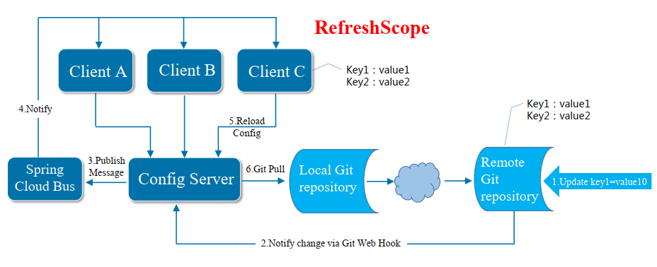


#### Apollo vs Spring Cloud Config 

结论： Apollo是企业生产级配置中心，适用范围更广

| 功能点         | Apollo                                            | Spring Cloud Config                             |
| -------------- | ------------------------------------------------- | ----------------------------------------------- |
| 配置界面       | 统一界面管理不同环境/集群配置                     | 无，通过git操作                                 |
| 配置生效时间   | 实时                                              | 重启生效，或者Refresh，或git hook + MQ扩展      |
| 版本管理       | 界面上直接提供发布历史和回滚按钮                  | 无，通过git操作                                 |
| 灰度发布       | 支持                                              | 不支持                                          |
| 授权/审计/审核 | 界面上直接操作，且支持修改和发布权限分离          | 需要通过git仓库设置，且不支持修改和发布权限分离 |
| 实例配置监控   | 可以方便看到当前哪些客户端在使用哪些配置          | 不支持                                          |
| 配置获取性能   | 快，通过数据库访问+缓存支持                       | 较慢，需从git clone repo，然后本地文件读取      |
| 客户端支持     | 原生支持Java/.Net，提供API，支持Spring annotation | Spring应用+annotation支持                       |


#### Apollo FAQ和开发常见问题 

##### 常见FAQ

- Cluster是什么？
  一个应用不同实例的分组，比如典型的多机房部署按数据中心分集群。

- Namespace是什么？
  一个应用下不同配置的分组，例如应用配置application，中间件配置framework，数据库配置database

- 多个应用想使用同一份配置，如何做到？
  使用公有Namespace

- 客户端访问配置是否有权限，是否支持配置加密？
  Apollo Client获取配置没有做权限管控，配置加密需要应用层自己实现


##### 应用开发常见问题

- 本地开发没有问题，为什么线上会出问题
  首先检查服务器上对应的data文件夹读写权限，此权限对应的是程序运行时所对应的角色； 环境是否配对

- 为什么不能进行编辑发布操作
  编辑和发布权限需要管理员授权，即使是管理员自己需要自己给自己授权

- 接入了apollo值不更新怎么办？
  - 通过Config每次获取最新值，
  - 监听配置变更事件，
  - Spring RefreshScope

- 一个应用可以创建多个版本的配置吗？
  使用集群Cluster 


##### 高级功能和定制参考 

- Apollo开发指南：https://github.com/ctripcorp/apollo/wiki/Apollo%E5%BC%80%E5%8F%91%E6%8C%87%E5%8D%97
- 灰度发布使用指南：https://github.com/ctripcorp/apollo/wiki/Apollo%E4%BD%BF%E7%94%A8%E6%8C%87%E5%8D%97#%E4%BA%94%E7%81%B0%E5%BA%A6%E5%8F%91%E5%B8%83%E4%BD%BF%E7%94%A8%E6%8C%87%E5%8D%97
- Portal 实现用户登录功能：https://github.com/ctripcorp/apollo/wiki/Portal-%E5%AE%9E%E7%8E%B0%E7%94%A8%E6%88%B7%E7%99%BB%E5%BD%95%E5%8A%9F%E8%83%BD
- 邮件模板样例：https://github.com/ctripcorp/apollo/wiki/%E9%82%AE%E4%BB%B6%E6%A8%A1%E6%9D%BF%E6%A0%B7%E4%BE%8B
- 部署&开发遇到的常见问题：https://github.com/ctripcorp/apollo/wiki/%E9%83%A8%E7%BD%B2&%E5%BC%80%E5%8F%91%E9%81%87%E5%88%B0%E7%9A%84%E5%B8%B8%E8%A7%81%E9%97%AE%E9%A2%98

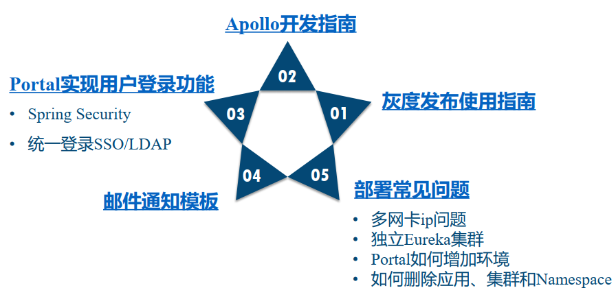


#### 参考资源和后续课程预览 

##### 参考文章

微服务来了，配置怎么办？
http://p.primeton.com/articles/59f2c45e4be8e639a5002b84

Feature Flag Driven Development
https://blog.launchdarkly.com/feature-flag-driven-development/

Feature flagging to mitigate risk in database migration
https://blog.launchdarkly.com/feature-flagging-to-mitigate-risk-in-database-migration/

Trunk based Development 
https://www.stevesmith.tech/blog/organisation-pattern-trunk-based-development/


##### 参考ppt

百倍速交付~谈Trunk-Based Development
https://www.slideshare.net/bryan0817/trunkbased-development 


##### 携程Apollo参考 

Github站点
https://github.com/ctripcorp/apollo

Apollo源码解析(宇道源码) 
http://www.iocoder.cn/categories/Apollo/


##### Spring Cloud Config 

Dive into Spring Cloud Config
https://nobodyiam.com/2016/04/02/dive-into-spring-cloud-config/

Spring Cloud Config
https://spring.io/projects/spring-cloud-config


##### 其它开源配置中心产品 

百度Disconf
https://github.com/knightliao/disconf

Qihoo360 QConf 
https://github.com/Qihoo360/QConf

Netflix Archaius（客户端） （可以扩展对接Apollo）
https://github.com/Netflix/archaius


##### SaaS服务 

[Feature Flags, Toggles, Controls](https://featureflags.io/)：https://featureflags.io/

https://launchdarkly.com/


##### 后续课程预览~技术体系


### Zuul 和 微服务网关架构

#### 课程概述 

- Netflix开源网关Zuul深度剖析
- 面向业务场景、架构和微服务
- Zuul核心源码分析
- Zuul定制扩展和集成
- 结合案例和实操
- 结合生产最佳实践
- Spring Cloud Zuul 简介 


##### 架构和技术栈预览 


#### Zuul网关和基本应用场景 

##### API网关是如何演化出来的？ 

- 单体应用
- 微服务


##### API网关基本功能 

- 单点入口
- 路由转发
- 限流熔断
- 日志监控
- 安全认证


##### Netflix Zuul网关 

Netflix于2012年初开源

- https://github.com/Netflix/zuul
- Zuul is an edge service that provides dynamic routing, monitoring, resiliency, security, and more

亮点：可动态发布的过滤器机制

- Zuul在英文中是怪兽的意思，寓意看门神兽
- 2014年被Pivotal集成入Spring Cloud 体系 

Netflix前总架构师Adrian Cockcroft评价
“One of our most powerful mechanisms and somewhat overlooked NetflixOSS projects is the Zuul gateway service. ”


##### Netflix架构体系和Zuul 

- ELB 做负载均衡
- Zuul 网关


##### Netflix使用情况2017 


##### 国内公司落地案例 

- 携程
- 拍拍贷


#### Zuul网关高级应用场景 

##### 红绿部署 

- 发布的时候，发布新的 V2 版本
- 通过网关，将生产流量从 V1 缓慢切换到 V2,，如果出现问题，直接切回到 V1


##### 开发者测试分支 

- 网关判断是开发者测试流量，就将其 导到 开发者测试集群中


##### 埋点测试 

- 太多的埋点，直接上线，对于系统会有性能影响
- 但是有需要一些埋点，进行跟踪，就可以使用网关将流量导到埋点测试中


##### 压力测试 


##### 调试路由 

- 开发者，添加特殊的 header，进行调试
- 有些问题，本地测不出来，需要去生产环境


##### 金丝雀测试 


##### 粘性金丝雀 

- 根据用户的 IP信息，保证用户的访问一直都是这个集群
- 不会让用户的请求，到处跳


##### 失败注入测试 


##### 降级测试 


##### Netflix持续交付流水线 


##### 跨区域高可用 

- 当某一部分出现问题后，会自动切换至其他集群


##### 防爬防攻击 


##### 健康检查和屏蔽坏节点 


#### Zuul网关架构剖析 

##### Zuul网关架构 

- 过滤器管理模块
- 过滤器加载模块
- 网关过滤器运行时模块


##### 请求处理生命周期 


##### 过滤器关键概念

| 类型Type                             |
| ------------------------------------ |
| 定义在路由流程中，过滤器被应用的阶段 |

| 执行顺序Execution Order              |
| ------------------------------------ |
| 在同一个Type中，定义过滤器执行的顺序 |

| 条件Criteria               |
| -------------------------- |
| 过滤器被执行必须满足的条件 |

| 动作Action                           |
| ------------------------------------ |
| 如果条件满足，过滤器中将被执行的动作 |


##### 标准过滤器类型 

- Pre
- Routing
- Post
- Error


##### 过滤器样例 


##### Filter管理 


#### Zuul网关代码剖析(Code Review) 

- 网关是微服务架构的核心
- 网址：https://github.com/spring2go/s2g-zuul
- io.spring2go.zuul.servlet.InitializeServletListener
- io.spring2go.zuul.servlet.SyncZuulServlet
- io.spring2go.zuul.servlet.AsyncZuulServlet


#### Zuul过滤器管理工具(Code Review) 

- 使用 MySQL的类，io.spring2go.zuul.filters.JDBCZuulFilterDao
- 数据表：src/main/resources/db/schema.sql
- 使用 HTTP 的类，io.spring2go.zuul.filters.HttpZuulFilterDao
- 过滤器管理 类，io.spring2go.zuul.filters.FilterScriptManagerServlet
- 客户端管理页面，src/main/webapp/admin/filterLoader.jsp


#### 过滤器实验~前置过滤器

- pre


#### 过滤器实验~路由过滤器 

- route
- s2g-zuul-mobile/src/scripts/pre/TestRoute.groovy
- s2g-zuul-mobile/src/scripts/route/ExecuteRoute.groovy


#### 过滤器实验~后置过滤器 

- post
- s2g-zuul-mobile/src/scripts/post/DebugHeader.groovy
- s2g-zuul-mobile/src/scripts/post/SendResponse.groovy
- s2g-zuul-mobile/src/scripts/post/DebugResponse.groovy


#### Zuul网关对接Apollo 

##### Netflix Archaius 

- 进行对接Apollo ，是一个变色龙
- Archaius 是一个组合配置，分层级配置，上级覆盖下级


##### Zuul对接Apollo 

- 网址：https://github.com/netflix/archaius
- Apollo 支持与 Archaius 对接
- 使用Apollo 的配置作为最高级配置，将本地的Zuul配置覆盖，本地配置不生效
- Archaius 配置，不是实时生效，而是轮循的去拉，大概是30秒
- InfoBoard工具，看网关配置的值


#### Zuul网关生产部署实践 

##### 参考部署架构案例 

- 负载均衡器：F5+Nginx
- Zuul网关，分集群部署，对应域名
- 集中式过滤器管理站点


##### 分集群过滤器管理 


##### 网关生产级部署实践 

- 授权认证中心
- 配置中心
- 熔断（Hystric, Turbine, Eureka）
- 防爬虫系统
- 监控，Cat
- 日志，ELK
- 监控，时序数据库，KairosDB


##### Zuul网关集成Hystrix实时监控 


#### Zuul网关路由管理实践 

##### 基于Eureka自发现(Netflix做法) 

- 路由表在  Eureka 上，结合 Ribbon ，既可以自己发现路由表
- 根据表，得到对应的服务的 IP

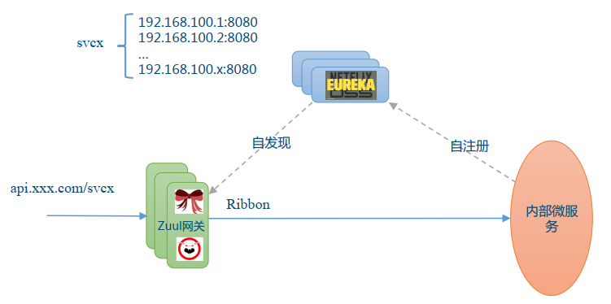


##### 基于域名做法 

- 大部分使用的方式
- 使用服务治理中心，后期定期拉取路由


##### 简单基于Apollo做法 

- 实验与 Apollo 对接的时候，使用这种方式
- 网关配置在 Apollo 配置中心
- 网关定期拉取配置，更新配置


#### 基于网关的两层路由体系 

##### 内网Nginx静态配置做法 

- 两层集群
- 路由配置在服务治理中心，网关定期拉取路由表


##### 内网Zuul动态配置做法 

- 使用Zuul，内部实现服务自注册，自发现
- 两层Zuul，性能会比较差
- Nginx使用c，Zuul是使用 JVM


##### 内网kong动态配置做法 

- 使用 Kong 网关，提升 Zuul 的性能问题


#### Spring Cloud Zuul 

##### Spring Cloud Zuul简介 

Spring Cloud Zuul = Netflix Zuul内核+Spring Boot

EnableZuulProxy标注 ，就可以启用 Zuul

**去掉了动态过滤器加载**！

建议：生产项目，直接使用Netflix Zuul，动态过滤器是一个好的特性。


#### Zuul 2.0简介 

##### Zuul 1.0~阻塞多线程模式 

- 请求进来，一次一个 Servlet 处理


##### 阻塞同步模式优劣 

- 适用: 计算密集型(CPU bound)场景 


##### Zuul 2.0 ~ 非阻塞异步模式 

- 通过总线，队列，每个 Core 上一个事件环
- 前面发布事件，后面回调


##### 非阻塞异步模式优劣 

- 适用: IO密集型(IO bound)场景 


##### 性能比对 

- https://github.com/strangeloop/StrangeLoop2017/blob/master/slides/ArthurGonigberg-ZuulsJourneyToNonBlocking.pdf


##### Zuul 2额外功能亮点 

- 服务器协议
- 弹性
- 运维


##### Zuul 2架构概览 

- 使用 Netty
- Inbound Filters
- Endpoint Filter
- Outbound Filters


##### 个人建议 

- 生产使用 Zuul 1.0
- 关注和实验 Zuul 2.0


#### Zuul网关生产最佳实践 

##### Zuul网关最佳实践 (1.0版本)

- 异步AsyncServlet优化连接数（1.0本质是同步模式，使用Servlet）
- Apollo配置中心集成动态配置（不能经常部署网关和关闭启停）
- Hystrix熔断限流
  - 信号量隔离（不要使用线程隔离）
- 连接池管理
- CAT和Hystrix监控
- 过滤器调试技巧（直接先写成.java文件，然后调试完成，更改后缀为.groovy文件，上传文件之后就可以直接编译使用）
- 网关无业务逻辑
- 自助路由(需定制扩展) 


#### 参考资源和后续课程预览 

##### 参考文章

Announcing zuul edge service in the cloud
https://medium.com/netflix-techblog/announcing-zuul-edge-service-in-thecloud-ab3af5be08ee

Zuul 2 : The Netflix Journey to Asynchronous, Non-blocking Systems
https://medium.com/netflix-techblog/zuul-2-the-netflix-journey-toasynchronous-non-blocking-systems-45947377fb5c

Open Souring Zuul 2
https://medium.com/netflix-techblog/open-sourcing-zuul-2-82ea476cb2b3

Spring Cloud Zuul 
https://cloud.spring.io/spring-cloud-netflix/1.4.x/multi/multi__router_and_filter_zuul.html


##### 参考ppt

| Netflix’s Global Edge Architecture                           |
| ------------------------------------------------------------ |
| • https://www.slideshare.net/MikeyCohen1/edge-architecture-ieeeinternational-conference-on-cloud-engineering-32240 |

| Zuul @ Netflix                                               |
| ------------------------------------------------------------ |
| • https://www.slideshare.net/MikeyCohen1/zuul-netflix-springone-platform |

| Zuul’s Journey to Non-Blocking                               |
| ------------------------------------------------------------ |
| • https://github.com/strangeloop/StrangeLoop2017/blob/master/slides/ArthurGonigberg-ZuulsJourneyToNonBlocking.pdf |


##### 源码

Netflix Zuul
https://github.com/Netflix/zuul

Spring2go定制版Zuul 
https://github.com/spring2go/s2g-zuul


##### 其它开源网关产品

Kong(核心开源)
https://github.com/Kong/kong

Tyk(核心开源)
https://github.com/TykTechnologies/tyk

悟空API网关(部分开源+商业支持)
https://github.com/eolinker/GoKu-API-Gateway

小豹API网关(商业)
http://www.xbgateway.com/ 


##### 后续课程预览~模块

- 服务安全
- 运行时支撑服务
- 服务容错
- 服务监控
- 服务框架
- 后台服务
- 服务部署平台


##### 后续课程预览~技术体系


### CAT 和 微服务调用链监控架构

#### 课程概述 

##### 课程概述和亮点 

- 调用链监控原理分析和产品比对
- 大众点评开源调用链产品CAT深度剖析
- CAT埋点案例和实践
- Zuul和CAT集成
- CAT生产治理最佳实践
- Spring Cloud Sleuth和Zipkin简介 


##### 架构和技术栈预览 


#### 调用链监控业务需求 

##### 从单块到微服务 


##### 应用监控缺失造成的坑 

- 康威定律


##### DevOps实践1：要提升必先测量 


##### DevOps实践2：研发自助监控 


#### 调用链监控原理 

##### Google Dapper论文 

- http://static.googleusercontent.com/media/research.google.com/en//pubs/archive/36356.pdf


###### Dapper Deployment 


###### Dapper UI 


###### 核心概念 

| 概念            | 含义                         |
| --------------- | ---------------------------- |
| Trace （tid）   | 一次分布式调用的链路踪迹     |
| Span (sid, pid) | 一个方法(局部或远程)调用踪迹 |
| Annotation      | 附着在Span上的日志信息       |
| Sampling        | 采样率                       |


##### Zipkin 

- https://zipkin.io/
- google 没有开源，Twitter 基于论文实现了 zipkin，并将其开源


###### Zipkin UI 


##### Open Tracing 

- http://opentracing.io/
- 定义一个标准，规范调用链
- 解决互操作，兼容成本


#### 调用链监控产品和比较 

##### 演进时间线 


##### 开源产品比较 

|               | 点评CAT                    | Open Zipkin                      | Naver Pinpoint         |
| ------------- | -------------------------- | -------------------------------- | ---------------------- |
| 调用链可视化  | 有                         | 有                               | 有                     |
| 聚合报表      | 非常丰富                   | 少                               | 中                     |
| ServerMap     | 简单依赖图                 | 简单                             | 好                     |
| 埋点方式      | 侵入                       | 侵入                             | 非侵入字节码增强       |
| Heartbeat支持 | 有                         | 无                               | 有                     |
| Metric支持    | 简单                       | 无                               | 无                     |
| 告警支持      | 有                         | 无                               | 有                     |
| 多语言支持    | Java/.Net                  | 丰富                             | 只有Java               |
| 界面中文支持  | 好                         | 无                               | 无                     |
| 社区支持      | 内置文档，作者在国内       | 文档较丰富，中文社区一般         | 文档一般，暂无中文社区 |
| 国内案例      | 携程、点评、陆金所、拍拍贷 | 京东、阿里定制不开源             | 唯品会改造定制         |
| 源头祖先      | eBay CAL                   | Google Dapper                    | Google Dapper          |
| 类似产品      | 暂无                       | Uber Jaeger, Spring Cloud Sleuth | Apache Skywalking      |


#### 点评CAT背景介绍 

##### CAT简介 

- 大众点评开源的基础监控框架，在中间件（ MVC框架、 RPC框架、数据库框架、缓存框架等）得到广泛应用，为点评各个业务线提供系统的性能指标、健康状况和基础告警。
- https://github.com/dianping/cat
- 设计理念源自eBay监控框架CAL(Centralized Application Logging)
- 国内上百家公司使用或评估 


##### 作者 


##### CAT监控场景 

- 业务层
- 应用层
- 系统层


##### CAT在点评的发展历程 


##### CAT@大众点评(2016-10) 


##### CAT@携程旅游网(2016-10) 


##### 资深用户反馈 

- 报表丰富 


#### CAT典型报表 

##### 应用报错大盘 


##### 业务大盘 

- 这块一般使用 Metrix 监控


##### CAT的Logview 

- 调用树


##### 分布式 Logview 

- 跨进程展示
- 跨机器展示


##### 可视化Logview 

- 时间轴显示调用链


##### 应用报表(APM) 

| 报表名称            | 用途                                                         |
| ------------------- | ------------------------------------------------------------ |
| Transaction实时报表 | 一段代码的运行时间/次数/分布、比如URL/Cache/SQL执行次数和响应时间 |
| Event实时报表       | 事件产生的次数/分布，比如出现一个异常                        |
| Problem实时报表     | 根据Transaction/Event数据分析出来的系统出现的异常，包括访问较慢的程序等 |
| Heartbeat实时报表   | JVM内部一些状态信息， Load/Memory/GC/Thread等                |
| Metric实时报表      | 业务指标监控                                                 |
| Matrix实时报表      | 一个请求调用分布统计(一次请求中调用多少次SQL/RPC/Cache等)，可评估应用设计 的合理性 |
| Cross实时报表       | SOA系统中关于RPC调用的报表(支持粒度服务/IP/方法)             |
| Cache               | 缓存命中率分析                                               |
| Dependency实时报表  | 应用间依赖关系图，包括远程服务/数据库/缓存等                 |
| …                   | …                                                            |


##### Transaction报表 

- 平均延时
- 95线，99线


##### Event报表 


##### Problem报表 


##### Heartbeat报表 


##### Storage报表 

- 数据库层访问监控


##### Cache报表 


#### CAT告警 

##### 自助告警 

- 登录系统，设置监控配置


##### 失败率告警 


##### 响应时间告警 

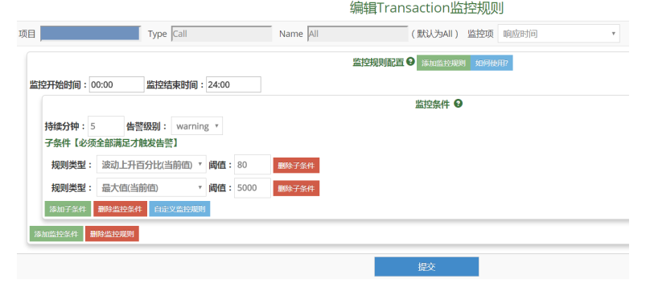


##### 心跳告警 

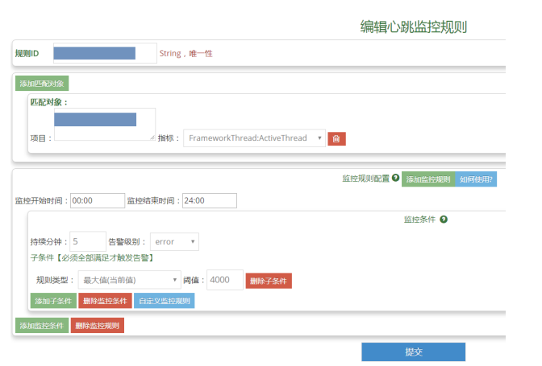


##### 告警策略 


##### 告警发送服务配置 

- 对接钉钉，微信，邮箱


#### CAT架构设计 

##### CAT设计目标

- 对应用无影响(服务端上下线、宕机等)
- 实时性(消息尽快到达服务端)
- 吞吐量(服务端高的吞吐量)
- 开销低(客户端尽可能开销低) (开销2%以内)
- （不能保证）可靠性(消息100%到达服务端)
- （不能保证）服务端100%的处理到达消息 


##### 客户端设计 

- 使用 ThreadLocal （线程局部变量）实现
- 使用异步队列实现
- 构建消息树


##### 服务器端设计 

- 消息消费机
- 分析器


##### 部署 

- 物理机内存大


##### 监控模型 


##### 监控API 

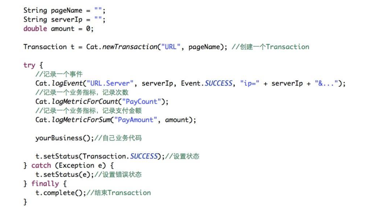


#### CAT本地部署 

- cat 的文档，主要集中在 cat 内部，启动之后就可以看到


#### CAT埋点案例和代码剖析

##### Acme Financial案例 


#### CAT埋点案例实验 


#### Zuul网关集成CAT代码剖析 

##### Acme Financial案例 


#### Zuul网关集成CAT实验 


#### CAT生产埋点实践 


#### CAT生产部署实践 

##### 参考部署架构案例 

- 一台物理机（支持上千的应用）
- Collector, Alerting, Reporting
- HEFS 集群


##### Collector参考硬件规格 


#### CAT生产治理实践 

##### 生产治理实践 

- 框架统一埋点
- 技术栈
- Metric
- 告警
- 项目定期分组


##### 服务红黑榜~平均延迟 


##### 服务红黑榜~95线性能 


#### Spring Cloud Sleuth简介 

##### Spring Cloud Sleuth简介 

- Spring Cloud封装的Zipkin兼容客户端Tracer 
- 自身支持的库，点都埋好了，自动埋点


##### 集成架构


#### Spring Cloud Sleuth实验 

- Quickstart zipkin：https://zipkin.io/pages/quickstart.html


#### 参考资源和后续课程预览 

##### 参考文章

• 深度剖析开源分布式监控CAT
• https://tech.meituan.com/CAT_in_Depth_Java_Application_Monitoring.html

• Google Dapper论文
• http://static.googleusercontent.com/media/research.google.com/en//pubs/archive/36356.pdf


##### 参考站点

• OpenZipkin
• https://zipkin.io/

• OpenTracing
• http://opentracing.io/

• Spring Cloud Sleuth
• https://cloud.spring.io/spring-cloud-sleuth/ 


##### 其它开源调用链监控产品

• Uber Jaeger
• https://github.com/jaegertracing/jaeger

• Naver pinpoint
• https://github.com/naver/pinpoint

• Apache Skywalking
• https://github.com/apache/incubator-skywalking 


##### 商业APM和SaaS 

• OneAPM
• http://www.oneapm.com/

• NewRelic
• https://newrelic.com/

• AppDynamics
• https://www.appdynamics.com/ 


##### 架构和技术栈预览 


### Hystrix 和 微服务容错限流架构


