# Microservice Distributed System

## 如何设计一个分布式技术服务-系统设计面试案例

### 需求设计和简化架构

#### 面试题

如何设计一个视频观看量，关注量，应用请求量的技术系统。

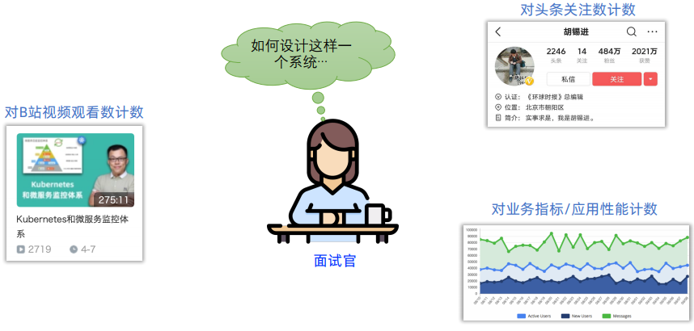

#### 需求沟通

考察点：主动性和沟通能力。

由于不同技术背景的人，熟悉的技术不一样，所以需要进一步明确需求。

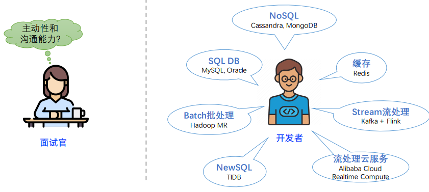

#### 需求澄清

- 场景用例
- 量级规模
- 性能
- 成本

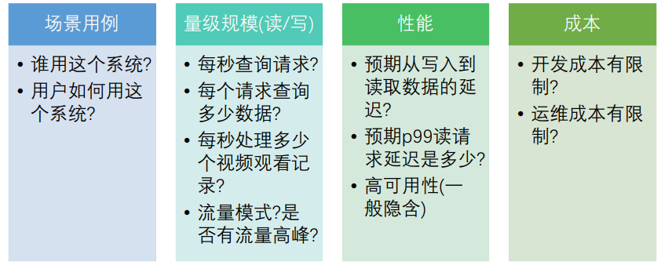

#### 功能需求-API

- 处理需求，对视频观看计数
- 查询需求：按照时间段返回视频观看数量

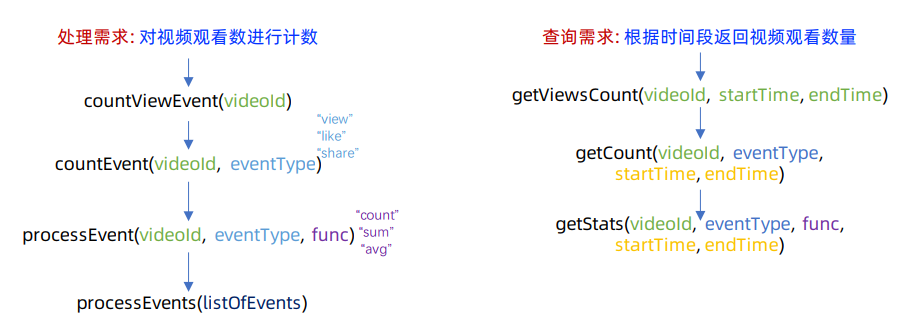

#### 非功能需求

- 规模
- 性能
- 高可用
- 水平按需扩展
- 低成本

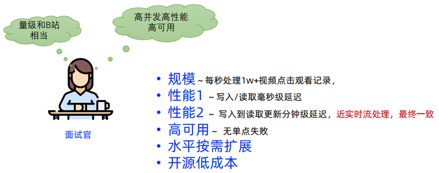

#### 从简化架构开始

- 抽象出的服务：计数服务，查询服务
- 操作的是数据：数据库

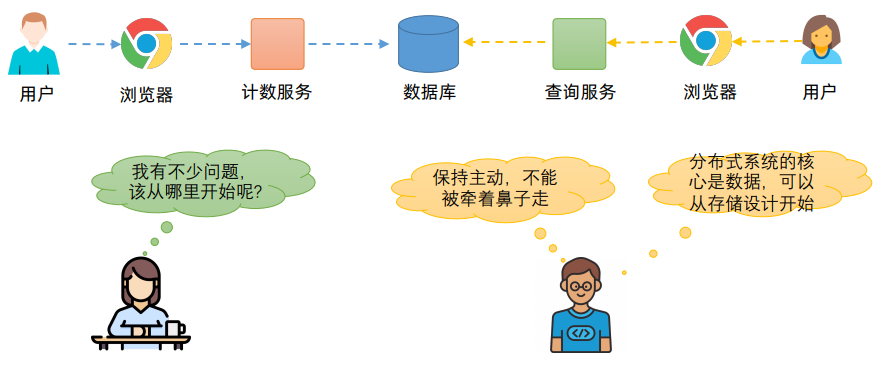

### 存储设计

#### 存什么？

- 单个事件的数据
- 聚合数据

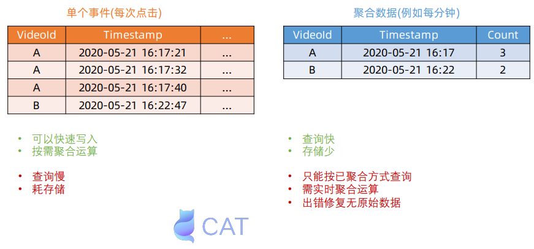

#### 数据库选型

- 可扩展
- 高性能
- 高可用
- 一致性
- 成本
- 学习门槛

#### SQL数据库+客户端嵌入代理

- ShardingSphere
- 将计数服务，路由到MySQL主节点上，写入数据
- 将查询服务，路由到MySQL从结点上，读取数据

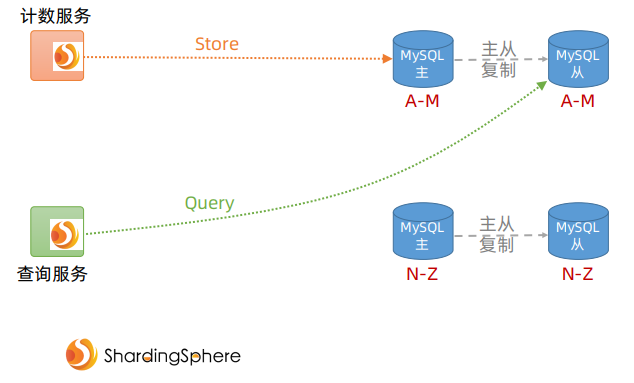

#### SQL数据库+独立部署代理层

- ShardingSphere
- 记录数据库存储配置，有一个配置注册中心
- 分别进行计数服务和查询服务的路由

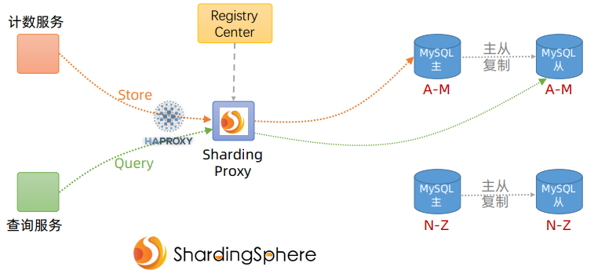

#### NoSQL数据库（Cassandra）

- 随机选择一个Node进行判断，写入的Node
- 仲裁写，多数写好，就表示已经写好了
- 一致性读，多个数据中心复制备份

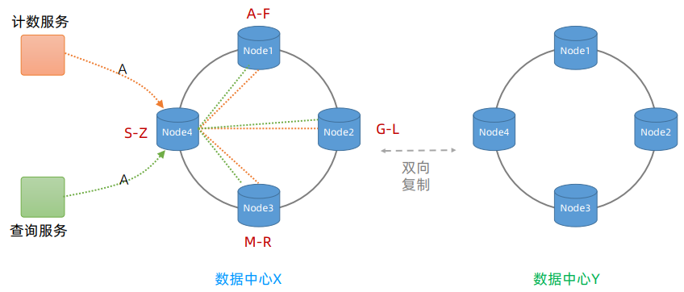

#### 表设计

- SQL数据库，表之间的关联，join
- NOSQL数据库，数据冗余，

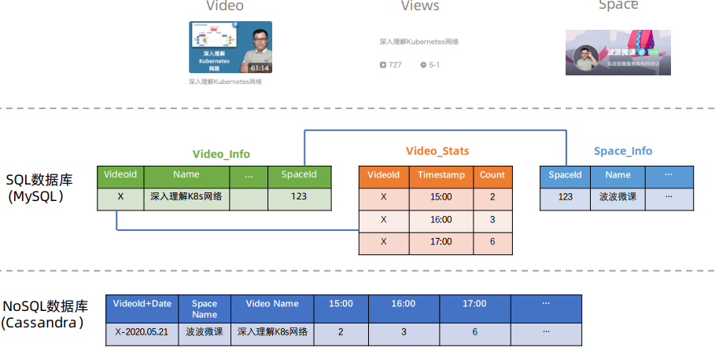

### 计数服务设计

#### 计数服务如何实现

- 可扩展性
- 高性能
- 高可用

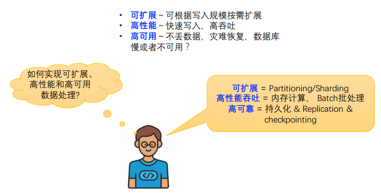

#### 数据聚合（aggregation）基础

- 一般采用预聚合
- 请求pull，拉模式，引入消息队列

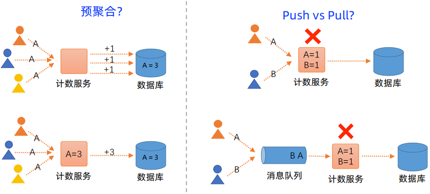

#### 消息队列基础

- Kafka
- 类似于数组，偏移量，消费指针，检查点
- 分区，对同一个主题，开多个分区，进行消息分摊

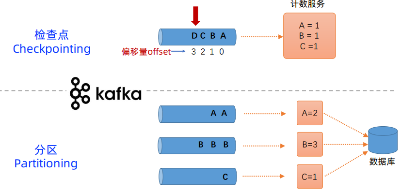

#### 计数消费者（详细设计）

- 数据聚合运算，使用内存中的concurrentHashmap，进行并发的运算
- 引入Internal的消息队列，作为数据库的缓冲
- DB writer 暂时无法写入数据到 DB 的时候，需要将数据写入 死信队列，保证数据不丢失
- 引入 Enrich Data Cache，将数据进行缓存，字段都写上值之后，在写入到数据库

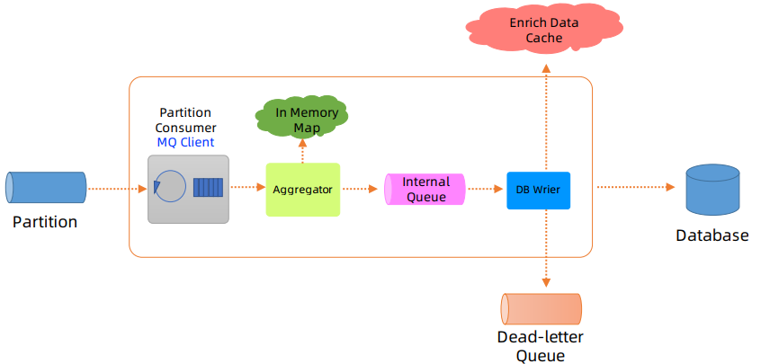

#### 数据接收路径（Data Ingestion Path）

- API Gateway
- Counting Service，服务代理
- Kafka

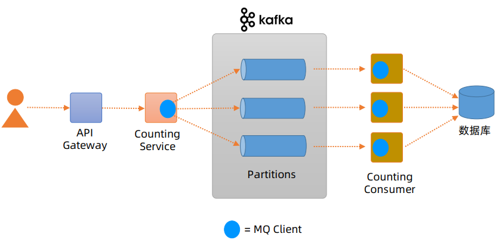

#### 数据接收路径上的面试题

- API Gateway，软件Nginx，硬件F5，NDS，注册中心
- 容错限流，Histrix，TopK实时防爬虫
- 消息队列的格式，json，二进制

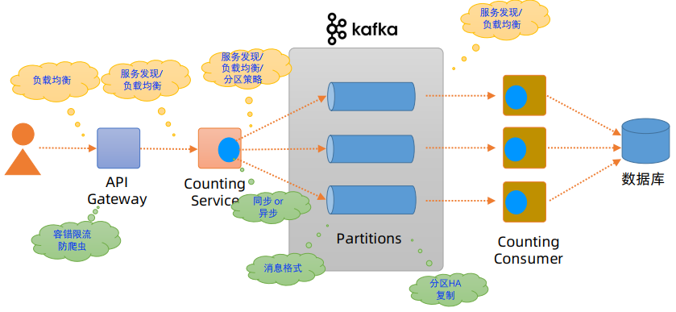

### 查询服务设计

#### 数据获取路径（Data Retrieval Path）

- 查询服务 Query Services
- 老数据归档（对象存储），2/8原则，近期数据缓存
- 热数据，冷数据

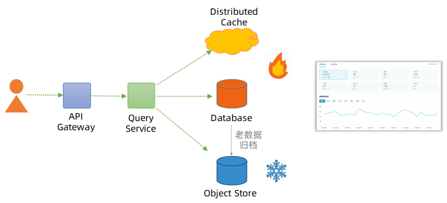

### 技术栈选型

#### 总体流程

- Counting service，计数服务
- Query service，查询服务

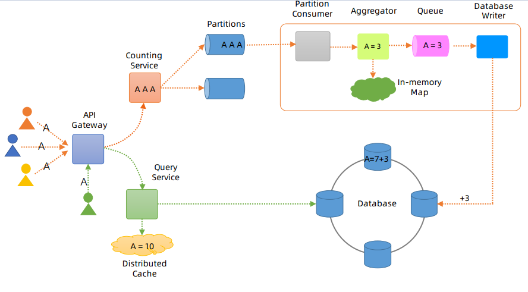

#### 技术栈选型

- API Gateway：f5，zuul
- Spring Boot
- Kafka
- redis
- cassandra，hadoop

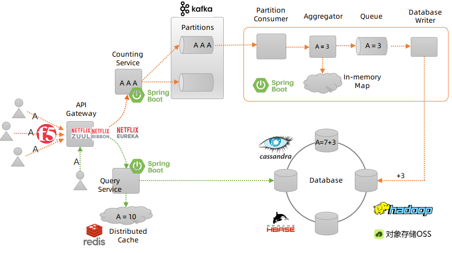

### 进一步考量和总结

#### 更多面试问题

- 如何定位系统瓶颈？
- 如何监控系统健康状况？（日志，metric，调用链）
- 如何确保线上系统运行结果正确？（两套系统，实时流处理系统+线下批处理系统）
- 如何解决热分区问题？（对视频按照时间分摊）
- 如何监控慢消费？解决？

#### 总结

- 功能需求
- 非功能需求
- 总体设计
- 详细设计
- 评估

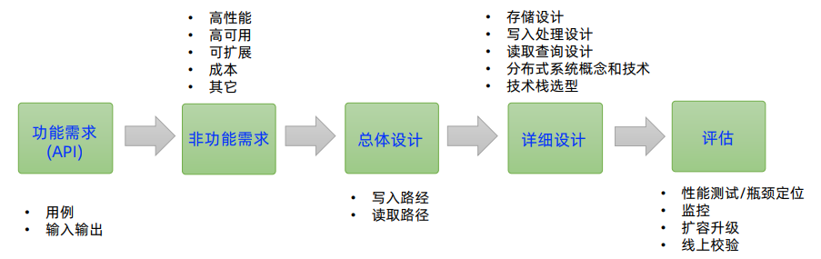

#### 扩展

- 监控系统
- 欺诈检测系统
- 限流系统
- 推荐系统
- 今日热点

### 参考

- System Design Interview – Step By Step Guide：https://www.youtube.com/watch?v=bUHFg8CZFws
- The System Design Primer：https://github.com/donnemartin/system-design-primer
- Consistent Hash Implementation in Java：https://github.com/Jaskey/ConsistentHash

## 如何设计一个简化版Kafka消息队列-拍拍贷PMQ设计演进案例

### 消息队列PMQ 2.0的项目背景

#### 挑战1~PMQ 1.0（2016.8）

- 一套Kafka 系统
- 一套 redis 系统

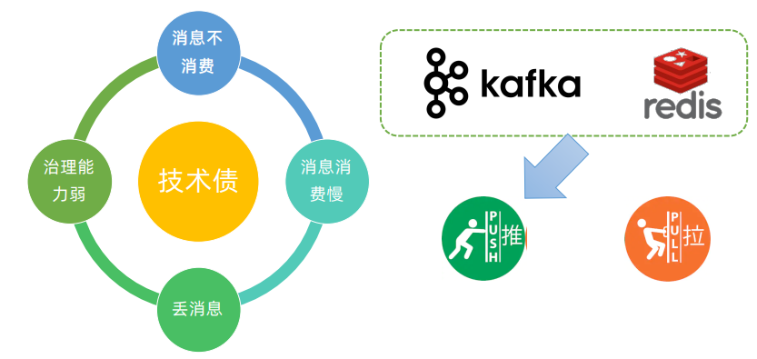

#### 挑战2

- 业务驱动
- 微服务与事件驱动架构

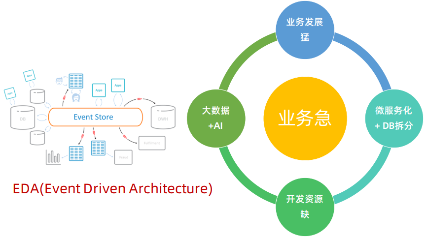

#### 为啥不要Meta Q /Rocket MQ?

- 阿里 Rocket MQ
- 无 C# 客户端，通讯协议复杂，定制 C# 客户端非常困难
- 复杂
  - 依赖 ZK/ NameServer
  - 支持事务消息
- 代码质量一般

#### 为什么不要 Kafka？

- 重且复杂
  - 消息 HA 多份拷贝存储，Leader/Follower 协议
  - 依赖 ZK
  - 代码复杂，Scala 写，普通研发无法深入理解，定制困难
- 不支持企业治理功能，如Topic和业务团队关系管理等
- 不支持高级消息队列特性，比如查消息
- 基于文件存储，适合日志场景，业务场景需要深度定制
- 定制 Kafka 例子
  - https://github.com/allegro/hermes
  - https://github.com/zalando/nakadi

#### 为啥要造轮子？

- 业务消息数据太关键
- 个人原因，需要落地
- 个人背景
  - 携程日志采集平台
  - 个人开源项目 bugqueue/luxun
  - https://github.com/bulldog2011
- 携程 Hermes/ qmq的启发
  - https://github.com/qunarcorp/qmq
  - https://github.com/ctripcorp/hermes

#### 设计目标

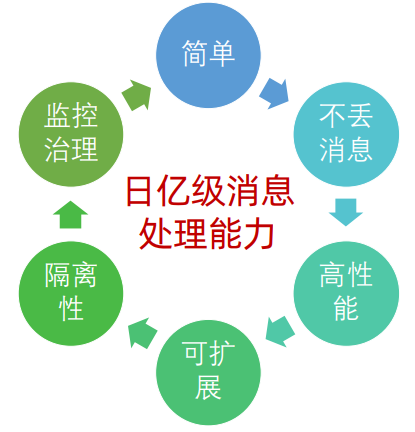

#### 设计限制

- 消息顺序性
  - 能保证消息顺序插入，保证相同分区的消息是顺序的（排除网络延迟），但是多个分区之间可能是乱序的
  - 消息并行消费或者多个分区并行消费，消息消费顺序可能是乱序的
- 消费语义
  - At Least Once 至少一次交付
  - 消费者挂或者重启，没有及时提交消费偏移，重启后可能接收到少量重复消息，消费者端业务方要做幂等处理

### PMQ 2.0的设计

#### 理解队列 Queue

- 入队，出队
- 头指针，尾指针
- https://github.com/bulldog2011/bigqueue

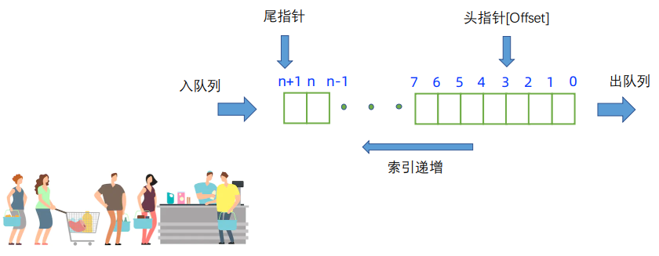

#### Queue 和 Topic（Fanout）语义

-  不同的头指针，Fanout

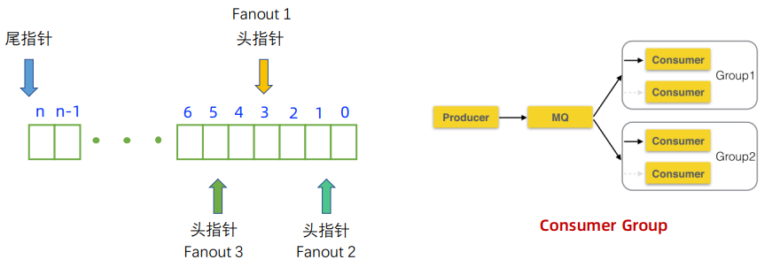

#### 核心概念模型

- 对 Queue 进行分区（Partution）
- 生产者与消费者关系

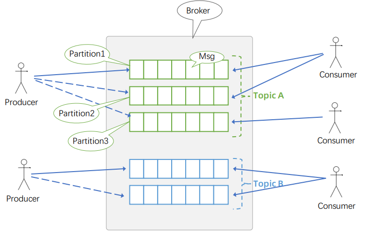

#### 理解消费者组

- Consumer Group
- 消费组之间互不影响，消费进度各不相同
- 限定，每一个消费者组中的消费者，不能消费同一个Topic的同一个Partition

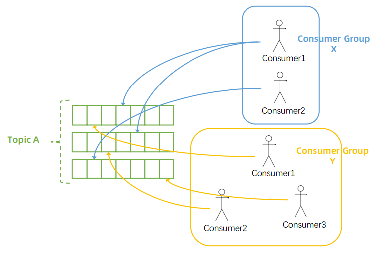

#### 存储设计

- 数据结点 DataNode（数据库），创建 Patation（数据库表）
- 绑定到Topic
- 最多 99个 Patation

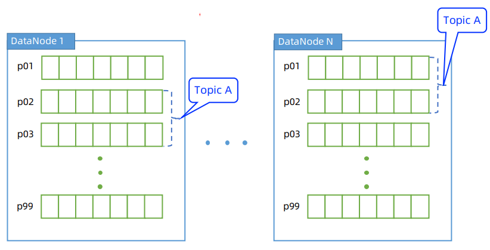

#### 分区队列实现

- 使用数据库实现
- 数据库表字段，自增主键，索引

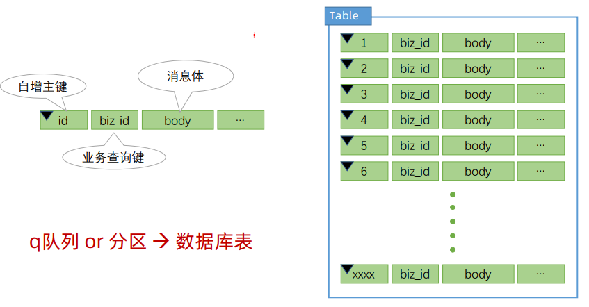

#### 元数据模型

- 数据之间的关系

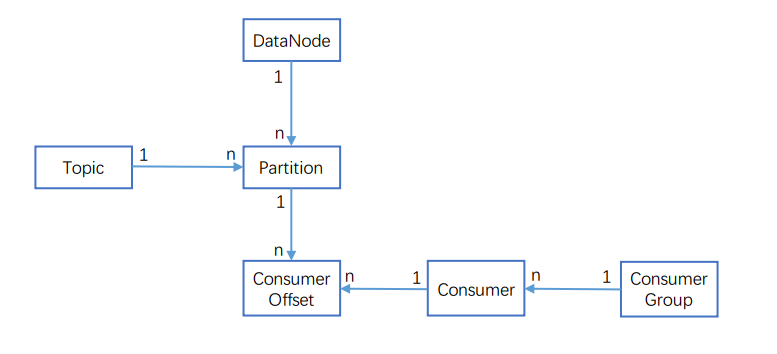

#### PMQ 2.0 总体架构

- Broker 节点，是无状态的，按需扩展

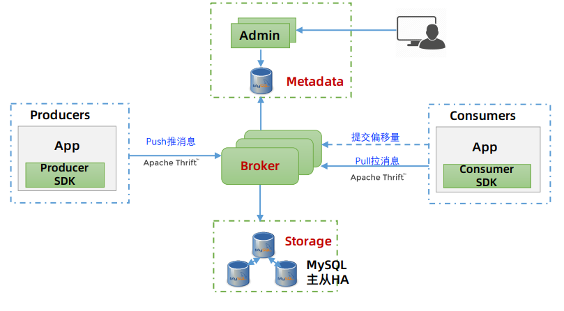

#### PMQ 2.0 服务发现

- 分布式系统，具体服务发现功能

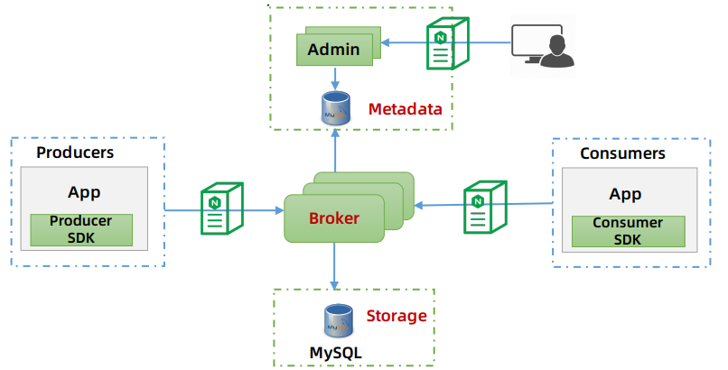

#### Push vs Pull 模式

- 推模式 与 拉模式
- 邮局的邮件 送与取
- 消费者拉模式，较好，最佳实践

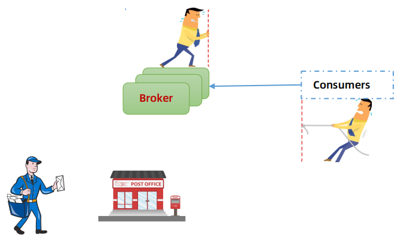

#### Kafka 总体架构

- 拉模式
- 使用 zookper

#### Produces 和 Partition之间的负载均衡

- 保证顺序消费
- Hash 机制可保证相同 key 的消息发往同一个分区，消费者保证顺序消费同一个分区

#### 同一组的 Consumer和Partition之间的负载均衡

- PMQ 2.0 暂时不支持动态重平衡，采用简单分区竞争策略，一个消费者一个分区
- 保证消费者不小于分区的数量，多部署一个消费者

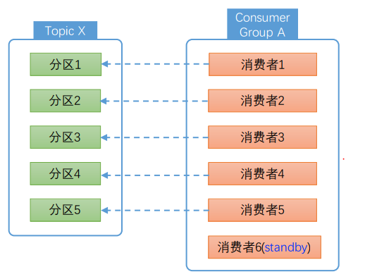

#### 什么是动态重平衡

- 增加消费者，实现分区的动态重新分配

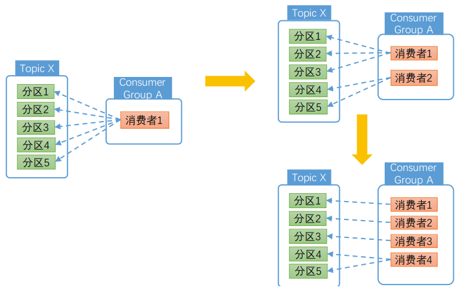

#### 消费者 Internal

- 拉消息 API
- 提交偏移 API
- 心跳检测 API
- 会有消息的重复消费

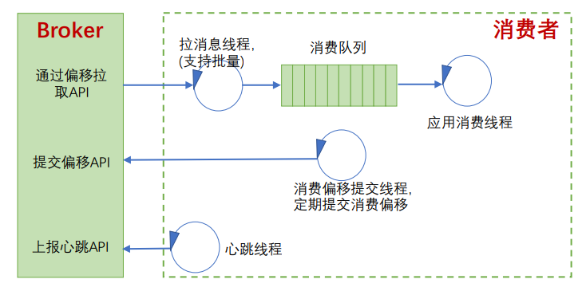

#### 同步和异步 Produce

- 异步性能 >> 同步
- 异步模式，可以实现批量操作，存在批量等待延时

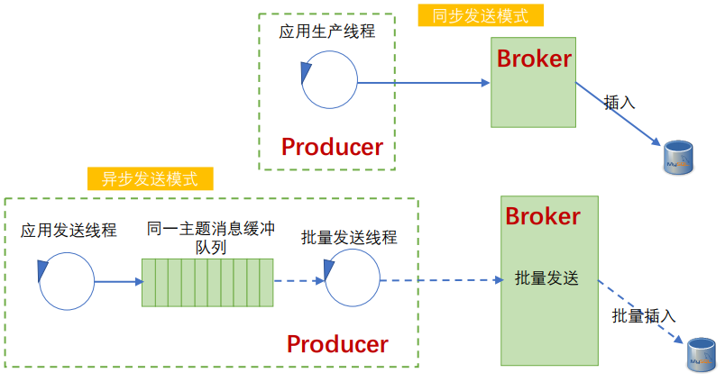

#### HA 保证

- Broker 无状态
- MySQL 消息数据库有DMA通过主从保证HA
- Broker定期同步元数据库中的元数据，元数据库挂，仅影响元数据管理功能,现有生产和消费无影响。
- 管理界面挂，仅影响元数据管理功能，现有生产和消费无影响
- 生产者挂，通过Metrics监控告警提醒
- 消费者挂，或者慢消费(lag监控)，通过Metrics监控告警提醒

#### Lag 堆积监控

- 消费者速度跟不上生产者速度，存量多
- Lag 监控告警
- https://github.com/linkedin/Burrow

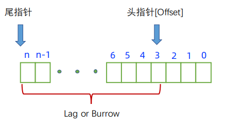

#### 性能和扩展性

- 消费者拉模式吞吐第一
  - 消费支持批量拉(batch pull)，只要消费足够快，理论无延迟(消息越多越快)
- 同步生产理论无延迟，异步生产秒级延迟
- 数据库插入不锁表，异步插入性能更好，除自增顺序号无其它索引
- 生产者快,或者消费慢，扩容增加分区队列分摊负载
- 同步生产慢，可以开启异步生产
- DB节点压力大，增加更多DB节点分摊负载
  - 支持分区迁移(设置分区为只读)

#### 性能测试分析

- 同步生产，普通单机测试可达1k/秒吞吐(消息1k)
- 异步生产，普通单机测试可达10k/秒吞吐(消息1k, batch=10)
- 批量消费，普通单机测试可达10k/秒吞吐(消息1k, batch=10)
- 异步生产性能>>优于同步
  - 实时事务型应用，建议同步，但是吞吐量降低
  - 吞吐型日志型应用，建议异步，但是有秒级延迟

#### 隔离性

- 分区通过表隔离，一个分区对应一个表，不同主题/分区互不干扰
- 消费端拉消息, Broker无状态，消费端天然隔离
- 消费者组维护各自的消费偏移,互不干扰

#### PMQ 2.0  vs Kafka

- PMQ 2.0  是简化版的 Kafka

|                | PMQ 2.0                                       | Kafka                        |
| -------------- | --------------------------------------------- | ---------------------------- |
| 队列持久化     | MySQL                                         | 文件                         |
| 通讯层         | Thrift                                        | 定制NIO协议                  |
| 元数据分区管理 | MySQL+静态分配                                | ZK动态管理                   |
| 消费者负载均衡 | 通过ip+进程号竞争分配 （1 consumer <> 1 queue | 动态重平衡                   |
| 消费状态存储   | 客户端+MySQL                                  | 客户端+ZK或Broker            |
| 消息HA         | 依赖MySQL HA                                  | 在不同Broker上存多份消息拷贝 |

### PMQ 3.0 的演进

#### PMQ 3.0 规划（2018）

- 消费者动态重平衡(P1)
- 调整消费偏移无需重启消费者(P1)
- 运维治理→研发自助(P1)
-  .Net转Java(P1)
- 完善失败消息处理(P1)
- 延迟消息(P2)
- 生产者异步持久化(P2)
- 开源(P2)
- 灵活消息查询ELK(P3)
- 消息轨迹可视化(P3)
- 事务消息?(P3)
- https://github.com/ppdaicorp/pmq
- https://github.com/ppdaicorp/pmq/wiki

#### 当前生产细节（PMQ 3.0/2020.5）

- 当前15(5主+10从)个DB物理机(4Oc)，20台Broker虚拟机。
- 一个DB节点10个库，一个库99张表，一个DB支持990个分区
- 消息保持7天后删除老消息(定时器)
- 单表100万消息OK，7天可支持700~1000万消息
- 分区个数估算，先估算topic每日消息量，除以100万，例如预估日700万消息，则预分配7个分区队列。测试环境一律2个分区。
- 日消息发送3亿，消费 6亿

### Kafka的动态重平衡是如何工作的？

#### Kafka Rebalance Protocol

- 分布式算法：动态组成员的资源分配问题
- Rebalance/Rebalancing: the procedure that is followed by a number of distributed processes that use Kafka clients and/or the Kafka coordinator to form a common group and distributea set of resources among the member of the group (source :lncremental Cooperative Rebalancing: Support and Policies)

#### 分区-消费者场景

- 对不同的分区，根据消费者的个数，动态分配

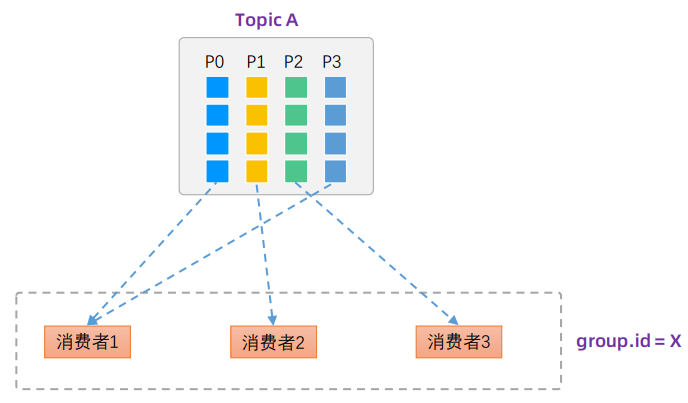

#### Kafka 重平衡协议和组件

- 自定义实现重平衡协议

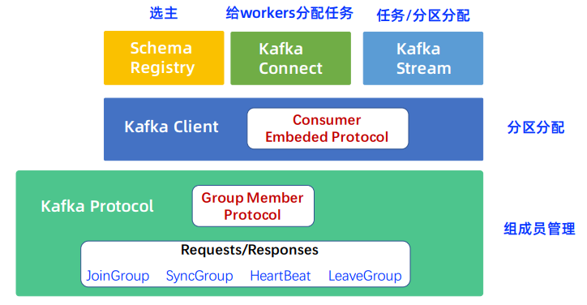

#### Protocol：JoinGroup Request

- 选出协调者 Coordinator，保证确定消费者的状态，组织消费者

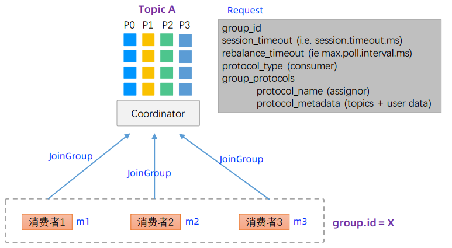

#### Protocol：JoinGroup Response

- 协调者 Coordinator 等一会，类似于屏障（barrier），
- 当消费者不变的时候，再从消费者中选出一个 Leader

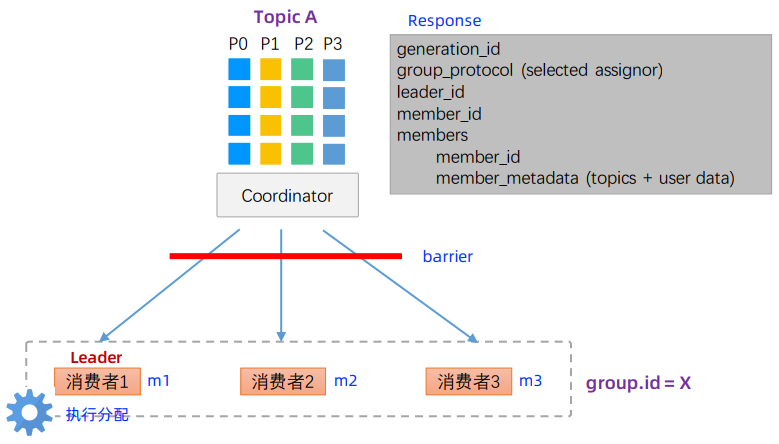

#### Protocol：SyncGroup Request

- 进行不同分区的请求

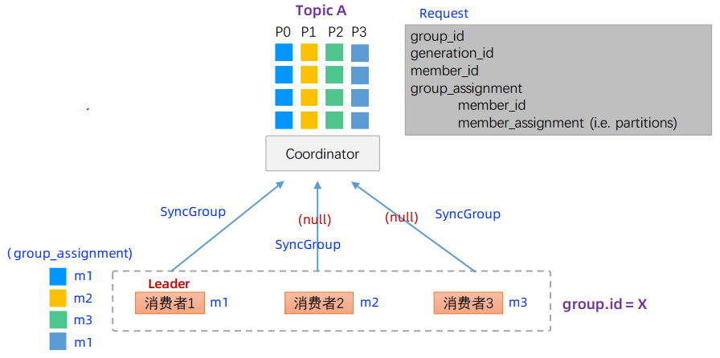

#### Protocol：SyncGroup Response

- 进行不同分区的响应

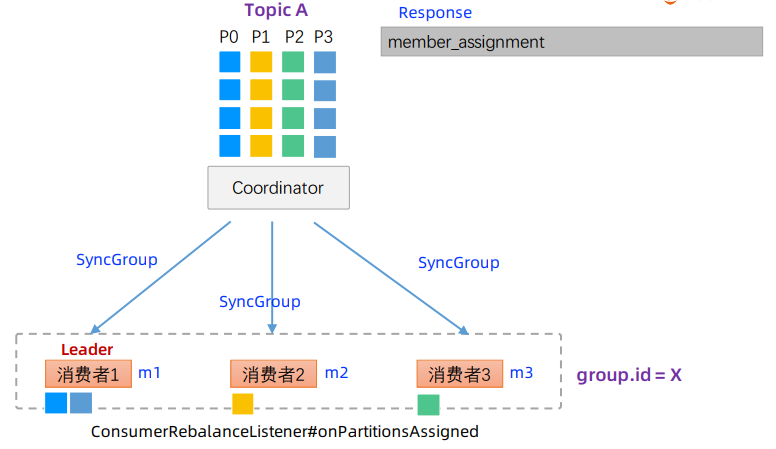

#### Protocol：Heartbeat

- 心跳检测，保证服务正常

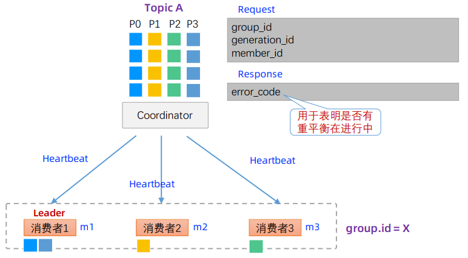

#### Protocol：LeaveGroup

- stop the world 效应
- 当有消费者离开消费组的时候，全部消费者停止消费，重新进行分配，重新进行分配周期

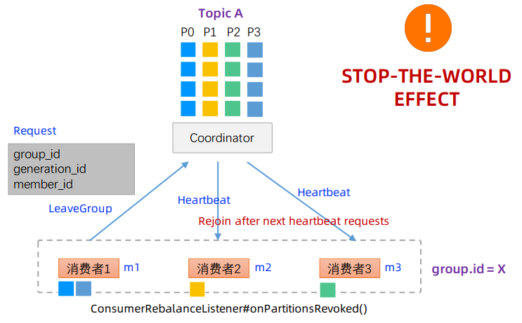

#### Rebalance

- 当经过了充分分配的周期之后，进入了新的平衡状态

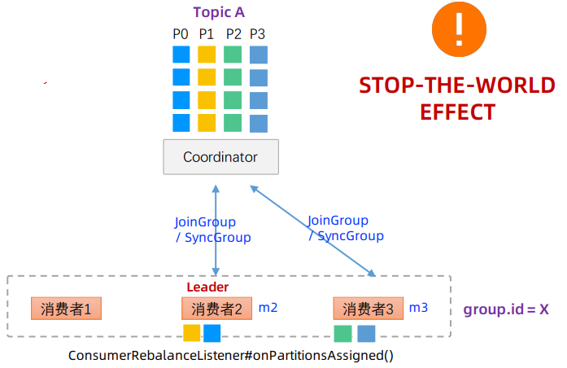

#### JoinGroup Again

- 当某个消费者，又连接成功到 coordinator的时候
- 重新进行分区与消费者分配，再一次 Stop the world

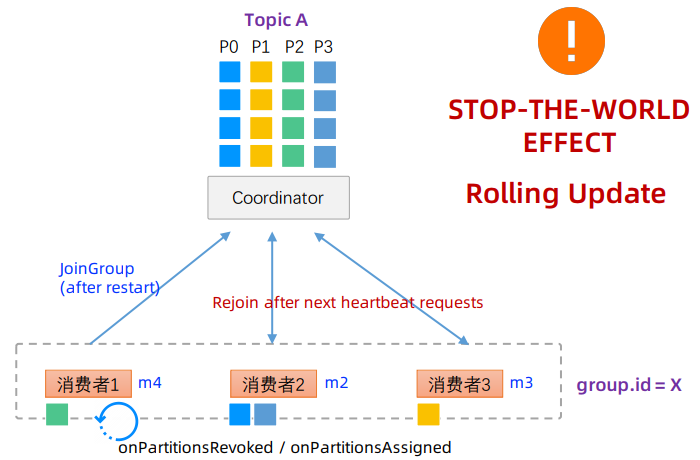

#### Timeout

- 根据两个参数判断，消费者是否死掉

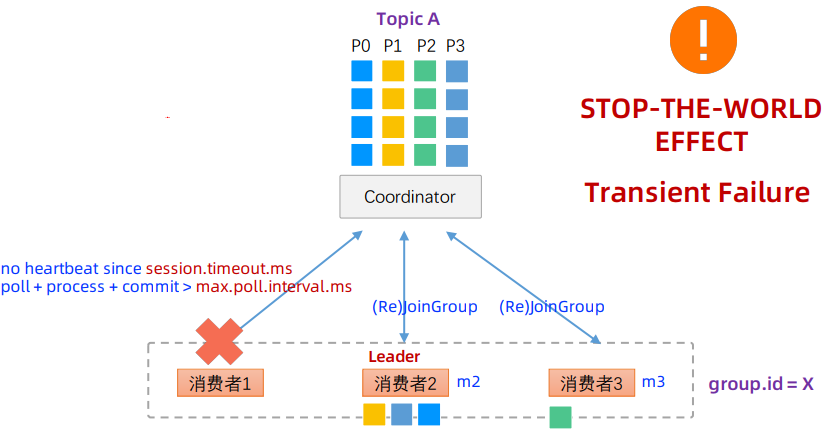

#### Kafka 重平衡优化

- Static Membership
- Incremental Cooperative Rebalabcing
- Apache Kafka Rebalance Protocol, or the magic behind your streams applications：https://medium.com/streamthoughts/apache-kafka-rebalance-protocol-or-the-magic-behind-your-streams-applications-e94baf68e4f2

#### 动态重平衡 in PMQ 3.0

- 简化版动态重平衡

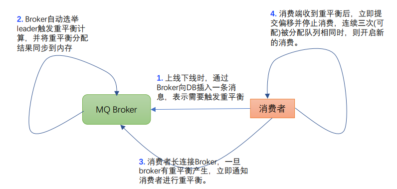

### 消息队列设计和治理最佳实践

#### 推Push vs 拉Pull

- 推，Broker 有状态，客户端简单
- 拉，Broker 无状态，将复杂性放在消费端

#### 泳道和舱壁隔离

- 隔离，功能与业务
- Hystrics

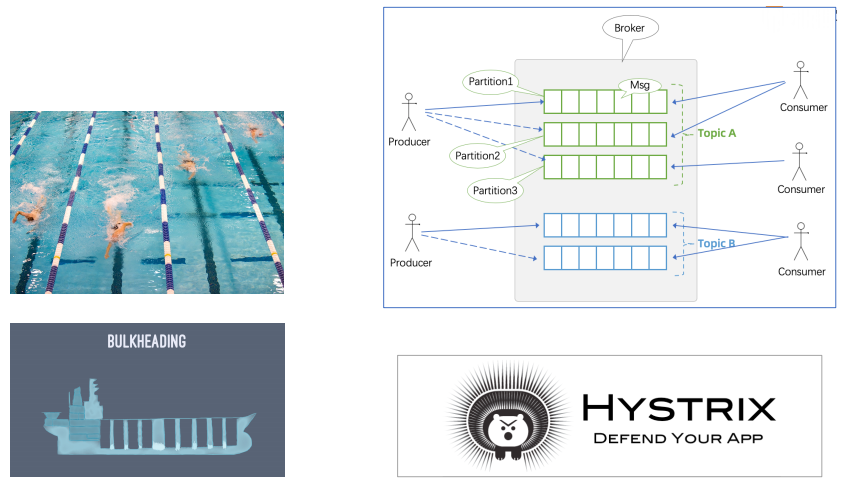

#### 延迟 vs 吞吐

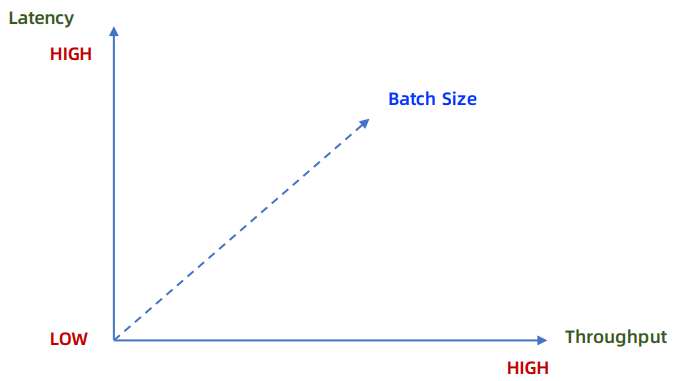

#### 动态重平衡协议

#### 核心基础设施要自研 or 定制

- PMQ 2.0  是简化版的 Kafka

|                | PMQ 2.0                                       | Kafka                        |
| -------------- | --------------------------------------------- | ---------------------------- |
| 队列持久化     | MySQL                                         | 文件                         |
| 通讯层         | Thrift                                        | 定制NIO协议                  |
| 元数据分区管理 | MySQL+静态分配                                | ZK动态管理                   |
| 消费者负载均衡 | 通过ip+进程号竞争分配 （1 consumer <> 1 queue | 动态重平衡                   |
| 消费状态存储   | 客户端+MySQL                                  | 客户端+ZK或Broker            |
| 消息HA         | 依赖MySQL HA                                  | 在不同Broker上存多份消息拷贝 |

#### MQ 治理最佳实践

- 研发自助治理
  - 主题/分区申请，扩容，监控
- 堆积(lag)监控告警
- 动态偏移调整
- 失败消息处理
  - 死信(dead letter)队列
- 线上测试+监控
  - https://github.com/linkedin/kafka-monitor

## 如何解决微服务的数据一致性和事务问题

### 微服务的四大技术难题是什么？

#### 微服务四大技术难题

> 最难的部分和数据（状态）有关

- 数据一致性分发
- 数据聚合Join
- 分布式事务
- 单体系统解耦拆分

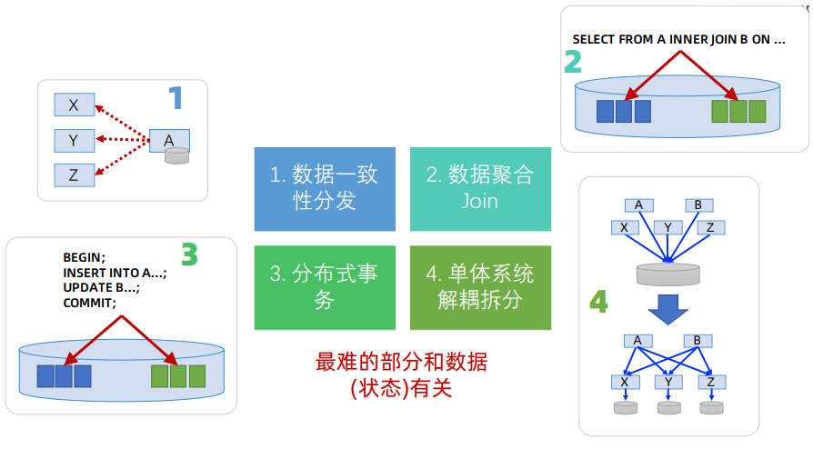

### 如何解决微服务的数据一致性分发问题？

#### 为啥要分发数据？场景？

- 更新缓存
- 同步到其他服务
- 同步到搜索引擎
- 同步到数据仓库
- 数据复制（replication）
- 支持数据库拆分迁移
- 实现CQRS/去数据库Join
- 实现分布式事务 
- 流计算
- 大数据BI/AI
- 审计日志，历史归档

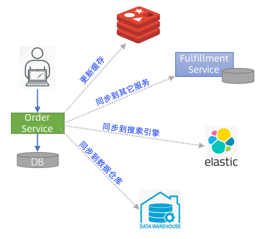

#### 双写？

- 双写的时候，如何保证事务性？

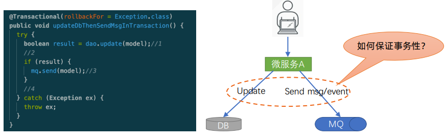

#### 模式一：事务性发件箱（Transactional Outbox）

- 保证两个动作的事务性
- 需要在 MQ 实现 幂等性

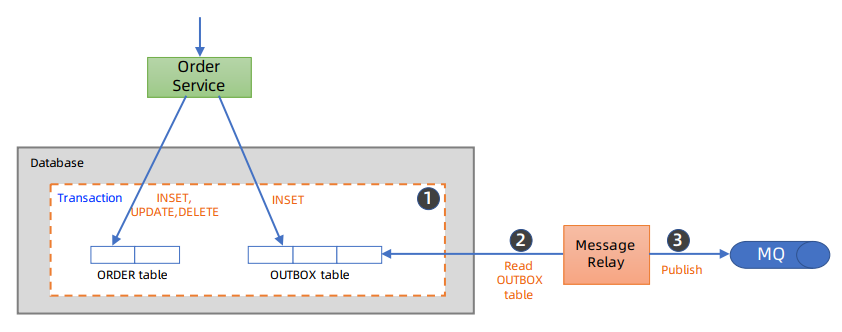

#### Transactional Outbox 参考实现~Killbill Common Queue

- 基于集中式数据库实现
- https://github.com/killbill/killbill-commons/tree/master/queue

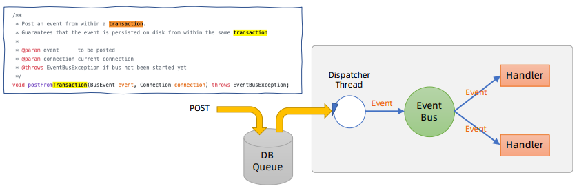

#### Reaper机制

- 收割机线程，Reaper
- 查看无人处理的任务，标记为自己的任务，保证高可用
- https://github.com/killbill/killbill-commons/tree/master/queue

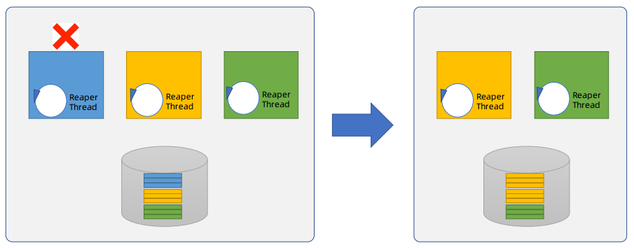

#### Killbill PersistentBus表结构

- https://github.com/killbill/killbill-commons/blob/master/queue/src/main/resources/org/killbill/queue/ddl.sql

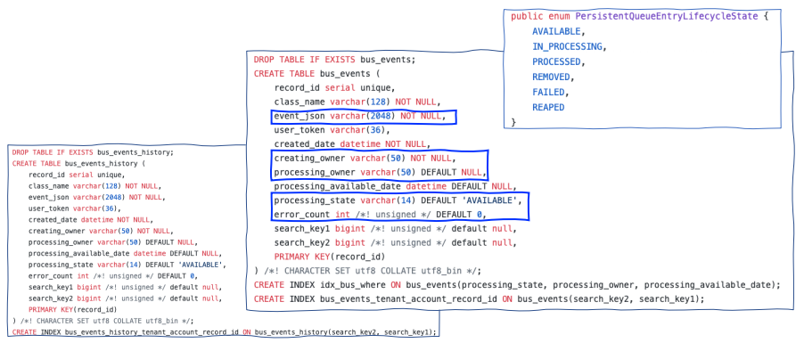

#### Killbill PersistentBus处理状态迁移

- 处理状态的状态图
- 有失误状态重试最大次数

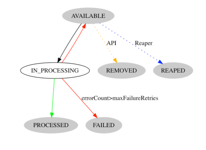

#### 模式二：变更数据捕获（Change Data Capture，CDC）

- 使用变更的日志，进行捕获
- 实现两个事件的事务

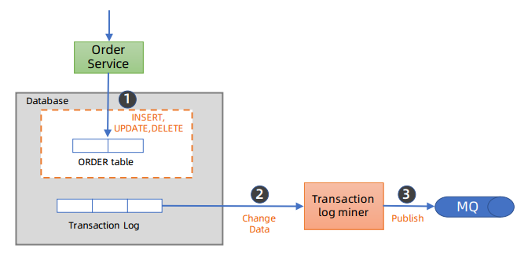

#### CDC开源项目（企业级）

- 推荐生产使用，阿里 Canal
- https://github.com/alibaba/canal
- Redhat Debezium
- https://github.com/debezium/debezium
- Zzendesk Maxwell
- https://github.com/zendesk/maxwell
- Airbnb SpinalTap
- https://github.com/airbnb/SpinalTap

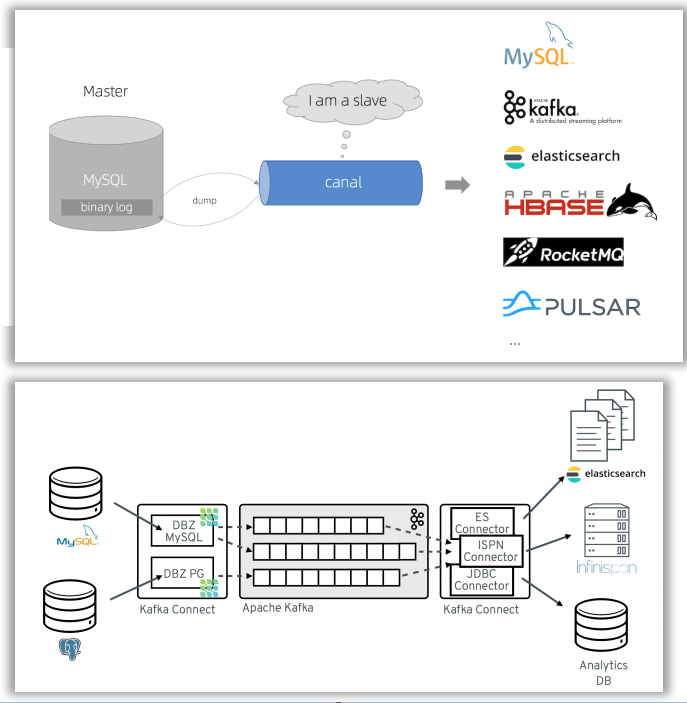

#### 学习参考~Eventuate-Tram

- 微服务架构设计模式
- http://www.chrisrichardson.net/
- https://eventuate.io/

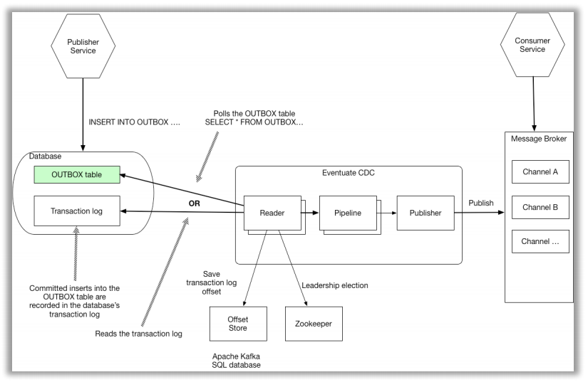

#### Transactional Outbox vs CDC

|                   | Transaction Outbox     | CDC                              |
| ----------------- | ---------------------- | -------------------------------- |
| 复杂性            | 相对简单               | 复杂（高可用/监控）              |
| Pulling延迟和开销 | 近实时，有一定性能开销 | 较实时，性能开销小               |
| 应用侵入性        | 有                     | 无                               |
| 适合场合          | 早期/中小规模          | 中大规模，有独立框架团队治理维护 |

#### Single Source of Truth

- 也称Single System of Record
  - 某一个服务是某些数据的唯一主人
  - 该服务是数据的权威记录系统(canonical system of record)
  - 其它的数据拷贝都是只读，非权威的缓存(read-only, non-authoritative cache)

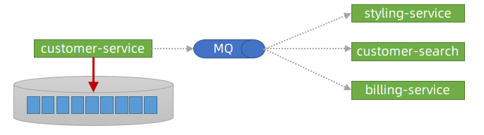

### 如何解决微服务的数据聚合Join问题？

#### 单库Join的问题

- join 会引入 笛卡尔积等

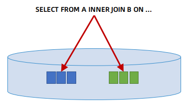

#### 分布式聚合Join的问题

- 聚合层（Aggregator），BFF（Backend for Frontend）层
- N+1问题，一个数据库查一次，一个数据库查n次
- 数据量问题
- 性能开销问题

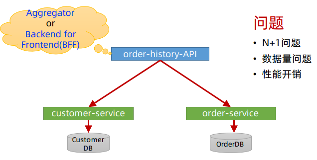

#### Denormalize + Materialize the View

- 数据分发技术
- 反正规化 + 物化视图
- 预聚合技术

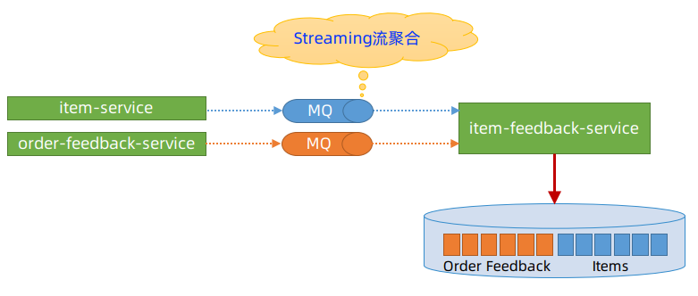

#### CQRS（Command Query ）模式

- 服务层的读写模式
- 命令查询的责任分离 Command Query Responsibility Segregation (简称CQRS)

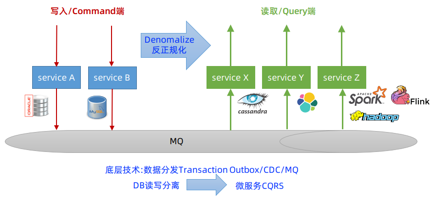

#### CQRS 和最终一致性

- UI 更新问题
- At Least Once 语义
  - 客户端幂等
- 最终一致性，引入时间差问题

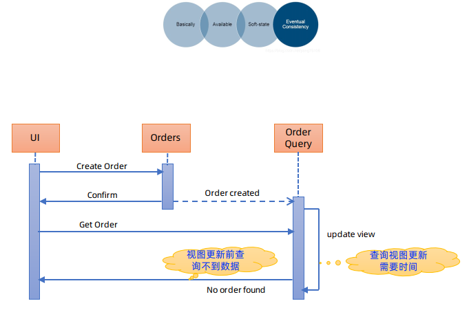

#### CQRS 和 UI 更新策略

- 乐观更新 Optimistic update
- 拉模式 Pull
- 发布订阅模式 Publish-subscribu

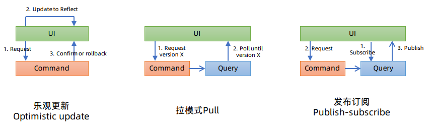

#### 网站架构 2005 vs 2016

- 2016 年架构只是在 2005年的基础上变得更加复杂而已，种类更多，基本流程还是没有变化的

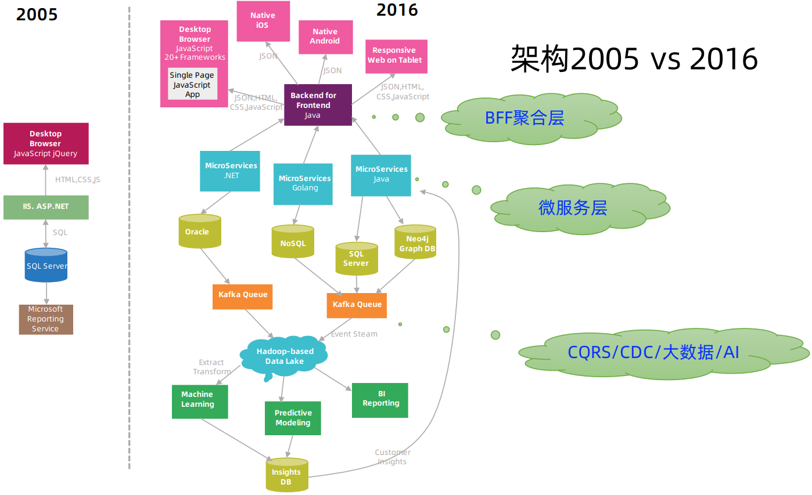

### 如何解决微服务的分布式事务问题？

