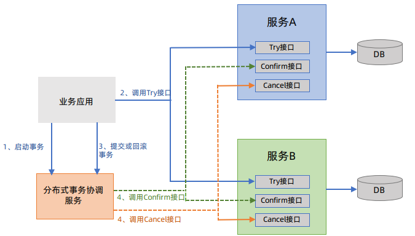
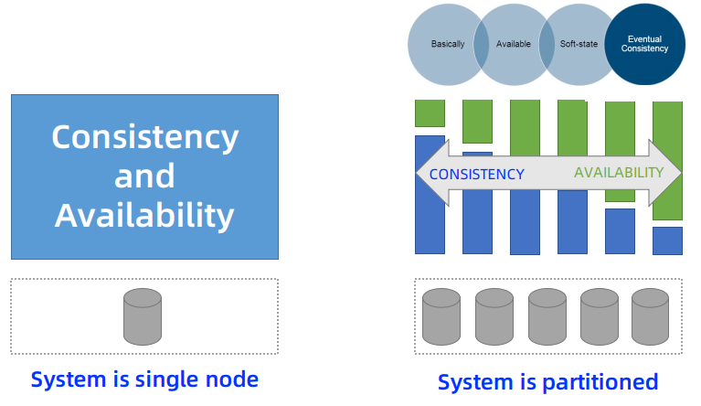
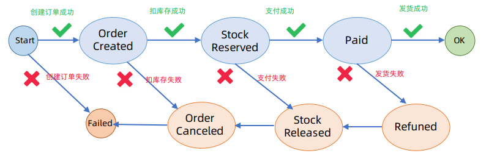
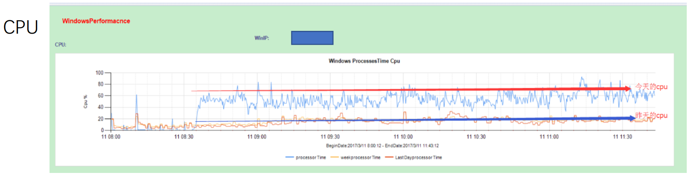
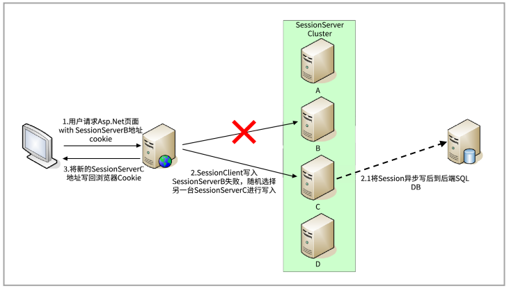

# Microservice Distributed System

## 如何设计一个分布式技术服务-系统设计面试案例

### 需求设计和简化架构

#### 面试题

如何设计一个视频观看量，关注量，应用请求量的技术系统。


#### 需求沟通

考察点：主动性和沟通能力。

由于不同技术背景的人，熟悉的技术不一样，所以需要进一步明确需求。


#### 需求澄清

- 场景用例
- 量级规模
- 性能
- 成本


#### 功能需求-API

- 处理需求，对视频观看计数
- 查询需求：按照时间段返回视频观看数量


#### 非功能需求

- 规模
- 性能
- 高可用
- 水平按需扩展
- 低成本


#### 从简化架构开始

- 抽象出的服务：计数服务，查询服务
- 操作的是数据：数据库


### 存储设计

#### 存什么？

- 单个事件的数据
- 聚合数据


#### 数据库选型

- 可扩展
- 高性能
- 高可用
- 一致性
- 成本
- 学习门槛


#### SQL数据库+客户端嵌入代理

- ShardingSphere
- 将计数服务，路由到MySQL主节点上，写入数据
- 将查询服务，路由到MySQL从结点上，读取数据


#### SQL数据库+独立部署代理层

- ShardingSphere
- 记录数据库存储配置，有一个配置注册中心
- 分别进行计数服务和查询服务的路由


#### NoSQL数据库（Cassandra）

- 随机选择一个Node进行判断，写入的Node
- 仲裁写，多数写好，就表示已经写好了
- 一致性读，多个数据中心复制备份


#### 表设计

- SQL数据库，表之间的关联，join
- NOSQL数据库，数据冗余，


### 计数服务设计

#### 计数服务如何实现

- 可扩展性
- 高性能
- 高可用


#### 数据聚合（aggregation）基础

- 一般采用预聚合
- 请求pull，拉模式，引入消息队列


#### 消息队列基础

- Kafka
- 类似于数组，偏移量，消费指针，检查点
- 分区，对同一个主题，开多个分区，进行消息分摊


#### 计数消费者（详细设计）

- 数据聚合运算，使用内存中的concurrentHashmap，进行并发的运算
- 引入Internal的消息队列，作为数据库的缓冲
- DB writer 暂时无法写入数据到 DB 的时候，需要将数据写入 死信队列，保证数据不丢失
- 引入 Enrich Data Cache，将数据进行缓存，字段都写上值之后，在写入到数据库


#### 数据接收路径（Data Ingestion Path）

- API Gateway
- Counting Service，服务代理
- Kafka


#### 数据接收路径上的面试题

- API Gateway，软件Nginx，硬件F5，NDS，注册中心
- 容错限流，Histrix，TopK实时防爬虫
- 消息队列的格式，json，二进制


### 查询服务设计

#### 数据获取路径（Data Retrieval Path）

- 查询服务 Query Services
- 老数据归档（对象存储），2/8原则，近期数据缓存
- 热数据，冷数据


### 技术栈选型

#### 总体流程

- Counting service，计数服务
- Query service，查询服务


#### 技术栈选型

- API Gateway：f5，zuul
- Spring Boot
- Kafka
- redis
- cassandra，hadoop


### 进一步考量和总结

#### 更多面试问题

- 如何定位系统瓶颈？
- 如何监控系统健康状况？（日志，metric，调用链）
- 如何确保线上系统运行结果正确？（两套系统，实时流处理系统+线下批处理系统）
- 如何解决热分区问题？（对视频按照时间分摊）
- 如何监控慢消费？解决？


#### 总结

- 功能需求
- 非功能需求
- 总体设计
- 详细设计
- 评估


#### 扩展

- 监控系统
- 欺诈检测系统
- 限流系统
- 推荐系统
- 今日热点


### 参考

- System Design Interview – Step By Step Guide：https://www.youtube.com/watch?v=bUHFg8CZFws
- The System Design Primer：https://github.com/donnemartin/system-design-primer
- Consistent Hash Implementation in Java：https://github.com/Jaskey/ConsistentHash


## 如何设计一个简化版Kafka消息队列-拍拍贷PMQ设计演进案例

### 消息队列PMQ 2.0的项目背景

#### 挑战1~PMQ 1.0（2016.8）

- 一套Kafka 系统
- 一套 redis 系统


#### 挑战2

- 业务驱动
- 微服务与事件驱动架构


#### 为啥不要Meta Q /Rocket MQ?

- 阿里 Rocket MQ
- 无 C# 客户端，通讯协议复杂，定制 C# 客户端非常困难
- 复杂
  - 依赖 ZK/ NameServer
  - 支持事务消息
- 代码质量一般


#### 为什么不要 Kafka？

- 重且复杂
  - 消息 HA 多份拷贝存储，Leader/Follower 协议
  - 依赖 ZK
  - 代码复杂，Scala 写，普通研发无法深入理解，定制困难
- 不支持企业治理功能，如Topic和业务团队关系管理等
- 不支持高级消息队列特性，比如查消息
- 基于文件存储，适合日志场景，业务场景需要深度定制
- 定制 Kafka 例子
  - https://github.com/allegro/hermes
  - https://github.com/zalando/nakadi


#### 为啥要造轮子？

- 业务消息数据太关键
- 个人原因，需要落地
- 个人背景
  - 携程日志采集平台
  - 个人开源项目 bugqueue/luxun
  - https://github.com/bulldog2011
- 携程 Hermes/ qmq的启发
  - https://github.com/qunarcorp/qmq
  - https://github.com/ctripcorp/hermes


#### 设计目标


#### 设计限制

- 消息顺序性
  - 能保证消息顺序插入，保证相同分区的消息是顺序的（排除网络延迟），但是多个分区之间可能是乱序的
  - 消息并行消费或者多个分区并行消费，消息消费顺序可能是乱序的
- 消费语义
  - At Least Once 至少一次交付
  - 消费者挂或者重启，没有及时提交消费偏移，重启后可能接收到少量重复消息，消费者端业务方要做幂等处理


### PMQ 2.0的设计

#### 理解队列 Queue

- 入队，出队
- 头指针，尾指针
- https://github.com/bulldog2011/bigqueue


#### Queue 和 Topic（Fanout）语义

-  不同的头指针，Fanout


#### 核心概念模型

- 对 Queue 进行分区（Partution）
- 生产者与消费者关系


#### 理解消费者组

- Consumer Group
- 消费组之间互不影响，消费进度各不相同
- 限定，每一个消费者组中的消费者，不能消费同一个Topic的同一个Partition


#### 存储设计

- 数据结点 DataNode（数据库），创建 Patation（数据库表）
- 绑定到Topic
- 最多 99个 Patation


#### 分区队列实现

- 使用数据库实现
- 数据库表字段，自增主键，索引


#### 元数据模型

- 数据之间的关系


#### PMQ 2.0 总体架构

- Broker 节点，是无状态的，按需扩展


#### PMQ 2.0 服务发现

- 分布式系统，具体服务发现功能


#### Push vs Pull 模式

- 推模式 与 拉模式
- 邮局的邮件 送与取
- 消费者拉模式，较好，最佳实践


#### Kafka 总体架构

- 拉模式
- 使用 zookper


#### Produces 和 Partition之间的负载均衡

- 保证顺序消费
- Hash 机制可保证相同 key 的消息发往同一个分区，消费者保证顺序消费同一个分区


#### 同一组的 Consumer和Partition之间的负载均衡

- PMQ 2.0 暂时不支持动态重平衡，采用简单分区竞争策略，一个消费者一个分区
- 保证消费者不小于分区的数量，多部署一个消费者


#### 什么是动态重平衡

- 增加消费者，实现分区的动态重新分配


#### 消费者 Internal

- 拉消息 API
- 提交偏移 API
- 心跳检测 API
- 会有消息的重复消费


#### 同步和异步 Produce

- 异步性能 >> 同步
- 异步模式，可以实现批量操作，存在批量等待延时


#### HA 保证

- Broker 无状态
- MySQL 消息数据库有DMA通过主从保证HA
- Broker定期同步元数据库中的元数据，元数据库挂，仅影响元数据管理功能,现有生产和消费无影响。
- 管理界面挂，仅影响元数据管理功能，现有生产和消费无影响
- 生产者挂，通过Metrics监控告警提醒
- 消费者挂，或者慢消费(lag监控)，通过Metrics监控告警提醒


#### Lag 堆积监控

- 消费者速度跟不上生产者速度，存量多
- Lag 监控告警
- https://github.com/linkedin/Burrow


#### 性能和扩展性

- 消费者拉模式吞吐第一
  - 消费支持批量拉(batch pull)，只要消费足够快，理论无延迟(消息越多越快)
- 同步生产理论无延迟，异步生产秒级延迟
- 数据库插入不锁表，异步插入性能更好，除自增顺序号无其它索引
- 生产者快,或者消费慢，扩容增加分区队列分摊负载
- 同步生产慢，可以开启异步生产
- DB节点压力大，增加更多DB节点分摊负载
  - 支持分区迁移(设置分区为只读)


#### 性能测试分析

- 同步生产，普通单机测试可达1k/秒吞吐(消息1k)
- 异步生产，普通单机测试可达10k/秒吞吐(消息1k, batch=10)
- 批量消费，普通单机测试可达10k/秒吞吐(消息1k, batch=10)
- 异步生产性能>>优于同步
  - 实时事务型应用，建议同步，但是吞吐量降低
  - 吞吐型日志型应用，建议异步，但是有秒级延迟


#### 隔离性

- 分区通过表隔离，一个分区对应一个表，不同主题/分区互不干扰
- 消费端拉消息, Broker无状态，消费端天然隔离
- 消费者组维护各自的消费偏移,互不干扰


#### PMQ 2.0  vs Kafka

- PMQ 2.0  是简化版的 Kafka

|                | PMQ 2.0                                       | Kafka                        |
| -------------- | --------------------------------------------- | ---------------------------- |
| 队列持久化     | MySQL                                         | 文件                         |
| 通讯层         | Thrift                                        | 定制NIO协议                  |
| 元数据分区管理 | MySQL+静态分配                                | ZK动态管理                   |
| 消费者负载均衡 | 通过ip+进程号竞争分配 （1 consumer <> 1 queue | 动态重平衡                   |
| 消费状态存储   | 客户端+MySQL                                  | 客户端+ZK或Broker            |
| 消息HA         | 依赖MySQL HA                                  | 在不同Broker上存多份消息拷贝 |


### PMQ 3.0 的演进

#### PMQ 3.0 规划（2018）

- 消费者动态重平衡(P1)
- 调整消费偏移无需重启消费者(P1)
- 运维治理→研发自助(P1)
-  .Net转Java(P1)
- 完善失败消息处理(P1)
- 延迟消息(P2)
- 生产者异步持久化(P2)
- 开源(P2)
- 灵活消息查询ELK(P3)
- 消息轨迹可视化(P3)
- 事务消息?(P3)
- https://github.com/ppdaicorp/pmq
- https://github.com/ppdaicorp/pmq/wiki


#### 当前生产细节（PMQ 3.0/2020.5）

- 当前15(5主+10从)个DB物理机(4Oc)，20台Broker虚拟机。
- 一个DB节点10个库，一个库99张表，一个DB支持990个分区
- 消息保持7天后删除老消息(定时器)
- 单表100万消息OK，7天可支持700~1000万消息
- 分区个数估算，先估算topic每日消息量，除以100万，例如预估日700万消息，则预分配7个分区队列。测试环境一律2个分区。
- 日消息发送3亿，消费 6亿


### Kafka的动态重平衡是如何工作的？

#### Kafka Rebalance Protocol

- 分布式算法：动态组成员的资源分配问题
- Rebalance/Rebalancing: the procedure that is followed by a number of distributed processes that use Kafka clients and/or the Kafka coordinator to form a common group and distributea set of resources among the member of the group (source :lncremental Cooperative Rebalancing: Support and Policies)


#### 分区-消费者场景

- 对不同的分区，根据消费者的个数，动态分配


#### Kafka 重平衡协议和组件

- 自定义实现重平衡协议


#### Protocol：JoinGroup Request

- 选出协调者 Coordinator，保证确定消费者的状态，组织消费者


#### Protocol：JoinGroup Response

- 协调者 Coordinator 等一会，类似于屏障（barrier），
- 当消费者不变的时候，再从消费者中选出一个 Leader


#### Protocol：SyncGroup Request

- 进行不同分区的请求


#### Protocol：SyncGroup Response

- 进行不同分区的响应


#### Protocol：Heartbeat

- 心跳检测，保证服务正常


#### Protocol：LeaveGroup

- stop the world 效应
- 当有消费者离开消费组的时候，全部消费者停止消费，重新进行分配，重新进行分配周期


#### Rebalance

- 当经过了充分分配的周期之后，进入了新的平衡状态


#### JoinGroup Again

- 当某个消费者，又连接成功到 coordinator的时候
- 重新进行分区与消费者分配，再一次 Stop the world


#### Timeout

- 根据两个参数判断，消费者是否死掉


#### Kafka 重平衡优化

- Static Membership
- Incremental Cooperative Rebalabcing
- Apache Kafka Rebalance Protocol, or the magic behind your streams applications：https://medium.com/streamthoughts/apache-kafka-rebalance-protocol-or-the-magic-behind-your-streams-applications-e94baf68e4f2


#### 动态重平衡 in PMQ 3.0

- 简化版动态重平衡


### 消息队列设计和治理最佳实践

#### 推Push vs 拉Pull

- 推，Broker 有状态，客户端简单
- 拉，Broker 无状态，将复杂性放在消费端


#### 泳道和舱壁隔离

- 隔离，功能与业务
- Hystrics


#### 延迟 vs 吞吐


#### 动态重平衡协议


#### 核心基础设施要自研 or 定制

- PMQ 2.0  是简化版的 Kafka

|                | PMQ 2.0                                       | Kafka                        |
| -------------- | --------------------------------------------- | ---------------------------- |
| 队列持久化     | MySQL                                         | 文件                         |
| 通讯层         | Thrift                                        | 定制NIO协议                  |
| 元数据分区管理 | MySQL+静态分配                                | ZK动态管理                   |
| 消费者负载均衡 | 通过ip+进程号竞争分配 （1 consumer <> 1 queue | 动态重平衡                   |
| 消费状态存储   | 客户端+MySQL                                  | 客户端+ZK或Broker            |
| 消息HA         | 依赖MySQL HA                                  | 在不同Broker上存多份消息拷贝 |


#### MQ 治理最佳实践

- 研发自助治理
  - 主题/分区申请，扩容，监控
- 堆积(lag)监控告警
- 动态偏移调整
- 失败消息处理
  - 死信(dead letter)队列
- 线上测试+监控
  - https://github.com/linkedin/kafka-monitor


## 如何解决微服务的数据一致性和事务问题

### 微服务的四大技术难题是什么？

#### 微服务四大技术难题

> 最难的部分和数据（状态）有关

- 数据一致性分发
- 数据聚合Join
- 分布式事务
- 单体系统解耦拆分


### 如何解决微服务的数据一致性分发问题？

#### 为啥要分发数据？场景？

- 更新缓存
- 同步到其他服务
- 同步到搜索引擎
- 同步到数据仓库
- 数据复制（replication）
- 支持数据库拆分迁移
- 实现CQRS/去数据库Join
- 实现分布式事务 
- 流计算
- 大数据BI/AI
- 审计日志，历史归档


#### 双写？

- 双写的时候，如何保证事务性？


#### 模式一：事务性发件箱（Transactional Outbox）

- 保证两个动作的事务性
- 需要在 MQ 实现 幂等性


#### Transactional Outbox 参考实现~Killbill Common Queue

- 基于集中式数据库实现
- https://github.com/killbill/killbill-commons/tree/master/queue


#### Reaper机制

- 收割机线程，Reaper
- 查看无人处理的任务，标记为自己的任务，保证高可用
- https://github.com/killbill/killbill-commons/tree/master/queue


#### Killbill PersistentBus表结构

- https://github.com/killbill/killbill-commons/blob/master/queue/src/main/resources/org/killbill/queue/ddl.sql


#### Killbill PersistentBus处理状态迁移

- 处理状态的状态图
- 有失误状态重试最大次数


#### 模式二：变更数据捕获（Change Data Capture，CDC）

- 使用变更的日志，进行捕获
- 实现两个事件的事务


#### CDC开源项目（企业级）

- 推荐生产使用，阿里 Canal
- https://github.com/alibaba/canal
- Redhat Debezium
- https://github.com/debezium/debezium
- Zzendesk Maxwell
- https://github.com/zendesk/maxwell
- Airbnb SpinalTap
- https://github.com/airbnb/SpinalTap


#### 学习参考~Eventuate-Tram

- 微服务架构设计模式
- http://www.chrisrichardson.net/
- https://eventuate.io/


#### Transactional Outbox vs CDC

|                   | Transaction Outbox     | CDC                              |
| ----------------- | ---------------------- | -------------------------------- |
| 复杂性            | 相对简单               | 复杂（高可用/监控）              |
| Pulling延迟和开销 | 近实时，有一定性能开销 | 较实时，性能开销小               |
| 应用侵入性        | 有                     | 无                               |
| 适合场合          | 早期/中小规模          | 中大规模，有独立框架团队治理维护 |


#### Single Source of Truth

- 也称Single System of Record
  - 某一个服务是某些数据的唯一主人
  - 该服务是数据的权威记录系统(canonical system of record)
  - 其它的数据拷贝都是只读，非权威的缓存(read-only, non-authoritative cache)


### 如何解决微服务的数据聚合Join问题？

#### 单库Join的问题

- join 会引入 笛卡尔积等


#### 分布式聚合Join的问题

- 聚合层（Aggregator），BFF（Backend for Frontend）层
- N+1问题，一个数据库查一次，一个数据库查n次
- 数据量问题
- 性能开销问题


#### Denormalize + Materialize the View

- 数据分发技术
- 反正规化 + 物化视图
- 预聚合技术


#### CQRS（Command Query ）模式

- 服务层的读写模式
- 命令查询的责任分离 Command Query Responsibility Segregation (简称CQRS)


#### CQRS 和最终一致性

- UI 更新问题
- At Least Once 语义
  - 客户端幂等
- 最终一致性，引入时间差问题


#### CQRS 和 UI 更新策略

- 乐观更新 Optimistic update
- 拉模式 Pull
- 发布订阅模式 Publish-subscribu


#### 网站架构 2005 vs 2016

- 2016 年架构只是在 2005年的基础上变得更加复杂而已，种类更多，基本流程还是没有变化的


### 如何解决微服务的分布式事务问题？

#### 单机DB事务 -> 分布式事务

- 订单表与库存表，一个事务保证操作没错


#### ACID事务保证

- 原子性 Atomicity
- 一致性 Consistency
- 隔离性 Isolation
- 持久性 Durability


#### 事务隔离级别

- 读未提交 Read Uncommited
- 读已提交 Read Committed
- 可重复读 Repeatable Reads（MySQL默认隔离级别）
- 串行化  Serializable
- 分布式事务从0到1-认识分布式事务：https://www.codingapi.com/blog/2020/01/01/txlcn001/


#### 2PC/XA（两阶段提交）

- 两阶段事务
- 第一阶段，准备阶段
- 第二阶段，提交事务，或者回滚事务
- XA，分布式两阶段提交，一个二阶段提交协议的规范
- 阿里 Seate 是一种优化版 2PC


#### 2PC 样例

- 基于 Atomikos 实现股票交易分布式事务
- 分布式事务样例：Atomikos + Spring + MySQL + ActiveMQ + DerbySpring
- 事务传播行为：https://github.com/Apress/practical-microservices-architectural-patterns/tree/master/Christudas_Ch13_Source/ch13/ch13-01/XA-TX-Distributed


#### TCC

- 一种2PC变体， 约等于 应用层/服务层 2PC
- 另一种分布式事务解决方案
- TCC 简化流程，每一个服务需要实现三个接口，Try接口，confirm接口，Cancel接口




#### CAP 原理

- 系统分区之后，无法同时满足A与C
- CAP：一致性（Consistency）、可用性（Availability）、分区容错性（Partition tolerance）




#### 成年人不用分布式事务（2PC）

- Life Beyond Distributed Transactions -  An apostate's opinion
- 超越分布式事务 - 一个反叛者的观点
- https://queue.acm.org/detail.cfm?id=3025012


#### 微服务时代的事务处理原则

> Saga  模式，分布式事务的解决方案
>
> - 将全局事务建模成一组本地ACID事务
> - 引入事务补偿机制处理失败场景

- 假定网络或者服务不可靠
- 将全局事务建模成一组本地ACID事务
- 引入事务补偿机制处理失败场景
- 事务始终处在一种明确的状态(不管成功还是失败)
- 最终一致
- 考虑隔离性
- 考虑幂等性
- 异步响应式，尽量避免直接同步调用


#### 购物场景状态机（简化）

- 简化事务状态机
- 状态机有明确的状态迁移方案




#### 协同式（Choreography）Saga

- 发消息模式


#### 编排式（Orchestration）Saga

- 有一个编排者，让后续系统，创建事务，做什么事
- 集中的方式


#### 补偿样例1


#### 补偿样例2


#### 协同式（Choreography）vs 编排式（Orchestration）

- 协同式（Choreography），适合小系统
- 编排式（Orchestration），适合大系统，扩展方便
- 芭蕾舞 vs 交响乐


#### Saga不保证隔离性

- 语义锁
- 更多办法参考《微服务架构设计模式》，包括Saga


#### 相关概念

- Saga 引擎
- 微服务编排引擎（Orchestrator）/协调器（Coordinator）
- 工作流引擎
- 状态机引擎
- 分布式事务中间件


### 阿里分布式事务中间件Seata简析

#### Seata 背景

- https://github.com/seata/seata
- 阿里巴巴分布式事务
- 蚂蚁金服分布式事务


#### Seata 概念

- 一个全局分布式事务是由若干个本地分支事务组成


#### Seata 角色

- Transaction Coordinator（TC）
- Transaction Manager（TM）
- Resource Manager（RM）


#### Seata 原理

- XID，在TC中，确定是哪一个分支的事务
- TC 需要保证高可用


#### Seata 事务注解

- Spring 的注解 @Transactional
- Seata 的 @GlobalTransactional
- Seata 的 全局锁机制，@GlobalLock，支持轻量级全局锁定隔离


#### Seata-AT 原理：Phase 1

- 两阶段的第一阶段，SQL事务已经提交


#### Seata-AT 原理：Phase 2 Commit

- 成功提交，找到 Undo log，删除
- 可以异步执行


#### Seata-AT 原理：Phase 2 Rollback

- 失败回滚
- 找到回滚 SQL，执行，并提交回滚
- 可以异步执行


#### Sata 通用分布式事务框架

- 推荐使用 AT Mode


#### Sata 高可用部署

- 部署多台 TC
- 提供注册中心，配置中心
- 基于 Seata 解决微服务架构下数据一致性的实践：https://github.com/seata/seata-samples/tree/master/ha


#### 支持框架、数据库和模式

- RPC
  - Dubbo
  - Spring Cloud
  - Motan
  - SPFA-RPC
  - 自定义RPC框架
- 数据库
  - MySQL，Oracle，postgreSQL，TiDB和RDS系列等
  - AT 模式
- 模式
  - AT（推荐）
  - TCC
  - Saga ~ 异步长事务


#### 参考资料

- Seata PPT 文档
- https://github.com/seata/awesome-seata


### Uber 微服务编排引擎Cadence简析

#### Uber Cadence 背景

- https://github.com/uber/cadence
- Cadence is a distributed, scalable, durable, and highly available orchestration engine to execute asynchronous long-running business logic in a scalable and resilient way.
- https://cadenceworkflow.io/


#### Uber Cadence 主要作者


#### Uber 案例 ~ 小费Tips

- 客户扣钱，司机加钱
- 两次调用保证事务性


#### Tips with Cadence

- Cadence 是一个工作流引擎
- Activity Worker，两个小的事务
- Workflow Worker，驱动全局事务的执行
- Workflow Starter，显示的启用


#### Cadence 编程模式

- Activity
  - 活动，任务Task，处理器 Handler，微服务，Actor，分支事务执行者 
- Workflow
  - 工作流，编排流程，分布式事务流程
  - 长短事务都支持
- Starter
  - 启动，发信号，查询
  - 同步，异步都支持


#### Cadence Activity 功能

- 支持运行任何应用程序代码
- 支持长期运行任务(heartbeating)
- 支持异步执行
- 根据设置的重试策略进行自动重试
- 支持路由到指定的主机或者进程
- 通过队列派遣任务执行
- 支持对worker进行限流
- 支持对queue进行限流


#### Cadence Activity 样例


#### Cadence Workflow 功能

- 支持虚拟对象技术（Virtual Objects）
- 支持事务
- 对活动(Activities)进行编排
- 支持接收外部事件并作出响应
- 有状态(包含局部变量和栈)
- 支持长期运行
- 支持持久化的时钟


#### Cadence Workflow 样例


#### Activity 重试


#### 事务补偿


#### Cadence 客户端库

- java & go
- 无状态
- 屏蔽开发复杂性
- 支持以容错Actor方式开发分布式业务逻辑
  - Distributed business logic programmed as fault tolerant actors 


#### Cadence Web UI ~ 工作流查询

- https://github.com/uber/cadence-web


#### Cadence Web UI ~ 工作流执行细节

- https://github.com/uber/cadence-web
- 类似于 java 语言执行调用栈


#### Cadence 实现 Saga模式

- https://github.com/uber/cadence-java-samples/tree/master/src/main/java/com/uber/cadence/samples/bookingsaga
- 添加补偿，saga.addCompensation()


#### 参考资料

- Cadence: The Only Workflow Platform You'll Ever Need. 
  -  https://www.youtube.com/watch?v=llmsBGKOuWl&t=606sCadence 
- Meetup: Introduction to Cadence
  -  长事务案例UberEATS(送餐服务)
  - https://www.youtube.com/watch?v=-Bulkhlc-RMuber 
- Cadence: Fault Tolerant Actor Framework
  - 长事务案例uDebitReward(司机积分服务)
  - https://www.youtube.com/watch?v=qce_AqCkFys&t=197s
- 更多同步/异步执行样例
  - https://github.com/uber/cadence-java-samples


### 如何理解 Uber Cadence 的架构设计？

#### Cadence 微服务架构

- Matching Service
- History Service
- Cassandra，MySQL


#### Frontend Service

- 相当于一个BFF或者Facade服务
- 大部分透传调用History和Matching Service
- 暴露对全局实体的CRUD操作
- 暴露可视化(Visibility)API


#### Frontend 

- History Service 和 Matching Service 是有状态的
- Ubuer Ringpop：https://github.com/uber/ringpop-go


#### History Service

- 两个队列 Transfer queue 和 Timer queue
- Shard Controller


#### 如何绑定分片（Shard）？


#### Shard RangeID

- Acqure Shard 操作，接着原子操作（CAS） writes，对 range_id +1操作
- 当另一个 Host 加入的时候，继续 Acqure Shard 操作，range_id +1操作
- 原来的 Host 就不能继续 Shard


#### Cadence 为什么要支持事务性分发？


#### Transfer queue

- 实现事务的流转


#### 关键技术 ~ 事务性发件箱

- 事务性发件箱是事务一致性分发的解决方案


#### Cadence 中的分布式问题和技术

- 任务处理器
  - Handler 
  - Actor
  - 微服务
- 发现和路由(Discovery & Routing)
- 负载均衡(Load Balancing)
- 分布式存储
- 分片Shardinng
- 队列机制Queuing
- 事件溯源(Event Sourcing)
- 组成员协议+一致性Hash(Ringpop)
- 持久化Timer(延迟任务)
- 限流和流控


#### 参考资料

- Cadence Meetup: Cadence Architecture
- https://www.youtube.com/watch?v=5M5eiNBUf4Q
- Cadence源码(可以从早期release看起)
- https://github.com/uber/cadence
- 阅读源码：cadence-v0.1.0-beta
- https://github.com/uber/cadence/releases/tag/v0.1.0-beta


### 如何实现遗留系统的解耦拆分？

#### 什么时候该解耦拆分？

- 研发速度(Velocity)
  - 单体耦合系统造成交付效率低下
  - 团队间相互依赖，无法独立交付
  - 新人上手产出很慢
- 扩展(Scaling)
  - 无法再对单体系统进行垂直(vertical)扩展
  - 系统的某些部分需要独立扩展能力
- 部署(Deployment)
  - 系统的某些部分需要独立部署的能力
  - 单体发布太慢、太复杂、风险太高


#### 共享单体 DB ~ StichFix 案例

- GeeCON 2019: Randy Shoup - Scaling yout Architecture with Services and Events
- https://www.youtube.com/watch?v=zVJSTMD6zg0


#### 解耦拆分案例场景


#### 步骤1：创建一个新服务


#### 步骤2：应用走服务调用


#### 不要停在步骤2

- 所有分布式系统的问题
- 所有共享DB的问题
- 没有获得微服务的任何好处


#### 步骤3：迁移到独立DB


#### 步骤4：继续拆分服务


#### 步骤5：继续拆分服务


#### 完成

- 基础领域服务，独立数据源


### 拍拍贷系统拆分项目案例

#### 拆分前

问题：

- 所有数据在同一台数据库服务器上
- 应用可以不通过接口直接访问数据
- 跨库join严重，单点问题
- CPU时常飙高
- 磁盘空间吃紧
- QPS > 4w+(正常1w左右)





#### 拆分后

- 所有应用访问数据库，全部通过服务接口 api


#### 拆分技术1 ~ 接口收口


#### 收口沟通


#### 拆分技术2 ~ 数据库迁移

- 写新DB，读写老DB，数据补偿
- 读写新DB，读写老DB，数据对比
- 读写新DB，写老DB
- 读写新DB，不操作老DB
- 使用 Apollo 配置中心开关


#### DB 监控


#### 迁移技术3 ~ 数据分发去 Join

- 服务层双写
- 分发器，将数据推到相关的业务库中
- MQ，是 消息队列PMQ


#### 拆分迁移关键步骤小节

- 接口收口
- 双写迁移 DB
  - 增量可回滚
  - 数据补偿+对比
- 数据分发去 Join
- 计划 + 梳理 + 沟通  + 监控


### CQRS / CDC 技术在 Netflix 的实践

#### 数据同步和填充平台 Delta

- An eventual consistent, event driven, data synchronization and enrichment platform.
- 基于CDC/CQRS模式
- 场景需求
  - 搜索引擎
  - 数据仓库
  - 事件驱动工作流
- 现有解决办法的问题
  - 双写
    - 需要后台修复程序才能保持一致性
    - 延迟+开销
  - 事务性发件箱+Polling
    - 多语言环境，难以提供标准库
    - 应用侵入性
  - 分布式事务XA
    - 性能和死锁问题
    - 某些系统如ES不支持XA


#### 使用  Delta 之前的 Movice Search

- 查询数据 Movie Service DB
- 数据填充，Deal Service，Talent Service ......


#### 使用  Delta 之后的 Movice Search

- 使用CDC，捕获数据库的变更记录


#### 整体架构


#### DB Log

- CDC 自研产品
- 功能亮点
  - 数据顺序性
    - 全量或部分Dump
    - CDC和Dump可以交替进行
    - 不锁表
    - 各种输出源
    - 高可用部署


#### 参考资料

- Delta: A Data Synchronization and Enrichment Platform
- https://netflixtechblog.com/delta-a-data-synchronization-and-enrichment-platform-e82c36a79aee
- DBLog:A Generic Change-Data-Capture Framework
- https://netflixtechblog.com/dblog-a-generic-change-data-capture-framework-69351fb9099b
- Capturing Data Evolution in a Service Oriented Architecture
- https://medium.com/airbnb-engineering/capturing-data-evolution-in-a-service-oriented-architecture-72f7c643ee6f


### 小结

#### 微服务的四大技术难题


#### 如何解决微服务的数据一致性分发问题？

- 事务性发件箱模式(Transactional Outbox)
- 变更数据捕获(Change Data Capture,CDC)
- 双写?
  - 需要后台校验补偿
- 确保单一真实数据源(Single Source of Truth)


#### 如何解决微服务的数据聚合Join问题？

- BFF聚合层
- 反正规化+流聚合
  - 分布式物化视图(Materialized View)
  - CQRS模式
- CQRS最终一致性
  - UI更新


#### 如何解决微服务的分布式事务问题？

- 2PC/XA/TCC
- Saga模式
  - 协同VS编排
  - 需考虑隔离性
- 主流开源产品
  - 2PC/XA/TCC方案~ Seata
  - 工作流/编排/Saga方案~ Cadence


#### 如何实现遗留系统的解耦拆分？

- 接口收口
- 拆分迁移DB
  - 双写＋开关,增量可回滚
  - 数据补偿＋比对
- 数据分发去Join


## 如何设计一个高并发无状态的会话缓存服务 - 携程SessionServer案例 

### SessionServer 项目背景和目标 

#### 粘性会话（Sticky Session）101

- Session会话机制，保存用户状态信息
- 粘性会话 通过 LB，将用户会话绑定到 对应的应用服务器


#### 粘性会话的问题

- LB  负载相对不均衡
- 应用和负载均衡设备耦合
  - 一道架构的枷锁，任何调整都要考虑到它
- 应用有状态
  - 单点问题
  - 发布问题
  - 难以水平扩展
    - Scale Out
    - 跨数据中心 HA


#### 负载不均衡问题

- Session 请求不均匀，有状态请求

- API  请求监控均衡，无状态请求


#### 诡异的客户慢问题

- 应用服务器有两台慢，刚好用户Session绑定到这两台服务器上
- 由于 LB 的不均衡，导致服务器请求大，资源不足


#### 面试题 ~ 四种常用会话技术

- 粘性会话
- 纯客户端会话（浏览器的Cookie大小限制 4K）
- 服务器共享会话
- 服务器端集中式会话（集中存储）


#### 携程当时现状（2014年初）

- 10000+服务器
- 2000+App
- 80,000,000PV
- Ajax >>PV
- session大小?1K 5K 50K 100K 1M ...
- 20分钟同时在线:6,000,000
- web应用主要基于ASP.Net开发
- https://www.ctrip.com/


#### SessionServer 架构和设计目标

- 消除Sticky Session，支持应用 Scale out（横向扩展）
- 高并发
- 高性能（99.99%<10ms)
- 高可用（HA)
- 水平按需扩展（直接添加服务器就可以实现扩展）
  - 透明扩容
- 透明升级（升级更新SessionServer）
- 支持跨数据中心（同城双活）
- 接入简单（不用改代码)
- 监控和运维友好（全部的监控）


### 总体架构设计

#### Thrift IDL

- ASP.NET state server Protocol
- https://docs.microsoft.com/en-us/openspecs/windows_protocols/ms-asp/83f6b453-c695-419c-998b-0aa50279bc40
- Thrift  二进制的通讯协议


#### 关键设计问题

- SessionID和SessionSever映射关系?
  - 分布式 KV Store
  -  一致性Hash? Raft?
- SessionServer挂了怎么办?
- 升级扩容?
- 服务发现?


#### SessionServer  总体架构

- 将 SessionServer  的 IP 进行来回传递，记录在浏览器的Cookie中
- SessionServer  将 Session数据，异步写到数据库
- SessionServer 出问题，Session client 会检测到，选择另一个 SessionServer  完成服务


#### SessionServer 内部设计

- 将热集的Session，存储在内存中
- 根据最近最少访问原则，将Session踢出到二级缓存


#### Workflow ~ 第一次请求处理


#### Workflow ~ 后续读请求


#### Workflow ~ 后续写请求


#### Workflow ~ 后续读失败


#### Workflow ~ 后续写失败




#### 跨数据中心 HA ~ 摇摆策略

- 两个数据中心互通
- 使用 euraka 实现，数据中心之间可以相互通信
- 保证请求到达任何一个数据中心，都可以找到对应的session


#### 跨数据中心 HA ~ 双写策略

- 在 Session 写入的时候，同时写到本地的 SessionServer和另一个数据中心的 SessionServer
- 使用 Memcached 实现缓存
- https://github.com/Netflix/EVCache


#### 优化和 x-pipe

- 后端存储使用缓存（redis）实现，性能优于 MySQL
- 携程 x-pipe，基于 Master-Slave 协议，实现跨数据中心同步数据
- https://github.com/ctripcorp/x-pipe


### 如何设计一个高性能基于内存的 LRU Cache

#### 术语

| Cache Hit      | 缓存命中     |
| -------------- | ------------ |
| Cache Miss     | 缓存不命中   |
| Cache Capacity | 缓存容量     |
| LRU            | 最近最少使用 |
| LFU            | 最不经常使用 |
| Expiration     | 缓存过期     |
| Eviction       | 缓存剔除     |
| Purge          | 缓存清理     |
| Activate       | 缓存激活加载 |
| Write Behind   | 写后         |
| Write Through  | 写穿透       |


#### 面试题：如何设计一个LRU 缓存

##### LRU Cache 原理

- 头结点就是下一个被剔除的对象

缺一张图


##### LRU Cache 实现 V1

- Node
- removeNode()
- offerNode()
- put()
- get()
- https://github.com/spring2go/okcache/tree/master/src/main/java/com/spring2go/lrucache/v1

```java
import java.util.HashMap;
import java.util.Map;

/**
 * LruCache实现，V1版本，线程不安全
 * <p>
 * Created on Jul, 2020 by @author bobo
 */
public class LruCacheV1<K, V> {

    private int maxCapacity;
    private Map<K, Node<K, V>> map;
    private Node<K, V> head, tail;

    private static class Node<K, V> {
        private V value;
        private K key;
        private Node<K, V> next, prev;

        public Node(K key, V value) {
            this.key = key;
            this.value = value;
        }

        @Override
        public String toString() {
            return value.toString();
        }
    }

    // 从双向链表中移除一个节点
    private void removeNode(Node<K, V> node) {
        if (node == null) return;

        if (node.prev != null) {
            node.prev.next = node.next;
        } else {
            head = node.next;
        }

        if (node.next != null) {
            node.next.prev = node.prev;
        } else {
            tail = node.prev;
        }
    }

    // 向双向链表的尾部添加一个节点
    private void offerNode(Node<K, V> node) {
        if (node == null) return;

        if (head == null) {
            head = tail = node;
        } else {
            tail.next = node;
            node.prev = tail;
            node.next = null;
            tail = node;
        }
    }

    public LruCacheV1(final int maxCapacity) {
        this.maxCapacity = maxCapacity;
        map = new HashMap<>();
    }

    public void put(K key, V value) {
        if (map.containsKey(key)) {
            Node<K, V> node = map.get(key);
            node.value = value;
            removeNode(node);
            offerNode(node);
        } else {
            if (map.size() == maxCapacity) {
                map.remove(head.key);
                removeNode(head);
            }
            Node<K, V> node = new Node<>(key, value);
            offerNode(node);
            map.put(key, node);
        }
    }

    public V get(K key) {
        Node<K, V> node = map.get(key);
        if (node == null) return null;
        removeNode(node);
        offerNode(node);
        return node.value;
    }

    public int size() {
        return map.size();
    }
}
```


#### 面试题：如何设计一个线程安全的LRU 缓存

##### LRU Cache 实现 V2

- ReentrantReadWriteLock()
- https://github.com/spring2go/okcache/tree/master/src/main/java/com/spring2go/lrucache/v2

```java
import java.util.HashMap;
import java.util.Map;
import java.util.concurrent.locks.Lock;
import java.util.concurrent.locks.ReadWriteLock;
import java.util.concurrent.locks.ReentrantReadWriteLock;

/**
 * LruCache实现，V1版本，线程安全
 *
 * Created on Jul, 2020 by @author bobo
 */
public class LruCacheV2<K, V> {
    private int maxCapacity;
    private Map<K, Node<K, V>> map;
    private Node<K, V> head, tail;

    private ReadWriteLock lock = new ReentrantReadWriteLock();
    private Lock writeLock = lock.writeLock();
    private Lock readLock = lock.readLock();

    private static class Node<K, V> {
        private V value;
        private K key;
        private Node<K, V> next, prev;

        public Node(K key, V value) {
            this.key = key;
            this.value = value;
        }

        @Override
        public String toString() {
            return value.toString();
        }
    }

    // 从双向链表中移除一个节点
    private void removeNode(Node<K, V> node) {
        if (node == null) return;

        if (node.prev != null) {
            node.prev.next = node.next;
        } else {
            head = node.next;
        }

        if (node.next != null) {
            node.next.prev = node.prev;
        } else {
            tail = node.prev;
        }
    }

    // 向双向链表的尾部添加一个节点
    private void offerNode(Node<K, V> node) {
        if (node == null) return;

        if (head == null) {
            head = tail = node;
        } else {
            tail.next = node;
            node.prev = tail;
            node.next = null;
            tail = node;
        }
    }

    public LruCacheV2(final int maxCapacity) {
        this.maxCapacity = maxCapacity;
        map = new HashMap<>();
    }

    public void put(K key, V value) {
        writeLock.lock();
        try {
            if (map.containsKey(key)) {
                Node<K, V> node = map.get(key);
                node.value = value;
                removeNode(node);
                offerNode(node);
            } else {
                if (map.size() >= maxCapacity) {
                    map.remove(head.key);
                    removeNode(head);
                }
                Node<K, V> node = new Node<>(key, value);
                offerNode(node);
                map.put(key, node);
            }
        } finally {
            writeLock.unlock();
        }
    }

    public V get(K key) {
        writeLock.lock();
        try {
            Node<K, V> node = map.get(key);
            if (node == null) return null;
            removeNode(node);
            offerNode(node);
            return node.value;
        } finally {
            writeLock.unlock();
        }
    }

    public int size() {
        readLock.lock();
        try {
            return map.size();
        } finally {
            readLock.unlock();
        }
    }
}
```


#### 面试题：如何设计一个线程安全和高并发的LRU 缓存

##### LRU Cache 实现 V3

- concurrentHashmap的两阶段分段锁机制
- 类似于分片 Shareding 操作
- cacheSegments
- https://github.com/spring2go/okcache/tree/master/src/main/java/com/spring2go/lrucache/v3

```java
/**
 *  LruCache实现，V3版本，线程安全+高并发
 *
 * Created on Jul, 2020 by @author bobo
 */
public class LruCacheV3<K, V> {

    private LruCacheV2<K, V>[] cacheSegments;

    public LruCacheV3(final int maxCapacity) {
        int cores = Runtime.getRuntime().availableProcessors();
        int concurrency = cores < 2 ? 2 : cores;
        cacheSegments = new LruCacheV2[concurrency];
        int segmentCapacity = maxCapacity / concurrency;
        if (maxCapacity % concurrency == 1) segmentCapacity++;
        for (int index = 0; index < cacheSegments.length; index++) {
            cacheSegments[index] = new LruCacheV2<>(segmentCapacity);
        }
    }

    public LruCacheV3(final int concurrency, final int maxCapacity) {
        cacheSegments = new LruCacheV2[concurrency];
        int segmentCapacity = maxCapacity / concurrency;
        if (maxCapacity % concurrency == 1) segmentCapacity++;
        for (int index = 0; index < cacheSegments.length; index++) {
            cacheSegments[index] = new LruCacheV2<>(segmentCapacity);
        }
    }

    private int segmentIndex(K key) {
        int hashCode = Math.abs(key.hashCode() * 31);
        return hashCode % cacheSegments.length;
    }

    private LruCacheV2<K, V> cache(K key) {
        return cacheSegments[segmentIndex(key)];
    }

    public void put(K key, V value) {
        cache(key).put(key, value);
    }

    public V get(K key) {
        return cache(key).get(key);
    }

    public int size() {
        int size = 0;
        for (LruCacheV2<K, V> cache : cacheSegments) {
            size += cache.size();
        }
        return size;
    }
}
```


#### SessionServer LRU Cache 

- 基于Guava Cache改造简化
- 核心思想类似LRUCache实现V3
  - 双端队列Deque
  - 分段锁+锁优化
- 支持过期清除
- 支持超过容量剔除到本地可持久化缓存（BigCache)
- 剔除由get/put操作触发，无需后台线程
- 支持写回到后端持久化存储（DB)
- 埋点统计
- https://github.com/spring2go/okcache/tree/master/src/main/java/com/spring2go/okcache


#### Caffeine （生产推荐）

- Guava Cache的升级版
- window TinyLFU
- 高并发RingBuffer
- https://github.com/ben-manes/caffeine


缺一张图


### 如何设计一个高性能大容量持久化的ConcurrentHashmap

#### 会话缓存溢出问题

- 二级缓存只追求容量


#### 可持久化的ConcurrentHashmap ~ BigCache

- 更新操作，删除多了，会有存储空洞，垃圾碎片，Cleaning Threads 实现清理
- https://github.com/spring2go/okcache/tree/master/src/main/java/com/spring2go/bigcache


#### Yahoo HaloDB

- 
- https://github.com/yahoo/HaloDB


### 设计评估和总结

#### 设计评估


#### Hystrix 限流容错


#### 生产性能监控


#### 最佳实践


