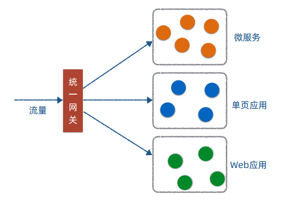
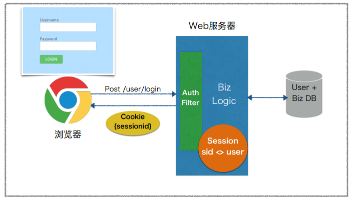
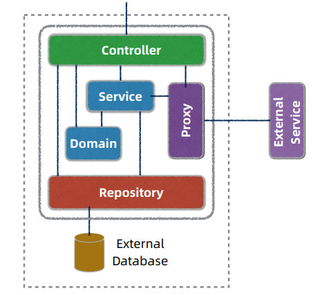
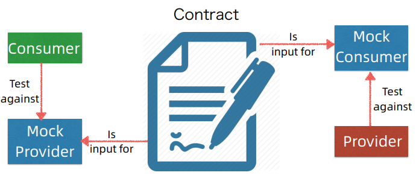
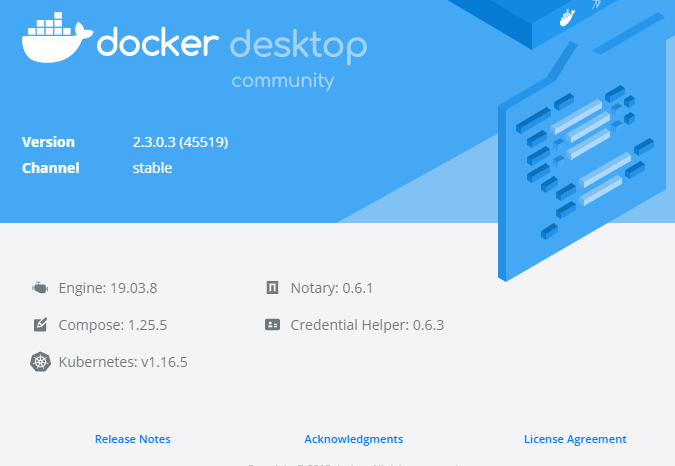

# Microservice Spring Boot Staffjoy

> 本文档属于微服务和云原生架构项目，基于 Spring Boot 和 Kubernetes 技术栈，
>
> 实现 Staffjoy 项目，构建微服务云原生应用 。

## 课程介绍和案例需求 

### 课程背景 

#### 课程背景

• 微服务+云原生理论和实际落地的鸿沟
• 纯教学案例过于简单
• 生产项目过于复杂
• 开发一个贴近生产的微服务+云原生教学案例 


#### eShopOnContainers 

- https://github.com/dotnet-architecture/eShopOnContainers
- 微软的开源微服务教学案例
- 基于 .net 技术栈


#### Microservices-Demo 

- https://github.com/GoogleCloudPlatform/microservices-demo
- 谷歌开源的云原生案例
- 基于谷歌的技术栈


#### Piggy-Metrics 

- https://github.com/sqshq/piggymetrics
- 个人开源的微服务案例
- 在微服务基础架构中进行了实践与改版


#### Staffjoy 教学版 

- https://github.com/LandRover/StaffjoyV2
- https://github.com/Staffjoy/v2
- 基于 go 语言实现，将其改版为 Spring Boot技术栈


### 课程目标和主要内容 

#### 课程目标和主要内容 Dev 

1. 掌握微服务架构和前后分离架构设计
2. 掌握基于 Spring Boot 搭建微服务基础框架
3. 进一步提升 Java/Spring 微服务开发技能
4. 掌握 Spring Boot 微服务测试和相关实践
5. 理解 SaaS 多租户应用的架构和设计 


#### 课程目标和主要内容 Ops

6. 理解可运维架构理念和相关实践
7. 掌握服务容器化和容器云部署相关实践
8. 理解云时代的软件工程流程和实践 


### 案例需求 

#### Staffjoy 公司背景

- 硅谷初创公司（2015 ~ 2017）
- 工时排班（Scheduling）SaaS 服务
- 开源
  - https://github.com/staffjoy/v22. 
  - https://www.staffjoy.com/
  - 原版 Golang
  - Staffjoy 课程教学版 Java/Spring 

#### Staffjoy 应用需求

1. 功能
• 管理员 Admin 管理公司和排班
• 雇员 Worker 管理个人信息
2. 非功能
• SaaS + 定制部署
• 一键部署到 Kubernetes 容器云
• 营销和客服友好（Marketing & Customer Friendly） 


#### 首页产品介绍和注册 


#### 产品订阅计划和报价 


#### 登录页 


#### MyAccount 雇员账户管理页 


#### App 管理员排班界面 


### 课程说明 

#### 课程先决条件

1. 主要面向应用开发工程师、DevOps 工程师或架构师
• 熟悉 Java/Spring、Web/HTML/JavaScript 和 MySQL

2. 主要开发工具
1. JDK 8 + Maven
2. Intellij IDEA or Eclipse STS
3. MySQL + Workbench
4. Node.js + npm
5. Docker 


#### 额外说明

1. 课程重点
• 课程目标
• 微服务和云原生架构
• Spring Boot + Kubernetes应用
2. 非重点
• 案例本身
• React.js 
3. 教学版 Staffjoy 改造
    • Golang -> Java/Spring
    • 去掉 gRPC API Gateway
    • 默认采用邮件通知
4. 教学版仅供参考！
5. Lombok 减少编码 


### 参考链接 

1. [微软微服务演示项目eShopOnContainers](https://github.com/dotnet-architecture/eShopOnContainers)
2. [谷歌微服务演示项目microservices-demo](https://github.com/GoogleCloudPlatform/microservices-demo)
3. [PiggyMetrics微服务演示项目](https://github.com/sqshq/piggymetrics)
4. [PiggyMetrics微服务演示项目改造版](https://github.com/spring2go/piggymetrics)
5. [Gitee开源项目](https://gitee.com/explore)
6. [Philip I. Thomas](https://www.linkedin.com/in/philipithomas/)
7. [Staffjoy Denouement](https://blog.staffjoy.com/denouement-abe7d26f2de0)
8. [Staffjoy开源项目](https://github.com/Staffjoy)
9. [Staffjoy V2](https://github.com/Staffjoy/v2)
10. [Staffjoy课程教学版](https://github.com/spring2go/staffjoy)
11. [Project Lombok](https://projectlombok.org/)


## 系统架构设计和技术栈选型 

### 为何采用微服务架构 

#### 观点1:单块优先 

- https://martinfowler.com/bliki/MonolithFirst.html


#### 微服务引入时机 

- https://martinfowler.com/bliki/MicroservicePremium.html


#### 观点2:微服务优先 

- 由于现在微服务实践的案例较多，直接实现微服务与实现单体应用的花费相当
- 那么，就还不如一次到底，直接实现微服务


### 架构设计和技术栈选型 

#### 总体架构设计 

- 绿色标注：微服务
- 浅红色：Webapp 应用
- Faraday 类似于 网关


#### Skywalking 依赖监控图 

- 使用 Skywalking  实现 调用链监控 看到的服务调用之间的关系


#### 架构设计思想 

- 分为治之
- 单一职责
- 关注分离


#### 技术栈选型 


#### SaaS 多租户设计 

- 由于提供的是 SaaS 服务，需要进行隔离
- 首先 以公司为隔离对象，在公司内部，进行不同资源与任务的隔离


### 数据和接口模型设计～账户服务 

#### 账户数据模型 


#### 账户接口 

- Intercom 客户系统 和 客服系统 是内部进行客户关系管理的系统，类似于 CMS（客户关系管理系统）


### 数据和接口模型设计～公司服务 

#### 公司数据模型 


#### 实体关系ER图(简化) 


#### 公司Company服务接口模型 

| 操作          | HTTP方法 | 功能                       |
| ------------- | -------- | -------------------------- |
| createCompany | POST     | 创建公司                   |
| listCompanies | GET      | 获取现有公司列表(内部使用) |
| getCompany    | GET      | 通过id获取公司             |
| updateCompany | PUT      | 更新公司信息               |


#### 公司管理员Admin服务接口模型 

| 操作        | HTTP方法 | 功能                             |
| ----------- | -------- | -------------------------------- |
| createAdmin | POST     | 创建用户和公司间的管理员关系     |
| listAdmins  | GET      | 通过公司id获取管理员用户列表     |
| getAdmin    | GET      | 通过公司id和用户id获取管理员关系 |
| getAdminOf  | GET      | 通过用户id获取其管理的公司列表   |
| deleteAdmin | DELETE   | 删除用户和公司间的管理员关系     |


#### 员工目录Directory服务接口模型 

| 操作                 | HTTP方法 | 功能                                                         |
| -------------------- | -------- | ------------------------------------------------------------ |
| createDirectory      | POST     | 将某用户添加到公司员工目录中                                 |
| listDirectories      | GET      | 列出某公司id下的所有员工目录项                               |
| getDirectoryEntry    | GET      | 通过公司id和用户id查询某员工目录项                           |
| getAssociations      | GET      | 获取某公司id下的所有员工目录项， 包括是否管理员，对应团队信息 |
| updateDirectoryEntry | PUT      | 更新员工目录项                                               |


#### 团队Team服务接口模型 

| 操作              | HTTP方法 | 功能                                 |
| ----------------- | -------- | ------------------------------------ |
| createTeam        | POST     | 创建团队                             |
| listTeams         | GET      | 列出某公司id下的所有团队             |
| getTeam           | GET      | 通过公司id和团队id获取团队信息       |
| updateTeam        | PUT      | 更新团队信息                         |
| getWorkerTeamInfo | GET      | 通过公司id和用户id查询该员工隶属团队 |


#### 雇员Worker服务接口模型 

| 操作         | HTTP方法 | 功能                                     |
| ------------ | -------- | ---------------------------------------- |
| createWorker | POST     | 建立某用户和某公司/团队间的雇员关系      |
| listWorkers  | GET      | 列出某公司id和团队id下的所有雇员目录项   |
| getWorker    | GET      | 获取某公司id、团队id和用户id的雇员目录项 |
| getWorkerOf  | GET      | 获取某用户id所隶属的团队                 |
| deleteWorker | DELETE   | 删除某用户和某公司/团队间的雇员关系      |


#### 任务Job服务接口模型 

| 操作      | HTTP方法 | 功能                                     |
| --------- | -------- | ---------------------------------------- |
| createJob | POST     | 为某公司/团队新建任务                    |
| listJobs  | GET      | 列出某公司/团队下的所有任务              |
| getJob    | GET      | 获取某公司id，团队id和任务id所对应的任务 |
| updateJob | PUT      | 更新任务信息                             |


#### 班次Shift服务接口模型 

| 操作              | HTTP方法 | 功能                                                  |
| ----------------- | -------- | ----------------------------------------------------- |
| createShift       | POST     | 在某公司/团队下创建新班次                             |
| getShift          | GET      | 通过班次id获取班次信息                                |
| listShifts        | POST     | 通过公司/团队/用户/任务id，时间范围等信息查询对应班次 |
| listWorkerShifts  | POST     | 通过公司/团队/雇员id和时间范围等信息 查询对应班次     |
| deleteShift       | DELETE   | 删除某个班次                                          |
| updateShift       | PUT      | 更新某班次信息                                        |
| bulkPublishShifts | POST     | 批量发布班次                                          |


### Dubbo、Spring Cloud和K8s 该如何选型？ 

#### 微服务公共关注点 

- 配置管理，Apollo
- 服务发现和LB，Eureka Ribbon
- 弹性和容错，Hystrix
- API管理， Zuul
- 服务安全，OAuth 2
- 日志监控，Prometheus
- Metrics 监控，Prometheus
- 调用链监控，Cat


#### Dubbo、Spring Cloud和K8s横向比对 


|              | Dubbo(阿里巴巴)     | Spring Cloud（Netflix）          | K8s（谷歌）                   |
| ------------ | ------------------- | -------------------------------- | ----------------------------- |
| 服务发现和LB | ZK/Nacos + Client   | Eureka + Ribbon                  | Service                       |
| API网关      | NA                  | Zuul                             | Ingress                       |
| 配置管理     | Diamond/Nacos       | Spring Cloud Config              | ConfigMaps/Secrets            |
| 容错限流     | Sentinel            | Hystrix                          | HealthCheck/Probe/ServiceMesh |
| 日志监控     | ELK                 | ELK                              | EFK                           |
| Metrics监控  | Dubbo Admin/Monitor | Actuator/MicroMeter + Prometheus | Heapster+Prometheus           |
| 调用链监控   | NA                  | SpringCloud Sleuth/Zipkin        | Jaeger/Zipkin                 |
| 应用打包       | Jar/War     | Uber Jar/War      | Docker Image/Helm                |
| 服务框架       | Dubbo RPC   | Spring(Boot) REST | 框架无关                         |
| 发布和调度     | NA          | NA                | Scheduler                        |
| 自动伸缩和自愈 | NA          | NA                | Scheduler/AutoScaler             |
| 进程隔离       | NA          | NA                | Docker/Pod                       |
| 环境管理       | NA          | NA                | Namespace/Auththorization        |
| 资源配额       | NA          | NA                | CPU/Mem Limit , Namespace Quotas |
| 流量治理       | ZK + Client | NA                | ServiceMesh                      |


#### 优劣比对 

|      | Dubbo                                 | Spring Cloud                                         | K8s                                                          |
| ---- | ------------------------------------- | ---------------------------------------------------- | ------------------------------------------------------------ |
| 亮点 | 阿里背书 成熟稳定 RPC高性能 流量治理  | Netflix/Pivotal背书 社区活跃 开发体验好 抽象组件化好 | 谷歌背书 平台抽象 全面覆盖微服务关注点(发布) 语言栈无关 社区活跃 |
| 不足 | 技术较老 耦合性高 JVM only 国外社区小 | JVM only 运行耗资源                                  | 偏DevOps和运维 重量复杂 技术门槛高                           |


#### 建议

- 理解微服务关注点，根据企业上下文综合考量
- 尽量不要混搭，保持体系一致性
- 个人倾向 K8s + Spring Boot 


### 技术中台到底讲什么？ 

#### 阿里巴巴中台体系 


#### eBay中台架构 

- https://www.slideshare.net/tcng3716/ebay-architecture


#### 拍拍贷中台架构 

- https://www.ppdai.com/


#### Staffjoy 的中台 

- 技术中台，云平台，支持一键部署
- 业务中台，账户和公司服务
- 业务前台，App和单页应用，REST API


### 参考链接 

1. [Microservice Premium](https://martinfowler.com/bliki/MicroservicePremium.html)
2. [Monolith First](https://martinfowler.com/bliki/MonolithFirst.html)
3. [阿里巴巴全面启动中台战略](https://www.huxiu.com/article/133482/1.html)


## 服务开发框架 设计和实践 

### Staffjoy 项目代码组织 

#### 项目代码组织 

- Mono-Repo ，单体仓库
- 微服务 api 与 service 分离
- common-lib 属于公共依赖


#### 依赖管理 

- ```xml
  <spring.cloud.version>Greenwich.RELEASE</spring.cloud.version>
  ```


### 谷歌为什么采用单体仓库(Mono-Repo) 

#### Multi-Repo vs Mono-Repo 

- 一开始是 单体应用，开始演变为微服务多仓库，最后合并为单体仓库
- 多仓库，不方便项目整体的开发，会存在大量的重复轮子，子仓库会形成属于自己的代码开发风格


#### 谁在用 MonoRepo? 

- Google的单体仓库构建工具：https://bazel.build/
- Facebook的单体仓库构建工具：https://buck.build/
- Shippable的微服务之道：mono repo vs multiple repositories ：http://blog.shippable.com/our-journey-to-microservices-and-a-mono-repository


### 微服务接口参数校验为何重要？ 

#### 控制器接口参数校验 

- ```java
  // @PhoneNumber
  // 自定义
  getAccountByPhonenumber(@RequestParam @PhoneNumber String phoneNumber)
  ```

- ```java
  // @Min(0)
  // 框架提供
  listAccounts(@RequestParam int offset, @RequestParam @Min(0) int limit)
  ```


#### DTO 参数校验 

- DTO：数据传输对象，对接API与网络传输

- 数据传输对象，需要保证参数存在意义，判空与格式匹配校验

- ```java
  @NotBlank
  @NotNull
  @PhoneNumber
  ```


#### 自定义标注 

- 自己实现注解，进行参数校验，使用自己的正则表达式逻辑


### 如何实现统一异常处理？ 

- 包含Rest 与 HTML异常的不同处理方式

#### 统一异常处理 

- Rest 框架自动实现异常捕获


#### RestControllerAdvice 

- xyz.staffjoy.common.error.GlobalExceptionTranslator


#### 统一异常捕获 


#### BaseResponse 

- xyz.staffjoy.common.api.BaseResponse


#### Web MVC ErrorController 

- xyz.staffjoy.web.controller.GlobalErrorController


### DTO 和 DMO为什么要互转？ 

#### DTO 和 DMO 

DTO：数据传输对象，对接API与网络传输

DMO：数据实体对象，业务对象，对接数据库


#### DTO 和 DMO互转 示例

- https://github.com/modelmapper/modelmapper
- 使用 ModelMapper 工具，实现传输对象和实体对象之间的转换
- xyz.staffjoy.account.service.AccountService#convertToDto
- xyz.staffjoy.account.service.AccountService#convertToModel


### 如何实现强类型接口设计？ 

#### 强类型 vs 弱类型 

- 编程语言的强类型和弱类型，动态与静态
- 服务框架强类型和弱类型


#### Spring Feign 

- 动态代理
- 实现一个 API 接口，完成 Spring Bean 与 Json 数据的转换(Encoder and Decoder)
- Bean 属于强类型，Json属于弱类型


#### 强类型接口设计 

- xyz.staffjoy.account.client.AccountClient
- xyz.staffjoy.account.dto.GenericAccountResponse
- xyz.staffjoy.account.dto.ListAccountResponse
- xyz.staffjoy.common.api.BaseResponse


#### Account Client 

- xyz.staffjoy.account.client.AccountClient


#### 继承关系 

- xyz.staffjoy.account.dto.GenericAccountResponse
- xyz.staffjoy.account.dto.ListAccountResponse
- xyz.staffjoy.common.api.BaseResponse


#### 客户端调用范例 

- xyz.staffjoy.account.client.AccountClient#getAccount
- xyz.staffjoy.whoami.service.WhoAmIService#findIntercomSettings
- 注意：这里的调用是跨服务的，需要使用接口调用！


#### 封装消息+捎带 


### 为什么框架层要考虑分环境配置？ 

#### 环境定义 

- xyz.staffjoy.common.env.EnvConstant


#### 环境配置 

- xyz.staffjoy.common.env.EnvConfig


#### 开发测试环境禁用Sentry异常日志 

- xyz.staffjoy.common.aop.SentryClientAspect
- 使用 切面编程实现，即 aop


### 异步调用处理 

#### ThreadPoolTaskExecutor 


#### AsyncExecutor 配置 

- xyz.staffjoy.account.config.AppConfig#asyncExecutor


#### Async 标注 

- xyz.staffjoy.account.service.helper.ServiceHelper#trackEventAsync


#### 线程上下文拷贝 

- 由于使用异步调用，会使得线程的切换之后，请求的信息丢失
- 使用线程上下文拷贝，实现信息同步
- xyz.staffjoy.account.config.AppConfig
- xyz.staffjoy.common.async.ContextCopyingDecorator
- https://stackoverflow.com/questions/23732089/how-to-enable-request-scope-in-async-task-executor


### Swagger 接口文档 

#### Swagger 配置 

- https://swagger.io/docs/specification/about/
- xyz.staffjoy.account.config.SwaggerConfig


#### Swagger UI 

- https://dzone.com/articles/spring-boot-restful-api-documentation-with-swagger
- 自动实现 服务的接口文档


#### Swagger JSON Doc 

- https://editor.swagger.io/
- 可以基于 JSON 接口文档，实现接口的自动生成


### 主流服务框架概览 

#### 主流服务框架概览 

|              | 支持公司 | 编程风格 | 编程模型 | 支持语言 | 亮点                           |
| ------------ | -------- | -------- | -------- | -------- | ------------------------------ |
| Spring(Boot) | Pivotal  | REST     | 代码优先 | Java     | 社区生态好                     |
| Dubbo        | 阿里     | RPC/REST | 代码优先 | Java     | 阿里背书+ 服务治理             |
| Motan        | 新浪     | RPC      | 代码优先 | Java为主 | 轻量版Dubbo                    |
| gRpc         | 谷歌     | RPC      | 契约优先 | 跨语言   | 谷歌背书+多语言支持+HTTP2 支持 |


### 参考链接 

1. [Shippable的微服务之旅：mono repo vs multiple repositories](http://blog.shippable.com/our-journey-to-microservices-and-a-mono-repository)
2. [Why startups need to use monorepo](https://medium.com/@hoangbkit/why-monorepo-in-2018-89221acd4bfb)
3. [Google Build System Bazel](https://bazel.build/)
4. [Facebook Build System Buck](https://buck.build/)
5. [Model Mapper](https://github.com/modelmapper/modelmapper)
6. [gRPC](https://grpc.io/)
7. [Thrift](https://github.com/apache/thrift)
8. [Swagger Codegen](https://github.com/swagger-api/swagger-codegen)
9. [Spring Boot RESTful API Documentation With Swagger 2](https://dzone.com/articles/spring-boot-restful-api-documentation-with-swagger)
10. [Swagger和Open API](https://swagger.io/docs/specification/about/)


## 可编程网关 设计和实践 

### 网关和 BFF 是如何演化出来的 

#### MyShop SOA V1 

- 桌面服务


#### MyShop SOA V2 

- 新增无线设备服务
- 该方案被否决


#### MyShop SOA V2.5 

- 使用无线 BFF 完成无线设备服务


#### MyShop SOA V3 

- 无线业务发展，添加无线网关解决多无线BFF耦合问题


#### MyShop SOA V4 

- 随着业务扩张，统一无线和桌面网关层


### 网关和反向代理是什么关系？ 

#### 反向代理 vs 网关 

- Web 时代，Nginx 和 HA proxy
- 微服务时代，Zuul 和 Nginx
- 云原生时代，Envoy(c++) 和 Traefil（golang）
- 反向代理，可以理解为不同应用设备之间的接待前台
- 网关，可以理解为每一个微服务之间的接口


### 网关需要分集群部署吗？ 

#### 反向代理+网关部署架构 

- Api 流量
- 网页流量


#### 统一网关部署架构 

- 一统网关和反向代理




#### 统一网关+分集群 


### Faraday 网关内核设计 

#### Faraday 网关内核设计 

- 路由映射表
- HttpClient映射表
- ReverseProxyFilter


#### 静态路由配置 

- staffjoy\faraday\src\main\resources\application-dev.yml
- 基于域名映射 对应的 微服务


### Faraday网关代码解析 

#### 网关代码解析 

- 路由映射表（上部分）
- xyz.staffjoy.faraday.core.mappings.MappingsProvider
- xyz.staffjoy.faraday.core.mappings.ConfigurationMappingsProvider
- xyz.staffjoy.faraday.core.mappings.ProgrammaticMappingsProvider
- ReverseProxyFilter（下部分）
- xyz.staffjoy.faraday.core.http.ReverseProxyFilter
- xyz.staffjoy.faraday.core.http.RequestForwarder


#### 统一异常处理 


### 生产级网关需要考虑哪些环节？ 

#### 生产扩展点 

- 限流熔断
- 动态路由和负载均衡（目前系统是将其写死了，直接使用域名映射服务）
- 基于 Path 的路由
  - api.xxx.com/pathx
- 截获器链（将请求截获器组成链式，更容易扩展）
- 日志采集和 Metrics 埋点
- 响应流优化 （数据不需要经过内核拷贝到内核）


### 主流开源网关概览 

#### 主流开源网关概览 

|                             | 支持公司        | 实现语言      | 亮点                                 | 不足                      |
| --------------------------- | --------------- | ------------- | ------------------------------------ | ------------------------- |
| Nginx (2004)                | Nginx Inc       | C/Lua         | 高性能，成熟稳定                     | 门槛高，偏运维，可编 程弱 |
| Kong (2014)                 | Kong Inc        | OpenResty/Lua | 高性能，可编程API                    | 门槛较高                  |
| Zuul1 (2012)                | Netflix/Pivotal | Java          | 成熟，简单门槛低                     | 性能一般，可编程一般      |
| Spring Cloud Gateway (2016) | Pivotal         | Java          | 异步，配置灵活                       | 早期产品                  |
| Envoy (2016)                | Lyft            | C++           | 高性能，可编程 ServiceMesh集成 API/  | 门槛较高                  |
| Traefik (2015)              | Containous      | Golang        | 云原生，可编程 种服务发现 API/对接各 | 生产案例不多              |


### 参考链接 

1. [Nginx](https://www.nginx.com/)
2. [Haproxy](http://www.haproxy.org/)
3. [Kong](https://konghq.com/kong/)
4. [Envoy](https://www.envoyproxy.io/)
5. [Traefik](https://traefik.io/)
6. [Zuul](https://github.com/Netflix/zuul)
7. [Spring Cloud Gateway](https://spring.io/projects/spring-cloud-gateway)
8. [Resilience4j](https://github.com/resilience4j/resilience4j)
9. [Hystrix](https://github.com/Netflix/Hystrix)
10. [Spring Cloud Netflix](https://spring.io/projects/spring-cloud-netflix)
11. [Micrometer](https://micrometer.io/)


## 安全框架 设计和实践 

### 网站安全认证架构演进～单块阶段 

#### MyStore Auth V1 ~ 认证阶段 

- 单块架构，使用 cookie + session机制，实现用户认证与有状态会话
- 业务量大了，就会出现系统访问慢，不可用



#### MyStore Auth V1 ~ 访问阶段 

- 浏览器，只需要携带本地存储的 cookie 就可以去服务器鉴权，得到session
- 进行后续的请求


#### Auth V1.1 ~ Sticky Session 

- 业务的发展，使用多态服务器部署
- 会存在用户每一次请求的处理服务器不是同一台，那么就会出现登录中断的状态
- 此时就需要，使用粘性会话保证
- 将某一个用户的请求绑定到一台机器上
- 用户量大量，会出现问题，某一个服务器宕机了，使得整个使用本服务器的用户都会登录中断


#### Auth V1.5 ~ Centralized Session 

- 将所有的用户请求 session 进行集中式存储
- 使用redis存储所有会话，保证请求有状态


### 网站安全认证架构演进～微服务阶段 

#### 微服务认证授权挑战 

- 业务发展，已经已经不只是 Web MVC，还有手机端，H5页面等技术
- 需要进行微服务改造


#### Auth 3.0 ~ Auth Service + Token 

- 将用户认证，鉴权，统一抽出来一个 Auth Service
- 下发一个无意义的 token 字符串，种到 客户端的 根域 下，可以使用 cookie 或者 HTTP header的方式携带 token ，进行请求与鉴权
- 这种方式存在的问题是，用户的鉴权逻辑与业务逻辑耦合，不方便规范


#### Auth 3.5 ~ Token + Gateway 

- 进一步发展，使用微服务网关，进行用户鉴权与请求过滤
- 解决了鉴权与业务逻辑耦合的问题


### 基于JWT令牌的安全认证架构 

#### Auth 3.6 ~ JWT + Gateway 

- 对系统进行解耦，更加轻量化微服务系统
- 请求鉴权之后，发布一个JWT的令牌
- 后续只需要网关进行鉴权，认证即可
- JWT令牌属于有状态，有内容的字符串，应用与对安全性要求不严格的场景下，但是其中的签名只有自己知道，所以安全性还可以


### JWT令牌原理 

#### JWT令牌结构 

JSON Web Token(JWT) 

- 网址：https://jwt.io/
- 三部分组成：Header.Claims（Payload）.Signature


#### JWT令牌示例 


#### JWT令牌类比签名支票 


### 两种 JWT 流程 

#### HMAC 流程 

- Auth server 与 Resource server之间 协商一个secret key，
- 这种保存 秘钥的方式，安全隐患大


#### RSA 流程 

- 基于 公私钥的方式实现 秘钥的保存
- 安全性更好
- 一般私钥的泄漏可能性更小


#### JWT 优劣 

优势：

- 紧凑轻量，包含了用户的信息
- 对 Auth Server 的压力小，不需要进行二次鉴权
- 简化 Auth Server 的实现，不需要二次鉴权的逻辑

不足：

- 无状态和吊销无法两全，由于taken存在信息，所以一般的吊销时间需要等到自然时间后，令牌自动过期，更新信息，也需要老的令牌自动过期
- 传输开销，如果令牌中 Claims（Payload）较大的时候，会出现更大的传输压力


### Staffjoy 安全认证架构和 SSO 

#### Staffjoy Auth ~ 登录认证阶段 

- 通过WWW服务，进行用户的登录认证
- 将JWT种在用户根域的cookie 中


#### Staffjoy JWT Cookie 

- 在用户浏览器，可以看到JWT令牌，在根域下，有过期时间


#### Staffjoy Auth ~ 后续访问阶段 

- 用户请求访问的时候，携带含有JWT的cookie，进入到网关，
- 网关进行鉴权，提取出用户的userid，传输到请求处理逻辑中
- 只要JWT一直存在，就会一直执行请求，当清除用户本地的jwt后，就需要重新登录认证


### 安全认证代码剖析～用户认证 

#### 引入JWT生成和校验库 

```xml
<dependency>
    <groupId>com.auth0</groupId>
    <artifactId>java-jwt</artifactId>
    <version>3.6.0</version>
</dependency>
```


#### JWT生成算法(common/sign) 

xyz.staffjoy.common.crypto.Sign

```java
public class Sign {
    public static String generateSessionToken(String userId, String signingToken, boolean support, long duration) {
        if (StringUtils.isEmpty(signingToken)) {
            throw new ServiceException("No signing token present");
        }
        Algorithm algorithm = getAlgorithm(signingToken);
        String token = JWT.create()
            .withClaim(CLAIM_USER_ID, userId)
            .withClaim(CLAIM_SUPPORT, support)
            .withExpiresAt(new Date(System.currentTimeMillis() + duration))
            .sign(algorithm);
        return token;
    }


    private static Algorithm getAlgorithm(String signingToken) {
        Algorithm algorithm = algorithmMap.get(signingToken);
        if (algorithm == null) {
            synchronized (algorithmMap) {
                algorithm = algorithmMap.get(signingToken);
                if (algorithm == null) {
                    algorithm = Algorithm.HMAC512(signingToken);
                    algorithmMap.put(signingToken, algorithm);
                }
            }
        }
        return algorithm;
    }
}    
```


#### JWT校验算法(common/sign) 

xyz.staffjoy.common.crypto.Sign

```java
public class Sign {
	static DecodedJWT verifyToken(String tokenString, String signingToken) {
        JWTVerifier verifier = verifierMap.get(signingToken);
        if (verifier == null) {
            synchronized (verifierMap) {
                verifier = verifierMap.get(signingToken);
                if (verifier == null) {
                    Algorithm algorithm = Algorithm.HMAC512(signingToken);
                    verifier = JWT.require(algorithm).build();
                    verifierMap.put(signingToken, verifier);
                }
            }
        }

        DecodedJWT jwt = verifier.verify(tokenString);
        return jwt;
    }
}
```


#### 登录login种Cookie(common/sessions) 

xyz.staffjoy.common.auth.Sessions

```java
public class Sessions {
    public static final long SHORT_SESSION = TimeUnit.HOURS.toMillis(12);
    public static final long LONG_SESSION = TimeUnit.HOURS.toMillis(30 * 24);

    public static void loginUser(String userId,
                                 boolean support,
                                 boolean rememberMe,
                                 String signingSecret,
                                 String externalApex,
                                 HttpServletResponse response) {
        long duration;
        int maxAge;

        if (rememberMe) {
            // "Remember me"
            duration = LONG_SESSION;
        } else {
            duration = SHORT_SESSION;
        }
        maxAge = (int) (duration / 1000);

        String token = Sign.generateSessionToken(userId, signingSecret, support, duration);

        Cookie cookie = new Cookie(AuthConstant.COOKIE_NAME, token);
        cookie.setPath("/");
        cookie.setDomain(externalApex);
        cookie.setMaxAge(maxAge);
        cookie.setHttpOnly(true);
        response.addCookie(cookie);
    }
}
```


#### Staffjoy JWT Cookie 


#### Cookie中取出JWT令牌(common/sessions) 

xyz.staffjoy.common.auth.Sessions

```java
public class Sessions {
    public static String getToken(HttpServletRequest request) {
        Cookie[] cookies = request.getCookies();
        if (cookies == null || cookies.length == 0) return null;
        Cookie tokenCookie = Arrays.stream(cookies)
                .filter(cookie -> AuthConstant.COOKIE_NAME.equals(cookie.getName()))
                .findAny().orElse(null);
        if (tokenCookie == null) return null;
        return tokenCookie.getValue();
    }
}
```


#### Auth 3.6 ~ JWT + Gateway 


#### JWT校验和取出用户会话数据(faraday/AuthRequestInterceptor) 

xyz.staffjoy.faraday.core.interceptor.AuthRequestInterceptor

```java
public class AuthRequestInterceptor implements PreForwardRequestInterceptor {
    
	private Session getSession(HttpServletRequest request) {
        String token = Sessions.getToken(request);
        if (token == null) return null;
        try {
            DecodedJWT decodedJWT = Sign.verifySessionToken(token, signingSecret);
            String userId = decodedJWT.getClaim(Sign.CLAIM_USER_ID).asString();
            boolean support = decodedJWT.getClaim(Sign.CLAIM_SUPPORT).asBoolean();
            Session session = Session.builder().userId(userId).support(support).build();
            return session;
        } catch (Exception e) {
            log.error("fail to verify token", "token", token, e);
            return null;
        }
    }

    @Data
    @Builder
    @AllArgsConstructor
    @NoArgsConstructor
    private static class Session {
        private String userId;
        private boolean support;
    }
}

```


#### 网关传递认证授权信息(faraday/AuthRequestInterceptor) 

xyz.staffjoy.faraday.core.interceptor.AuthRequestInterceptor

```java
public class AuthRequestInterceptor implements PreForwardRequestInterceptor {
    
	private String setAuthHeader(RequestData data, MappingProperties mapping) {
        // default to anonymous web when prove otherwise
        String authorization = AuthConstant.AUTHORIZATION_ANONYMOUS_WEB;
        HttpHeaders headers = data.getHeaders();
        Session session = this.getSession(data.getOriginRequest());
        if (session != null) {
            if (session.isSupport()) {
                authorization = AuthConstant.AUTHORIZATION_SUPPORT_USER;
            } else {
                authorization = AuthConstant.AUTHORIZATION_AUTHENTICATED_USER;
            }

            this.checkBannedUsers(session.getUserId());

            headers.set(AuthConstant.CURRENT_USER_HEADER, session.getUserId());
        } else {
            // prevent hacking
            headers.remove(AuthConstant.CURRENT_USER_HEADER);
        }
        headers.set(AuthConstant.AUTHORIZATION_HEADER, authorization);

        return authorization;
    }
}
```


#### 登录logout(common/sessions) 

xyz.staffjoy.common.auth.Sessions

```java
public class Sessions {    
	public static void logout(String externalApex, HttpServletResponse response) {
        Cookie cookie = new Cookie(AuthConstant.COOKIE_NAME, "");
        cookie.setPath("/");
        cookie.setMaxAge(0);
        cookie.setDomain(externalApex);
        response.addCookie(cookie);
    }
}

```


#### 认证上下文助手类(common/AuthContext) 

xyz.staffjoy.common.auth.AuthContext

```java
public class AuthContext {

    private static String getRequetHeader(String headerName) {
        RequestAttributes requestAttributes = RequestContextHolder.getRequestAttributes();
        if (requestAttributes instanceof ServletRequestAttributes) {
            HttpServletRequest request = ((ServletRequestAttributes)requestAttributes).getRequest();
            String value = request.getHeader(headerName);
            return value;
        }
        return null;
    }

    public static String getUserId() {
        return getRequetHeader(AuthConstant.CURRENT_USER_HEADER);
    }

    public static String getAuthz() {
        return getRequetHeader(AuthConstant.AUTHORIZATION_HEADER);
    }

}
```


#### Feign客户端传递用户认证信息(common/FeignRequestHeaderInterceptor) 

xyz.staffjoy.common.auth.FeignRequestHeaderInterceptor

```java
public class FeignRequestHeaderInterceptor implements RequestInterceptor {

    @Override
    public void apply(RequestTemplate requestTemplate) {
        String userId = AuthContext.getUserId();
        if (!StringUtils.isEmpty(userId)) {
            requestTemplate.header(AuthConstant.CURRENT_USER_HEADER, userId);
        }
    }
}
```


#### Staffjoy架构 


### 安全认证代码剖析~服务调用鉴权 

#### 服务间调用授权截获器(common/AuthorizeInterceptor) 

xyz.staffjoy.common.auth.Authorize

```java
@Target(ElementType.METHOD)
@Retention(RetentionPolicy.RUNTIME)
@Documented
public @interface Authorize {
    // allowed consumers
    String[] value();
}
```

xyz.staffjoy.common.auth.AuthorizeInterceptor

```java
public class AuthorizeInterceptor extends HandlerInterceptorAdapter {
    @Override
    public boolean preHandle(HttpServletRequest request, HttpServletResponse response, Object handler) throws Exception {
        if (!(handler instanceof HandlerMethod)) {
            return true;
        }

        HandlerMethod handlerMethod = (HandlerMethod) handler;
        Authorize authorize = handlerMethod.getMethod().getAnnotation(Authorize.class);
        if (authorize == null) {
            return true; // no need to authorize
        }

        String[] allowedHeaders = authorize.value();
        String authzHeader = request.getHeader(AuthConstant.AUTHORIZATION_HEADER);

        if (StringUtils.isEmpty(authzHeader)) {
            throw new PermissionDeniedException(AuthConstant.ERROR_MSG_MISSING_AUTH_HEADER);
        }

        if (!Arrays.asList(allowedHeaders).contains(authzHeader)) {
            throw new PermissionDeniedException(AuthConstant.ERROR_MSG_DO_NOT_HAVE_ACCESS);
        }

        return true;
    }
}
```


#### 控制器调用鉴权(account-svc/AccountController) 

xyz.staffjoy.account.controller.AccountController

```java
public class AccountController {
    @PostMapping(path = "/create")
    @Authorize(value = {
                    AuthConstant.AUTHORIZATION_SUPPORT_USER,
                    AuthConstant.AUTHORIZATION_WWW_SERVICE,
                    AuthConstant.AUTHORIZATION_COMPANY_SERVICE
    })
    public GenericAccountResponse createAccount(@RequestBody @Valid CreateAccountRequest request) {
        AccountDto accountDto = accountService.create(request.getName(), request.getEmail(), request.getPhoneNumber());
        GenericAccountResponse genericAccountResponse = new GenericAccountResponse(accountDto);
        return genericAccountResponse;
    }
    
    // ....
}
```


#### 用户角色和环境鉴权(account-svc/AccountController) 

xyz.staffjoy.account.controller.AccountController

```java
public class AccountController {
	private void validateAuthenticatedUser(String userId) {
        if (AuthConstant.AUTHORIZATION_AUTHENTICATED_USER.equals(AuthContext.getAuthz())) {
            String currentUserId = AuthContext.getUserId();
            if (StringUtils.isEmpty(currentUserId)) {
                throw new ServiceException("failed to find current user id");
            }
            if (!userId.equals(currentUserId)) {
                throw new PermissionDeniedException("You do not have access to this service");
            }
        }
    }

    private void validateEnv() {
        if (AuthConstant.AUTHORIZATION_SUPERPOWERS_SERVICE.equals(AuthContext.getAuthz())) {
            if (!EnvConstant.ENV_DEV.equals(this.envConfig.getName())) {
                logger.warn("Development service trying to connect outside development environment");
                throw new PermissionDeniedException("This service is not available outside development environments");
            }
        }
    }
}

```


#### API Client传递服务调用方(account-api/AccountClient) 

xyz.staffjoy.account.client.AccountClient

```java
@FeignClient(name = AccountConstant.SERVICE_NAME, path = "/v1/account", url = "${staffjoy.account-service-endpoint}")
// TODO Client side validation can be enabled as needed
// @Validated
public interface AccountClient {

    @PostMapping(path = "/create")
    GenericAccountResponse createAccount(@RequestHeader(AuthConstant.AUTHORIZATION_HEADER) String authz, @RequestBody @Valid CreateAccountRequest request);

    // ...
}
```


#### 授权Header定义(common/AuthConstant) 

xyz.staffjoy.common.auth.AuthConstant

```java
public class AuthConstant {

    public static final String COOKIE_NAME = "staffjoy-faraday";
    // header set for internal user id
    public static final String CURRENT_USER_HEADER = "faraday-current-user-id";
    // ...
}
```


#### Staffjoy Auth Enforcement 

- 外部服务调用（传递header，从网关访问内容部用户，必须加头部）
- 内部服务调用（传递header，可能会被绕开，内部可接受）


### 用户角色鉴权扩展 

#### 参考权限模型 

- 将用户关联到用户组，常见方式，进而定义用户的角色
- 将用户关联到注册应用，企业内部的应用比较多，进而定义用户的角色


#### Auth 3.7 ~ JWT + RBAC 

- RBAC: Role based account service
- 当用户鉴权登录后，定义相应的角色
- 后续用户访问服务的时候，加上用户的角色信息，roleinfo


### 参考链接 

1. [RFC 7519](https://tools.ietf.org/html/rfc7519.html)
2. [jwt.io](https://jwt.io/)
3. [Java implementation of JSON Web Token (JWT) by Auth0](https://github.com/auth0/java-jwt)


## 微服务测试 设计和实践

### 微服务测试挑战 

- 分而治之的思想
- 先隔离应用，一个一个服务的进行测试，
- 然后，进行服务之间的集成测试


#### Staffjoy架构图 

- 进行微服务的测试，测试蓝色的www和绿色的微服务应用


### 微服务测试分类和技术 

#### Spring(Boot)应用分层 

- Controller
- service（贫血(一般项目都是贫血)和充血模型设计）
- Domain
- Repository




#### 单元测试(Unit Test) 

- 可使用 juint 和 mockito
  1. [JUnit](https://junit.org/junit5/)
  2. [Mockito](https://site.mockito.org/)


#### 集成测试(Integration Test) 


#### 组件测试(Component Test) ~ 内部Mock 

1. [WireMock](http://wiremock.org/)
2. [Spring Mockbean](https://www.baeldung.com/java-spring-mockito-mock-mockbean)
3. 经常使用内存数据库，h2，进行测试


#### 组件测试(Component Test) ~ 外部Mock 

1. [Hoverfly](https://hoverfly.io/)
2. [Mountebank](http://www.mbtest.org/)


#### 契约测试(Contract Test) 

1. [Pact](https://docs.pact.io)
2. [Spring Cloud Contract](https://spring.io/projects/spring-cloud-contract)


#### 契约驱动测试 

- 可以用到客户端，也可以用到服务端




#### 端到端测试(End-to-End Test) 

1. [Selenium](https://www.seleniumhq.org/projects/webdriver/)
2. [REST-assured](http://rest-assured.io/)
3. 最常见的是在UI使用 Selenium


#### 总结 

> 一致性 > 具体定义 

| 分类       | 功能                                     |
| ---------- | ---------------------------------------- |
| 单元测试   | 确保类、模块功能正确                     |
| 集成测试   | 确保组件间接口、交互和链路正确           |
| 组件测试   | 确保微服务作为独立整体，接口功能正确契约 |
| 契约测试   | 确保服务提供方和消费方都遵循契约规范     |
| 端到端测试 | 确保整个应用满足用户需求                 |
| 探索测试   | 手工探索学习系统功能，改进自动化测试     |


### 测试金字塔和实践 

#### 测试金字塔 

越是底层，越有利，出问题的代价的越低


#### 端到端测试实践 

1. 80/20，聚焦核心业务服务（2/8定律）
2. 用户使用场景驱动
3. 适当Mock不稳定测试点
4. 规范测试环境和环境自动化
5. 测试数据管理
6. 灰度测试+生产监控 (Beta 测试，进行一定量的线上测试，线上环境更复杂)


### Test Case Review ~ 单元测试 

- Repository单元测试：xyz.staffjoy.account.repo.AccountRepoTest
- Controller单元测试：xyz.staffjoy.company.controller.ut.CompanyControllerUnitTest


### Test Case Review ~ 集成测试 

#### 集成测试(Integration Test) 

- 集成测试 Account ：xyz.staffjoy.account.controller.AccountControllerTest


#### Staffjoy架构图 


### Test Case Review ~ 组件测试 

#### 组件测试(Component Test) ~ 内部Mock 

- 组件测试 WWW服务的登录注销：xyz.staffjoy.web.controller.LoginControllerTest


#### Staffjoy架构图 


### Mock vs Spy 

#### 测试补充 

1. Mock vs. Spy （Mock针对接口；Spy针对类的场景，是没有接口的场景，进行部分mock）
   1. Mock and Spy 测试示例：
   2. xyz.staffjoy.account.service.helper.ServiceHelperTest
2. BDD行为驱动测试(了解，国内不流行)
3. 性能测试 （吞吐量，并发量，延迟）
   1. [JMeter](https://jmeter.apache.org)
   2. [Gatling](https://martinfowler.com/articles/microservice-testing/)


### 参考链接 

1. [JUnit](https://junit.org/junit5/)
2. [Mockito](https://site.mockito.org/)
3. [WireMock](http://wiremock.org/)
4. [Spring Mockbean](https://www.baeldung.com/java-spring-mockito-mock-mockbean)
5. [Hoverfly](https://hoverfly.io/)
6. [Mountebank](http://www.mbtest.org/)
7. [Pact](https://docs.pact.io)
8. [Spring Cloud Contract](https://spring.io/projects/spring-cloud-contract)
9. [Selenium](https://www.seleniumhq.org/projects/webdriver/)
10. [REST-assured](http://rest-assured.io/)
11. [JMeter](https://jmeter.apache.org)
12. [Gatling](https://gatling.io/open-source/)
13. [Microservice Testing](https://martinfowler.com/articles/microservice-testing/)
14. [Practical Test Pyramid](https://martinfowler.com/articles/practical-test-pyramid.html)


## 可运维架构 设计和实践 

### 何谓生产就绪Production Ready？ 

#### 经典软件工程阶段 

- 需求分析
- 架构设计
- 实现测试
- 部署运维


#### 互联网软件交付阶段 

- 编码完成
- 生产就绪
- 价值交付


#### 何谓生产就绪 

- 功能测试OK
- 性能测试OK
- 配置管理
- 日志监控
- Metrics监控
- 健康检查
- 调用链监控
- 安全性考量
- 扩展升级考量
- 高可用考量


### SpringBoot如何实现分环境配置？ 

#### Staffjoy环境 

- spring 的 profiles机制，分环境，并且可以重载
- DEV：intellJ
- TEST：docker  compose
- UAT & PROD：kubernetes


### Apollo vs Spring Cloud Config vs K8s ConfigMap 

#### 何谓动态配置更新 

- 动态配置更新 = 配置中心更新最新的配置到应用 + 应用自己实现配置更新监控，动态加载


#### Apollo vs Spring Cloud Config vs K8s ConfigMap 

|                | Apollo                     | Spring Cloud Config | K8s ConfigMaps     |
| -------------- | -------------------------- | ------------------- | ------------------ |
| 配置界面       | 统一界面管理不同环境和集群 | 无，通过git操作     | Cli或Dashboard     |
| 配置存储       | DB                         | Git                 | Etcd               |
| 配置生效时间   | 实时推送+应用配合          | 近实时+应用配合     | 近实时+应用配合    |
| 动态配置       | 支持，实时推送             | 复杂+Mq             | 支持发布更新       |
| 版本管理       | UI支持发布历史和回滚       | 无，通过git操作     | 无，需自己管理     |
| 灰度发布       | 支持                       | 不支持              | 支持灰度发布       |
| 授权/审计/审核 | UI操作，修改和发布权限分离 | 需通过git仓库设置   | K8s平台部分支持    |
| 实例配置监控   | 可见哪些客户端配置生效     | 不支持              | 可查询容器环境变量 |
| 客户端支持     | 原生Java/.Net，提供API，支 | Spring应用+标注支持 | 语言无关           |


#### 参考样例 

Apollo动态配置：https://github.com/ctripcorp/apollo-use-cases

SpringCloud集中配置 ：https://github.com/sqshq/piggymetrics/tree/master/config


### CAT vs Zipkin vs Skywalking 

#### 演进历史 

-  源头一：eBay
- 源头二：CAT


#### CAT vs Zipkin vs Skywalking 

|              | CAT                                  | Zipkin                                           | Apache Skywalking               |
| ------------ | ------------------------------------ | ------------------------------------------------ | ------------------------------- |
| 调用链可视化 | 有                                   | 有                                               | 有                              |
| 聚合报表     | 非常丰富                             | 少                                               | 较丰富                          |
| 服务依赖图   | 简单                                 | 简单                                             | 好                              |
| 埋点方式     | 侵入                                 | 侵入                                             | 非侵入，运行期字节码增强        |
| VM指标监控   | 好                                   | 无                                               | 有                              |
| 告警支持     | 有                                   | 无                                               | 有                              |
| 多语言支持   | Java/.Net                            | 丰富                                             | Java/.Net/NodeJS/PHP自动 Go手动 |
| 存储机制     | Mysql(报表)，本地文件/ HDFS（调用链) | 可选in memory, mysql, ES(生 产), Cassandra(生产) | H2, ES(生产)                    |
| 社区支持     | 主要在国内，点评/美团       | 文档丰富，国外主流               | Apache支持，国内社区好            |
| 国内案例                                  | 点评、携程、陆金所、拍 拍贷 | 京东、阿里定制不开源             | 华为，小米，当当，微众银行        |
| APM（application performance management） | Yes                         | No                               | Yes                               |
| 祖先源头                                  | eBay CAL                    | Google Dapper                    | Google Dapper                     |
| 同类产品                                  | 暂无                        | Uber Jaeger, Spring Cloud Sleuth | Naver Pinpoint                    |
| Github Stars(2019.6)                      | 9.6k                        | 11.2k                            | 9.2k                              |
| 亮点                                      | 企业生产级，报表丰富        | 社区社区生态好                   | 非侵入，Apache背书                |
| 不足                                      | 用户体验一般，社区一般      | APM报表能力弱                    | 时间不长，文档一般，仅限中文 社区 |


#### Skywalking Java Agent支持库 

- https://github.com/apache/skywalking/blob/master/docs/en/setup/service-agent/java-agent/Supported-list.md


#### Staffjoy依赖监控 


### 结构化日志和审计日志 

- Structured logging：https://github.com/jacek99/structlog4j
- 结构化和业务审计日志样例：
  - xyz.staffjoy.account.service.AccountService
  - xyz.staffjoy.common.auditlog.LogEntry
  - 配置初始化，环境和服务信息日志，到所有的结构化日志，xyz.staffjoy.common.config.StaffjoyConfig


### 集中异常监控和Sentry 

- https://sentry.io/
- https://github.com/getsentry/sentry
- 创建用户，自定义，就可以量小，使用sentry的云服务
- Sentry 主要是进行异常的集中监控，开源的产品；日志的记录，可以使用 ELK完成
- Staffjoy项目中：
- 创建Sentry的Spring Bean：xyz.staffjoy.common.config.StaffjoyConfig#sentryClient
- 做一个aop的拦截，只在生产环境启动 sentry服务：xyz.staffjoy.common.aop.SentryClientAspect
- 生产环境中，有异常和错误的时候，将信息上报到 Sentry：xyz.staffjoy.account.service.helper.ServiceHelper
  - xyz.staffjoy.account.service.helper.ServiceHelper#handleError
  - xyz.staffjoy.account.service.helper.ServiceHelper#handleException


### EFK & Prometheus & Skywalking K8s 集成架构 

#### EFK + K8s 

- fluentd
- Log Parser  可以自定义开发，进行日志的解析，和日志的个性化过滤
- Elastic


#### Prometheus+ K8s 

- Prometheus 与 K8S 的 Discovery集成，去Docker中抓取日志信息


#### SkyWalking + K8s 

- 使用 SkyWalking  的 Agent，进行字节码注入，自动埋点与探测，收集日志


### 参考链接 

1. [Apollo动态配置](https://github.com/ctripcorp/apollo-use-cases)
2. [SpringCloud集中配置](https://github.com/sqshq/piggymetrics/tree/master/config)
3. [Skywalking Java Agent支持库](https://github.com/apache/skywalking/blob/master/docs/en/setup/service-agent/java-agent/Supported-list.md)
4. [structlog4j](https://github.com/jacek99/structlog4j)
5. [Sentry.io](https://sentry.io)
6. [Sentry Open Source](https://github.com/getsentry/sentry)


## 服务容器化和 Docker Compose 部署 

### 本地开发部署架构和需求 

#### 本地 IDE部署架构 

- 端口与应用


#### 软件需求 

1. SwitchHosts
• https://github.com/oldj/SwitchHosts
2. SkyWalking(6.1.0)
• https://github.com/apache/skywalking/releases
• https://github.com/apache/skywalking/blob/master/docs/en/setup/serviceagent/java-agent/README.md
3. MySQL(5.7.25) + Workbench
• https://dev.mysql.com/downloads/mysql/
4. 阿里云邮箱账户(可选) 


### 手工服务部署和测试 

#### 部署步骤 

1. 清理释放内存
• 活动监控器
• 关闭Docker
2. 部署 MySQL 数据库
• staffjoy_account
• staffjoy_company
3. 部署 SkyWalking
    • bin/startup.sh
    • IDE 设置 skywalking-agent
4. 部署服务
    • 本地机密数据配置
    • Faraday配置Review
    • mail -> bot -> account -> company -> www -> whoami -> faraday
5. 部署单页应用
• npm install
• npm start
6. 启用 SwitchHosts 


#### 部署 MySQL 数据库

- create database staffjoy_account;
- create database staffjoy_company;
- 创建表：
  - account-svc/src/main/resources/db/schema.sql
  - company-svc/src/main/resources/db/schema.sql


#### 部署 SkyWalking

- run SkyWalking
  - win：D:\apache-skywalking-apm-6.1.0\apache-skywalking-apm-bin\bin\startup.bat
  - mac：apache-skywalking-apm-bin\bin\startup.sh
- IDE setting SkyWalking
  - Run > Edit Configurations 
  - VM options：-javaagent:/path/to/your/SkyWalking/agent/skywalking-agent.jar
  - Environment variables：SW_AGENT_NAME=xxx
  - 演示示例配置：
  - -javaagent:D:\apache-skywalking-apm-6.1.0\apache-skywalking-apm-bin\agent\skywalking-agent.jar
  - SW_AGENT_NAME=account-svc
  - SW_AGENT_NAME=bot-svc
  - SW_AGENT_NAME=company-svc
  - SW_AGENT_NAME=faraday-svc
  - SW_AGENT_NAME=ical-svc
  - SW_AGENT_NAME=mail-svc
  - SW_AGENT_NAME=sms-svc
  - SW_AGENT_NAME=www-svc
  - SW_AGENT_NAME=whoami-svc


#### 部署服务

- 本地机密数据配置
  - config/application.yml
  - sentry-dsn，是集中日志监控，需要保证格式一样，也可以用自己的
  - signing-secret，是JAT令牌的签名，需要配置
  - 后面其他的配置，是使用阿里云的短信服务和邮件服务配置
  - 阿里云 access：
    - aliyun-access-key: LTAI4FzQtkuKAZVCG7hZV2
    - Axaliyun-access-secret: GHV9rWL2GMNfhFhw5i5QWR07zjwfNv
- Faraday配置Review
  - faraday 网关配置：faraday/src/main/resources/application-dev.yml
  - mappings 中展示的是 路由表，不同的 host 对应 不同的 IP
- 部署微服务
  - 依次启动：mail -> bot -> account -> company -> www -> whoami -> faraday
  - 报错：time-zone issue 
  - reference：https://blog.csdn.net/CHS007chs/article/details/81348291


#### 部署单页应用

- ps：单页应用要求linux或mac环境编译，windows环境暂不支持
- cd frontend/myaccount
- npm install 
- npm start
- cd frontend/app
- npm install 
- npm start
- win 启动失败，没法进行测试中的 管理员 后台登录，以及排班等
  - https://github.com/spring2go/staffjoy/issues/6
  - 将npm-zepto替换为zepto-webpack
  - npm install zepto-webpack
- mac:  
  - brew install npm
  - npm install -g cnpm --registry=https://registry.npm.taobao.org
  - cnpm -v
  - cnpm install -g nrm
  - nrm ls
  - nrm use taobao
  - https://blog.csdn.net/qq_24672657/article/details/86775719


#### SwitchHosts 

```sh
# staffjoy-local

127.0.0.1 faraday.staffjoy-v2.local
127.0.0.1 account.staffjoy-v2.local
127.0.0.1 company.staffjoy-v2.local
127.0.0.1 ical.staffjoy-v2.local
127.0.0.1 whoami.staffjoy-v2.local
127.0.0.1 superpowers.staffjoy-v2.local
127.0.0.1 www.staffjoy-v2.local
127.0.0.1 myaccount.staffjoy-v2.local
127.0.0.1 app.staffjoy-v2.local
```


#### 测试步骤

1. 浏览器访问
• www.staffjoy-v2.local
2. 校验业务流程
• 注册管理员和公司，登录
• 注册雇员和登录（由于没有企业邮箱，无法实现雇员的登录，但是强行实现了管理员的注册）
• 排班
3. 校验 Cookie
4. 校验 DB 


### SkyWalking 调用链监控实验 

#### 测试步骤

1. 浏览器访问 Dashboard
• http://localhost:8080
• admin/admin
2. 校验拓扑图
3. 校验仪表盘
   1. 热力图，Global Heatmap
   2. 百分位，Global Percent Response
   3. 全局，服务，JVM等信息
4. 校验追踪
  1. list 展示
  2. tree 展示
5. 结束清理
  • 关闭服务
  • 关闭单页应用
  • 关闭 SkyWalking(jps) 


### Docker 和 Docker Compose 简介 

#### 容器用途

1. 标准化打包
2. 隔离
3. 标准化部署 


#### OS & Kernel 

- 用户态
- 内核态
- 硬件


#### 虚拟机和容器 

- Hypervisor vs Container Engine


#### Docker 容器核心技术 

- CGroups：管理硬件
- Namespaces：管理进程
- Networking：网络层
- Storage：存储的文件系统


#### 容器镜像 

- 不同的容器镜像，可以共用一个层，使用哈希值标识


#### Docker 架构 

- Client，执行命令行
- HOST，Daemon线程，Images
- Registry，仓库
- https://docs.docker.com/get-started/overview/


#### Docker Compose 

- docker 只能部署一个 单镜像
- docker compose，可以一键部署多个镜像，使用 up 命令
- 配置 docker-compose.yml 文件


### 容器镜像构建 Dockerfile 解析 

#### Account 服务 Dockerfile 

- account-svc/Dockerfile

- ```dockerfile
  FROM java:8-jdk-alpine
  
  COPY ./target/account-svc-1.0.0.jar /usr/app/
  
  WORKDIR /usr/app
  
  RUN sh -c 'touch account-svc-1.0.0.jar'
  
  ENTRYPOINT ["java", "-jar", "account-svc-1.0.0.jar"]
  ```

#### MyAccount 单页应用 Dockerfile 

- 两阶段构建技术：先生成镜像文件，后进行Nginx的启动

- frontend/myaccount/Dockerfile

- ```dockerfile
  FROM node:alpine as builder
  WORKDIR '/build'
  COPY myaccount ./myaccount
  COPY resources ./resources
  COPY third_party ./third_party
  
  WORKDIR '/build/myaccount'
  
  RUN npm install
  RUN npm rebuild node-sass
  RUN npm run build
  
  RUN ls /build/myaccount/dist
  
  FROM nginx
  EXPOSE 80
  COPY --from=builder /build/myaccount/dist /usr/share/nginx/html
  ```


### Docker Compose 部署文件解析 

#### Docker Compose 部署架构 


- 内部有自己的网络，保证全部使用 80 端口，都不会冲突
- 本地 docker compose 配置文件：.env
  - 设置内部访问 路由
  - 设置 阿里云 access
- docker-compose.yml
  - 设置 services 和 networks
  - services 内部设置各种 service，设置环境变量，镜像名字等信息


### 将 Staffjoy 部署到本地 Docker Compose 环境 

#### Docker Desktop for Mac/Win 安装

- https://docs.docker.com/docker-for-mac/install/
- https://docs.docker.com/docker-for-windows/install/




#### 构建和部署

1. 镜像构建
   • mvn clean package -DskipTests
   • docker-compose build（失败了，一直报错，无法解决啊！）
   • docker images

2. 部署 MySQL 数据库
• staffjoy_account
• staffjoy_company
3. 部署 Staffjoy
• docker-compose up
• docker-compose ps
4.  启用 SwitchHosts
5. 校验 Staffjoy
6. 清理
  • docker-compose down 


#### 拉取docker上的镜像

- https://hub.docker.com/u/boboweike
- docker pull boboweike/spring2go-petclinic
- ...


## 云原生架构和 Kubernetes 容器云部署 


