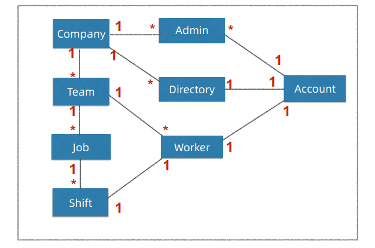
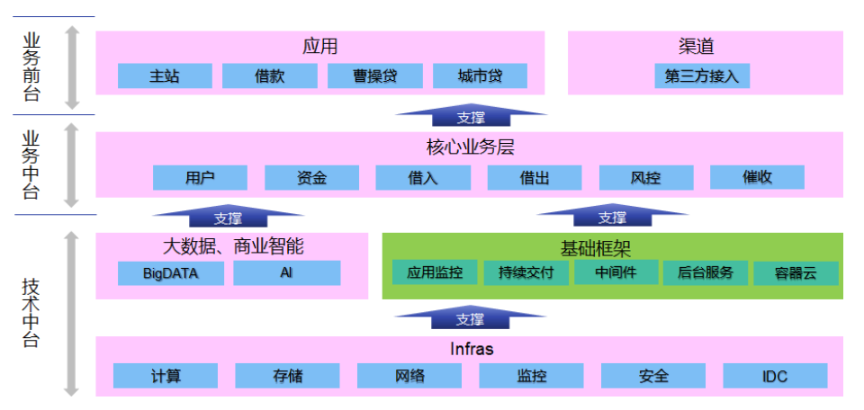

# Microservice Spring Boot Staffjoy

> 本文档属于微服务和云原生架构项目，基于 Spring Boot 和 Kubernetes 技术栈，
>
> 实现 Staffjoy 项目，构建微服务云原生应用 。

## 课程介绍和案例需求 

### 课程背景 

#### 课程背景

• 微服务+云原生理论和实际落地的鸿沟
• 纯教学案例过于简单
• 生产项目过于复杂
• 开发一个贴近生产的微服务+云原生教学案例 


#### eShopOnContainers 

- https://github.com/dotnet-architecture/eShopOnContainers
- 微软的开源微服务教学案例
- 基于 .net 技术栈


#### Microservices-Demo 

- https://github.com/GoogleCloudPlatform/microservices-demo
- 谷歌开源的云原生案例
- 基于谷歌的技术栈


#### Piggy-Metrics 

- https://github.com/sqshq/piggymetrics
- 个人开源的微服务案例
- 在微服务基础架构中进行了实践与改版


#### Staffjoy 教学版 

- https://github.com/LandRover/StaffjoyV2
- https://github.com/Staffjoy/v2
- 基于 go 语言实现，将其改版为 Spring Boot技术栈


### 课程目标和主要内容 

#### 课程目标和主要内容 Dev 

1. 掌握微服务架构和前后分离架构设计
2. 掌握基于 Spring Boot 搭建微服务基础框架
3. 进一步提升 Java/Spring 微服务开发技能
4. 掌握 Spring Boot 微服务测试和相关实践
5. 理解 SaaS 多租户应用的架构和设计 


#### 课程目标和主要内容 Ops

6. 理解可运维架构理念和相关实践
7. 掌握服务容器化和容器云部署相关实践
8. 理解云时代的软件工程流程和实践 


### 案例需求 

#### Staffjoy 公司背景

- 硅谷初创公司（2015 ~ 2017）
- 工时排班（Scheduling）SaaS 服务
- 开源
  - https://github.com/staffjoy/v22. 
  - https://www.staffjoy.com/
  - 原版 Golang
  - Staffjoy 课程教学版 Java/Spring 

#### Staffjoy 应用需求

1. 功能
• 管理员 Admin 管理公司和排班
• 雇员 Worker 管理个人信息
2. 非功能
• SaaS + 定制部署
• 一键部署到 Kubernetes 容器云
• 营销和客服友好（Marketing & Customer Friendly） 


#### 首页产品介绍和注册 


#### 产品订阅计划和报价 


#### 登录页 


#### MyAccount 雇员账户管理页 


#### App 管理员排班界面 


### 课程说明 

#### 课程先决条件

1. 主要面向应用开发工程师、DevOps 工程师或架构师
• 熟悉 Java/Spring、Web/HTML/JavaScript 和 MySQL

2. 主要开发工具
1. JDK 8 + Maven
2. Intellij IDEA or Eclipse STS
3. MySQL + Workbench
4. Node.js + npm
5. Docker 


#### 额外说明

1. 课程重点
• 课程目标
• 微服务和云原生架构
• Spring Boot + Kubernetes应用
2. 非重点
• 案例本身
• React.js 
3. 教学版 Staffjoy 改造
    • Golang -> Java/Spring
    • 去掉 gRPC API Gateway
    • 默认采用邮件通知
4. 教学版仅供参考！
5. Lombok 减少编码 


### 参考链接 

1. [微软微服务演示项目eShopOnContainers](https://github.com/dotnet-architecture/eShopOnContainers)
2. [谷歌微服务演示项目microservices-demo](https://github.com/GoogleCloudPlatform/microservices-demo)
3. [PiggyMetrics微服务演示项目](https://github.com/sqshq/piggymetrics)
4. [PiggyMetrics微服务演示项目改造版](https://github.com/spring2go/piggymetrics)
5. [Gitee开源项目](https://gitee.com/explore)
6. [Philip I. Thomas](https://www.linkedin.com/in/philipithomas/)
7. [Staffjoy Denouement](https://blog.staffjoy.com/denouement-abe7d26f2de0)
8. [Staffjoy开源项目](https://github.com/Staffjoy)
9. [Staffjoy V2](https://github.com/Staffjoy/v2)
10. [Staffjoy课程教学版](https://github.com/spring2go/staffjoy)
11. [Project Lombok](https://projectlombok.org/)


## 系统架构设计和技术栈选型 

### 为何采用微服务架构 

#### 观点1:单块优先 

- https://martinfowler.com/bliki/MonolithFirst.html


#### 微服务引入时机 

- https://martinfowler.com/bliki/MicroservicePremium.html


#### 观点2:微服务优先 

- 由于现在微服务实践的案例较多，直接实现微服务与实现单体应用的花费相当
- 那么，就还不如一次到底，直接实现微服务


### 架构设计和技术栈选型 

#### 总体架构设计 

- 绿色标注：微服务
- 浅红色：Webapp 应用
- Faraday 类似于 网关


#### Skywalking 依赖监控图 

- 使用 Skywalking  实现 调用链监控 看到的服务调用之间的关系


#### 架构设计思想 

- 分为治之
- 单一职责
- 关注分离


#### 技术栈选型 


#### SaaS 多租户设计 

- 由于提供的是 SaaS 服务，需要进行隔离
- 首先 以公司为隔离对象，在公司内部，进行不同资源与任务的隔离


### 数据和接口模型设计～账户服务 

#### 账户数据模型 


#### 账户接口 

- Intercom 客户系统 和 客服系统 是内部进行客户关系管理的系统，类似于 CMS（客户关系管理系统）


### 数据和接口模型设计～公司服务 

#### 公司数据模型 


#### 实体关系ER图(简化) 




#### 公司Company服务接口模型 

| 操作          | HTTP方法 | 功能                       |
| ------------- | -------- | -------------------------- |
| createCompany | POST     | 创建公司                   |
| listCompanies | GET      | 获取现有公司列表(内部使用) |
| getCompany    | GET      | 通过id获取公司             |
| updateCompany | PUT      | 更新公司信息               |


#### 公司管理员Admin服务接口模型 

| 操作        | HTTP方法 | 功能                             |
| ----------- | -------- | -------------------------------- |
| createAdmin | POST     | 创建用户和公司间的管理员关系     |
| listAdmins  | GET      | 通过公司id获取管理员用户列表     |
| getAdmin    | GET      | 通过公司id和用户id获取管理员关系 |
| getAdminOf  | GET      | 通过用户id获取其管理的公司列表   |
| deleteAdmin | DELETE   | 删除用户和公司间的管理员关系     |


#### 员工目录Directory服务接口模型 

| 操作                 | HTTP方法 | 功能                                                         |
| -------------------- | -------- | ------------------------------------------------------------ |
| createDirectory      | POST     | 将某用户添加到公司员工目录中                                 |
| listDirectories      | GET      | 列出某公司id下的所有员工目录项                               |
| getDirectoryEntry    | GET      | 通过公司id和用户id查询某员工目录项                           |
| getAssociations      | GET      | 获取某公司id下的所有员工目录项， 包括是否管理员，对应团队信息 |
| updateDirectoryEntry | PUT      | 更新员工目录项                                               |


#### 团队Team服务接口模型 

| 操作              | HTTP方法 | 功能                                 |
| ----------------- | -------- | ------------------------------------ |
| createTeam        | POST     | 创建团队                             |
| listTeams         | GET      | 列出某公司id下的所有团队             |
| getTeam           | GET      | 通过公司id和团队id获取团队信息       |
| updateTeam        | PUT      | 更新团队信息                         |
| getWorkerTeamInfo | GET      | 通过公司id和用户id查询该员工隶属团队 |


#### 雇员Worker服务接口模型 

| 操作         | HTTP方法 | 功能                                     |
| ------------ | -------- | ---------------------------------------- |
| createWorker | POST     | 建立某用户和某公司/团队间的雇员关系      |
| listWorkers  | GET      | 列出某公司id和团队id下的所有雇员目录项   |
| getWorker    | GET      | 获取某公司id、团队id和用户id的雇员目录项 |
| getWorkerOf  | GET      | 获取某用户id所隶属的团队                 |
| deleteWorker | DELETE   | 删除某用户和某公司/团队间的雇员关系      |


#### 任务Job服务接口模型 

| 操作      | HTTP方法 | 功能                                     |
| --------- | -------- | ---------------------------------------- |
| createJob | POST     | 为某公司/团队新建任务                    |
| listJobs  | GET      | 列出某公司/团队下的所有任务              |
| getJob    | GET      | 获取某公司id，团队id和任务id所对应的任务 |
| updateJob | PUT      | 更新任务信息                             |


#### 班次Shift服务接口模型 

| 操作              | HTTP方法 | 功能                                                  |
| ----------------- | -------- | ----------------------------------------------------- |
| createShift       | POST     | 在某公司/团队下创建新班次                             |
| getShift          | GET      | 通过班次id获取班次信息                                |
| listShifts        | POST     | 通过公司/团队/用户/任务id，时间范围等信息查询对应班次 |
| listWorkerShifts  | POST     | 通过公司/团队/雇员id和时间范围等信息 查询对应班次     |
| deleteShift       | DELETE   | 删除某个班次                                          |
| updateShift       | PUT      | 更新某班次信息                                        |
| bulkPublishShifts | POST     | 批量发布班次                                          |


### Dubbo、Spring Cloud和K8s 该如何选型？ 

#### 微服务公共关注点 

- 配置管理，Apollo
- 服务发现和LB，Eureka Ribbon
- 弹性和容错，Hystrix
- API管理， Zuul
- 服务安全，OAuth 2
- 日志监控，Prometheus
- Metrics 监控，Prometheus
- 调用链监控，Cat


#### Dubbo、Spring Cloud和K8s横向比对 


|              | Dubbo(阿里巴巴)     | Spring Cloud（Netflix）          | K8s（谷歌）                   |
| ------------ | ------------------- | -------------------------------- | ----------------------------- |
| 服务发现和LB | ZK/Nacos + Client   | Eureka + Ribbon                  | Service                       |
| API网关      | NA                  | Zuul                             | Ingress                       |
| 配置管理     | Diamond/Nacos       | Spring Cloud Config              | ConfigMaps/Secrets            |
| 容错限流     | Sentinel            | Hystrix                          | HealthCheck/Probe/ServiceMesh |
| 日志监控     | ELK                 | ELK                              | EFK                           |
| Metrics监控  | Dubbo Admin/Monitor | Actuator/MicroMeter + Prometheus | Heapster+Prometheus           |
| 调用链监控   | NA                  | SpringCloud Sleuth/Zipkin        | Jaeger/Zipkin                 |
| 应用打包       | Jar/War     | Uber Jar/War      | Docker Image/Helm                |
| 服务框架       | Dubbo RPC   | Spring(Boot) REST | 框架无关                         |
| 发布和调度     | NA          | NA                | Scheduler                        |
| 自动伸缩和自愈 | NA          | NA                | Scheduler/AutoScaler             |
| 进程隔离       | NA          | NA                | Docker/Pod                       |
| 环境管理       | NA          | NA                | Namespace/Auththorization        |
| 资源配额       | NA          | NA                | CPU/Mem Limit , Namespace Quotas |
| 流量治理       | ZK + Client | NA                | ServiceMesh                      |


#### 优劣比对 

|      | Dubbo                                 | Spring Cloud                                         | K8s                                                          |
| ---- | ------------------------------------- | ---------------------------------------------------- | ------------------------------------------------------------ |
| 亮点 | 阿里背书 成熟稳定 RPC高性能 流量治理  | Netflix/Pivotal背书 社区活跃 开发体验好 抽象组件化好 | 谷歌背书 平台抽象 全面覆盖微服务关注点(发布) 语言栈无关 社区活跃 |
| 不足 | 技术较老 耦合性高 JVM only 国外社区小 | JVM only 运行耗资源                                  | 偏DevOps和运维 重量复杂 技术门槛高                           |


#### 建议

- 理解微服务关注点，根据企业上下文综合考量
- 尽量不要混搭，保持体系一致性
- 个人倾向 K8s + Spring Boot 


### 技术中台到底讲什么？ 

#### 阿里巴巴中台体系 


#### eBay中台架构 

- https://www.slideshare.net/tcng3716/ebay-architecture


#### 拍拍贷中台架构 

- https://www.ppdai.com/




#### Staffjoy 的中台 

- 技术中台，云平台，支持一键部署
- 业务中台，账户和公司服务
- 业务前台，App和单页应用，REST API


### 参考链接 

1. [Microservice Premium](https://martinfowler.com/bliki/MicroservicePremium.html)
2. [Monolith First](https://martinfowler.com/bliki/MonolithFirst.html)
3. [阿里巴巴全面启动中台战略](https://www.huxiu.com/article/133482/1.html)


## 服务开发框架 设计和实践 

### Staffjoy 项目代码组织 

#### 项目代码组织 

- Mono-Repo ，单体仓库
- 微服务 api 与 service 分离
- common-lib 属于公共依赖


#### 依赖管理 

- ```xml
  <spring.cloud.version>Greenwich.RELEASE</spring.cloud.version>
  ```


### 谷歌为什么采用单体仓库(Mono-Repo) 

#### Multi-Repo vs Mono-Repo 

- 一开始是 单体应用，开始演变为微服务多仓库，最后合并为单体仓库
- 多仓库，不方便项目整体的开发，会存在大量的重复轮子，子仓库会形成属于自己的代码开发风格


#### 谁在用 MonoRepo? 

- Google的单体仓库构建工具：https://bazel.build/
- Facebook的单体仓库构建工具：https://buck.build/
- Shippable的微服务之道：mono repo vs multiple repositories ：http://blog.shippable.com/our-journey-to-microservices-and-a-mono-repository


### 微服务接口参数校验为何重要？ 

#### 控制器接口参数校验 

- ```java
  // @PhoneNumber
  // 自定义
  getAccountByPhonenumber(@RequestParam @PhoneNumber String phoneNumber)
  ```

- ```java
  // @Min(0)
  // 框架提供
  listAccounts(@RequestParam int offset, @RequestParam @Min(0) int limit)
  ```


#### DTO 参数校验 

- DTO：数据传输对象，对接API与网络传输

- 数据传输对象，需要保证参数存在意义，判空与格式匹配校验

- ```java
  @NotBlank
  @NotNull
  @PhoneNumber
  ```


#### 自定义标注 

- 自己实现注解，进行参数校验，使用自己的正则表达式逻辑


### 如何实现统一异常处理？ 

- 包含Rest 与 HTML异常的不同处理方式

#### 统一异常处理 

- Rest 框架自动实现异常捕获


#### RestControllerAdvice 

- xyz.staffjoy.common.error.GlobalExceptionTranslator


#### 统一异常捕获 


#### BaseResponse 

- xyz.staffjoy.common.api.BaseResponse


#### Web MVC ErrorController 

- xyz.staffjoy.web.controller.GlobalErrorController


### DTO 和 DMO为什么要互转？ 

#### DTO 和 DMO 

DTO：数据传输对象，对接API与网络传输

DMO：数据实体对象，业务对象，对接数据库


#### DTO 和 DMO互转 示例

- https://github.com/modelmapper/modelmapper
- 使用 ModelMapper 工具，实现传输对象和实体对象之间的转换
- xyz.staffjoy.account.service.AccountService#convertToDto
- xyz.staffjoy.account.service.AccountService#convertToModel


### 如何实现强类型接口设计？ 

#### 强类型 vs 弱类型 

- 编程语言的强类型和弱类型，动态与静态
- 服务框架强类型和弱类型


#### Spring Feign 

- 动态代理
- 实现一个 API 接口，完成 Spring Bean 与 Json 数据的转换(Encoder and Decoder)
- Bean 属于强类型，Json属于弱类型


#### 强类型接口设计 

- xyz.staffjoy.account.client.AccountClient
- xyz.staffjoy.account.dto.GenericAccountResponse
- xyz.staffjoy.account.dto.ListAccountResponse
- xyz.staffjoy.common.api.BaseResponse


#### Account Client 

- xyz.staffjoy.account.client.AccountClient


#### 继承关系 

- xyz.staffjoy.account.dto.GenericAccountResponse
- xyz.staffjoy.account.dto.ListAccountResponse
- xyz.staffjoy.common.api.BaseResponse


#### 客户端调用范例 

- xyz.staffjoy.account.client.AccountClient#getAccount
- xyz.staffjoy.whoami.service.WhoAmIService#findIntercomSettings
- 注意：这里的调用是跨服务的，需要使用接口调用！


#### 封装消息+捎带 


### 为什么框架层要考虑分环境配置？ 

#### 环境定义 

- xyz.staffjoy.common.env.EnvConstant


#### 环境配置 

- xyz.staffjoy.common.env.EnvConfig


#### 开发测试环境禁用Sentry异常日志 

- xyz.staffjoy.common.aop.SentryClientAspect
- 使用 切面编程实现，即 aop


### 异步调用处理 

#### ThreadPoolTaskExecutor 


#### AsyncExecutor 配置 

- xyz.staffjoy.account.config.AppConfig#asyncExecutor


#### Async 标注 

- xyz.staffjoy.account.service.helper.ServiceHelper#trackEventAsync


#### 线程上下文拷贝 

- 由于使用异步调用，会使得线程的切换之后，请求的信息丢失
- 使用线程上下文拷贝，实现信息同步
- xyz.staffjoy.account.config.AppConfig
- xyz.staffjoy.common.async.ContextCopyingDecorator
- https://stackoverflow.com/questions/23732089/how-to-enable-request-scope-in-async-task-executor


### Swagger 接口文档 

#### Swagger 配置 

- https://swagger.io/docs/specification/about/
- xyz.staffjoy.account.config.SwaggerConfig


#### Swagger UI 

- https://dzone.com/articles/spring-boot-restful-api-documentation-with-swagger
- 自动实现 服务的接口文档


#### Swagger JSON Doc 

- https://editor.swagger.io/
- 可以基于 JSON 接口文档，实现接口的自动生成


### 主流服务框架概览 

#### 主流服务框架概览 

|              | 支持公司 | 编程风格 | 编程模型 | 支持语言 | 亮点                           |
| ------------ | -------- | -------- | -------- | -------- | ------------------------------ |
| Spring(Boot) | Pivotal  | REST     | 代码优先 | Java     | 社区生态好                     |
| Dubbo        | 阿里     | RPC/REST | 代码优先 | Java     | 阿里背书+ 服务治理             |
| Motan        | 新浪     | RPC      | 代码优先 | Java为主 | 轻量版Dubbo                    |
| gRpc         | 谷歌     | RPC      | 契约优先 | 跨语言   | 谷歌背书+多语言支持+HTTP2 支持 |


### 参考链接 

1. [Shippable的微服务之旅：mono repo vs multiple repositories](http://blog.shippable.com/our-journey-to-microservices-and-a-mono-repository)
2. [Why startups need to use monorepo](https://medium.com/@hoangbkit/why-monorepo-in-2018-89221acd4bfb)
3. [Google Build System Bazel](https://bazel.build/)
4. [Facebook Build System Buck](https://buck.build/)
5. [Model Mapper](https://github.com/modelmapper/modelmapper)
6. [gRPC](https://grpc.io/)
7. [Thrift](https://github.com/apache/thrift)
8. [Swagger Codegen](https://github.com/swagger-api/swagger-codegen)
9. [Spring Boot RESTful API Documentation With Swagger 2](https://dzone.com/articles/spring-boot-restful-api-documentation-with-swagger)
10. [Swagger和Open API](https://swagger.io/docs/specification/about/)


## 可编程网关 设计和实践 

### 网关和 BFF 是如何演化出来的 

#### MyShop SOA V1 

- 桌面服务


#### MyShop SOA V2 

- 新增无线设备服务
- 该方案被否决


#### MyShop SOA V2.5 

- 使用无线 BFF 完成无线设备服务


#### MyShop SOA V3 

- 无线业务发展，添加无线网关解决多无线BFF耦合问题


#### MyShop SOA V4 

- 随着业务扩张，统一无线和桌面网关层


### 网关和反向代理是什么关系？ 

#### 反向代理 vs 网关 

- Web 时代，Nginx 和 HA proxy
- 微服务时代，Zuul 和 Nginx
- 云原生时代，Envoy(c++) 和 Traefil（golang）
- 反向代理，可以理解为不同应用设备之间的接待前台
- 网关，可以理解为每一个微服务之间的接口


### 网关需要分集群部署吗？ 

#### 反向代理+网关部署架构 

- Api 流量
- 网页流量


#### 统一网关部署架构 

- 一统网关和反向代理


#### 统一网关+分集群 


### Faraday 网关内核设计 

#### Faraday 网关内核设计 

- 路由映射表
- HttpClient映射表
- ReverseProxyFilter


#### 静态路由配置 

- staffjoy\faraday\src\main\resources\application-dev.yml
- 基于域名映射 对应的 微服务


### Faraday网关代码解析 

#### 网关代码解析 

- 路由映射表（上部分）
- xyz.staffjoy.faraday.core.mappings.MappingsProvider
- xyz.staffjoy.faraday.core.mappings.ConfigurationMappingsProvider
- xyz.staffjoy.faraday.core.mappings.ProgrammaticMappingsProvider
- ReverseProxyFilter（下部分）
- xyz.staffjoy.faraday.core.http.ReverseProxyFilter
- xyz.staffjoy.faraday.core.http.RequestForwarder


#### 统一异常处理 


### 生产级网关需要考虑哪些环节？ 

#### 生产扩展点 

- 限流熔断
- 动态路由和负载均衡（目前系统是将其写死了，直接使用域名映射服务）
- 基于 Path 的路由
  - api.xxx.com/pathx
- 截获器链（将请求截获器组成链式，更容易扩展）
- 日志采集和 Metrics 埋点
- 响应流优化 （数据不需要经过内核拷贝到内核）


### 主流开源网关概览 

#### 主流开源网关概览 

|                             | 支持公司        | 实现语言      | 亮点                                 | 不足                      |
| --------------------------- | --------------- | ------------- | ------------------------------------ | ------------------------- |
| Nginx (2004)                | Nginx Inc       | C/Lua         | 高性能，成熟稳定                     | 门槛高，偏运维，可编 程弱 |
| Kong (2014)                 | Kong Inc        | OpenResty/Lua | 高性能，可编程API                    | 门槛较高                  |
| Zuul1 (2012)                | Netflix/Pivotal | Java          | 成熟，简单门槛低                     | 性能一般，可编程一般      |
| Spring Cloud Gateway (2016) | Pivotal         | Java          | 异步，配置灵活                       | 早期产品                  |
| Envoy (2016)                | Lyft            | C++           | 高性能，可编程 ServiceMesh集成 API/  | 门槛较高                  |
| Traefik (2015)              | Containous      | Golang        | 云原生，可编程 种服务发现 API/对接各 | 生产案例不多              |


### 参考链接 

1. [Nginx](https://www.nginx.com/)
2. [Haproxy](http://www.haproxy.org/)
3. [Kong](https://konghq.com/kong/)
4. [Envoy](https://www.envoyproxy.io/)
5. [Traefik](https://traefik.io/)
6. [Zuul](https://github.com/Netflix/zuul)
7. [Spring Cloud Gateway](https://spring.io/projects/spring-cloud-gateway)
8. [Resilience4j](https://github.com/resilience4j/resilience4j)
9. [Hystrix](https://github.com/Netflix/Hystrix)
10. [Spring Cloud Netflix](https://spring.io/projects/spring-cloud-netflix)
11. [Micrometer](https://micrometer.io/)


## 安全框架 设计和实践 

### 网站安全认证架构演进～单块阶段 

#### MyStore Auth V1 ~ 认证阶段 


#### MyStore Auth V1 ~ 访问阶段 


#### Auth V1.1 ~ Sticky Session 


#### Auth V1.5 ~ Centralized Session 


